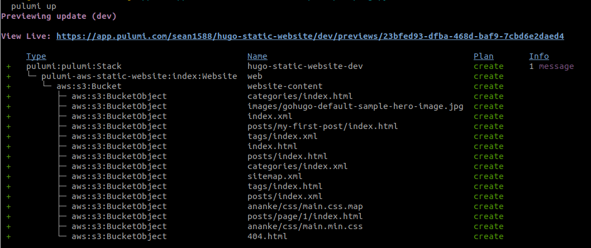
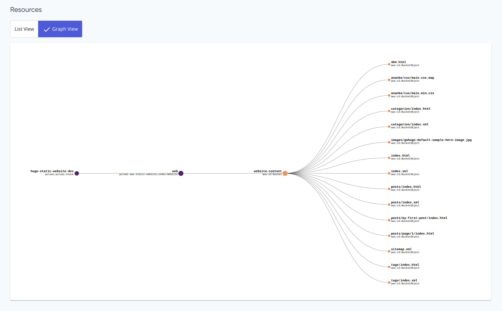
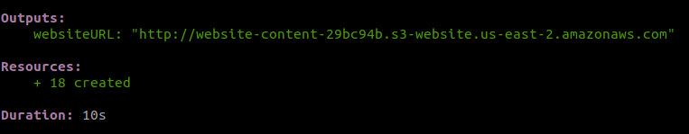
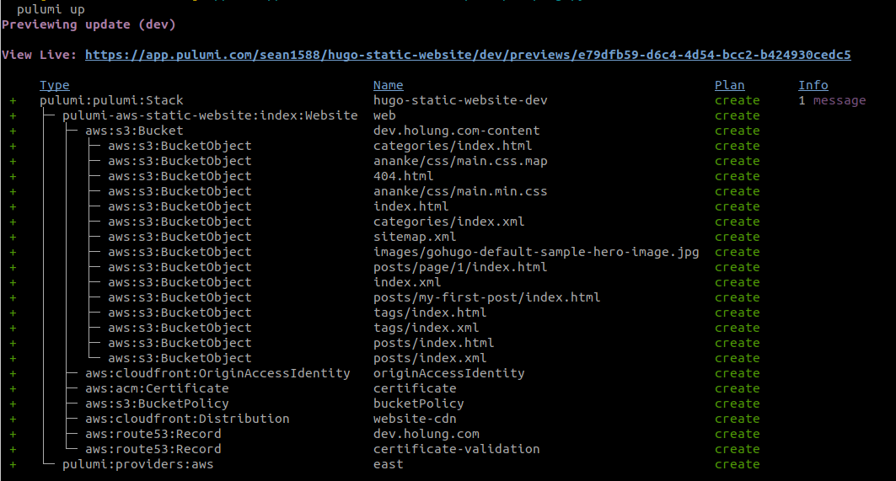
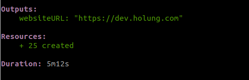

## Introducing the AWS Static Website Component

The [AWS Static Website](https://www.pulumi.com/registry/packages/aws-static-website/) component drastically reduces the complexity it takesmakes it easy to deploy a static website to Amazon S3 and, optionally, add a CloudFront content distribution network (CDN). While you can use any of the programming languages Pulumi supports (TypeScript, JavaScript, Python, Go, .NET, Java, and YAML), the component is particularly useful if you use YAML or JSON. With the component, you only need to write a few simple lines of code. Without the component, you would have to write and debug many lines of code to get the same functionality. With the AWS Static Website component, you’ll have a complete, functioning site in a few minutes. Without it, you can spend hours or even days to get the same result. 


# The Audience

The component is designed to be simple to use and accessible to a broad range of developers. The only prerequisites are a basic knowledge of YAML or JSON, an AWS account, and an understanding of what a static website is. Even if you’re not used to thinking about infrastructure as code (IaC), you can use the component and let it handle the complexities that make setting up a website so time consuming.

You will need to have Pulumi on your machine to use the component because you run the `pulumi up` command to deploy the website. There’s a link to the [installation instructions](#Install) at the end of this article. You’ll also need an AWS account.


# What the Component Does

As we said, the component deploys a static website to AWS and, optionally, a CloudFront CDN. You simply add a few lines of code, set a few configuration parameters, run `pulumi up` and let the component do the rest. The component sets up:


* An Amazon S3 bucket 
* An Amazon CloudFront CDN (optional)
    * An Amazon Route 53 DNS record
    * An Amazon Certificate Manager 


# Some Examples

Let’s look at two examples of how to use the component. You’ll find both examples and more at [https://gist.github.com/sean1588/f6ca2e09550e53c869259d569f29e9a1](https://gist.github.com/sean1588/f6ca2e09550e53c869259d569f29e9a1). We’re going to use YAML in this post but the gist also contains the JSON equivalents.


## Create a Website

This YAML code creates a basic static website.


```yaml
name: hugo-static-website
runtime: yaml
description: Example of deploying Hugo with Pulumi
resources:
  web:
    type: "aws-static-website:index:Website"
    properties:
      sitePath: "../my-website/public"
outputs:
  websiteURL: ${web.websiteURL}
```


This example code deploys a static Hugo website but you can use the component with any other static website framework, such as React. The only parameter that would change is the output directory specified in the** sitePath** property. 

The first two lines of this example give the project a name and tell Pulumi that the code is YAML. The next line is simply a description of the project. 

Next you allocate a _resource_. This is a Pulumi term. Resources are the fundamental units that make up your cloud infrastructure and Pulumi provides many resources that are ready for you to use. Here, you only need one: **aws-static-website:Website**, which is the AWS Static Website component. The resource has an input property, **sitePath**, which is the root directory that contains the website's contents. Of course, you can use any path you want. 

Finally, you’ll probably want to know the URL of your new site once it’s deployed. That’s what the **outputs** line does. If you’ll remember, **websiteURL** is one of the outputs that the component provides.

Remember, even though there are a few terms in the code you might be unfamiliar with, you can simply cut and paste the code in the gist.


### Get Started

To get started, go to the folder that contains your static website files. Then, follow these steps.


1. Create a directory named **infrastructure** with this command:


```bash
mkdir infrastructure && cd infrastructure

```


2. You’re now in the **infrastructure** directory. Generate a **Pulumi.yaml** file with this command:


```bash
pulumi new aws-yaml
```


Here’s an example of what the final directory structure looks like.
```
| hugo-website
├── public
│   ├── index.html
│   ├── main.css
├── infrastructure
│   ├── Pulumi.yaml
```

**Note:** Pulumi will add some other files to the **infrastructure** directory but you can ignore them.


3. Copy the resources section and the outputs section from the example and add it to the end of the **Pulumi.yaml** file.

```yaml
resources:
web:
    type: "aws-static-website:index:Website"
    properties:
    sitePath: "../my-website/public"
outputs:
websiteURL: ${web.websiteURL}
```


### Deploy the Website

To deploy the website, type `pulumi up`. You’ll first see a preview of all the resources that will be created. You then confirm that you want to proceed and Pulumi deploys the website.


### What You Gain

The entire example has 10 lines of YAML code. With this, you will get an S3 bucket provisioned with all of your website’s contents. If you looked at the preview screen when you ran `pulumi up`, you saw the many resources that actually had to be deployed to create the site. You never see any of that complexity. Here’s an example of what’s happening under the hood.




If you click **View Live**, you will go to the Pulumi Console, where you can see all of the information available about a deployment and explore the resources that were deployed. For example, you can see a resource graph and a list of resources. Here’s an example of a resource graph.





After Pulumi deploys the website, it will display any outputs you specified which, in our example, is the URL of the site.  as well as the number of resources created.




## Input Properties

The AWS Static Website has several input properties. Here are three of the most commonly used.

 


* **sitePath** - the root directory that contains the website’s contents (required).
* **withCDN** - sets a flag to provision a CloudFront CDN. 
* **targetDomain** - the domain that serves the content. A Route53 hosted zone must exist for this domain if you specify this option.

See the component’s [reference page](https://www.pulumi.com/registry/packages/aws-static-website/) for the others. 


## Output Properties

The AWS Static Website has several output properties. The one you’ll probably use the most is **websiteURL**, which is the URL to access the website. See the component’s [reference page](https://www.pulumi.com/registry/packages/aws-static-website/) for the others. 


## Add a CloudFront CDN

To add a CloudFront CDN, you only need to add one more line of code.


```
# Example using a CloudFront CDN
# YAML
name: hugo-static-website
runtime: yaml
description: Example of deploying Hugo with Pulumi
resources:
  web:
    type: "aws-static-website:index:Website"
    properties:
      sitePath: "./public"
      withCDN: true
outputs:
  websiteURL: ${web.websiteURL}
```


All you have to do is add the line: **withCDN: true** and the component sets up the CDN instance for you. Again, run `pulumi up`, confirm that you want to proceed, and Pulumi deploys the website. Here’s an example of what you’ll see.




And here’s the output.




# More Pulumi Advantages

We’ve already seen how much Pulumi simplifies creating a website. Pulumi also keeps track of any changes you make to any of the website files. It makes those changes the next time you run `pulumi up`. Here’s an example screenshot. The changes are marked in the Plan column.


If you simply want to take an inventory of what’s changed, you can run `pulumi up` and not proceed with the confirmation. Alternatively, you can run `pulumi preview`.

If you want to take down a site, run `pulumi destroy`. Pulumi marks all the resources for deletion. It first previews the changes and, if you confirm, removes them from your AWS account. You don’t have to worry that you’ll forget to remove some resource and continue to pay for it. Here’s an example of what you’d see if you ran `pulumi destroy` on a basic static website.


# Learn More

If you’re curious and want to learn more about Pulumi and the AWS Static Website component, here are a few links you might find interesting:


* You can examine the [GitHub repository](https://github.com/pulumi/pulumi-aws-static-website) that contains the code for the component.
* If you want to quickly try out the component, this GitHub repo houses a complete Hugo example project that you can clone.
* If you want to learn about other Pulumi components, take a look at the [registry page](https://pulumi.com/registry), which catalogs them all.
* If you want to delve deeper into Pulumi, the [Getting Started](https://www.pulumi.com/docs/get-started/) guide is a good first step.
* If you’re interested in learning more about Pulumi concepts, try the [Architecture & Concepts](https://www.pulumi.com/docs/intro/concepts/) page. 


# Install Pulumi

To install Pulumi for AWS, go to [Before You Begin](https://www.pulumi.com/docs/get-started/aws/begin/). There are instructions for macOS, Windows and Linux. You need to have an AWS account.
