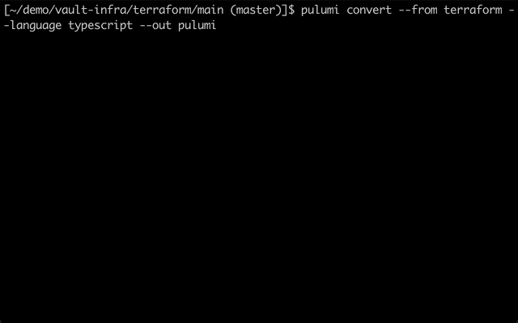

Over the last 2 years, we've seen an increasing trend of cloud development teams migrating to Pulumi from Terraform. These teams often have experience with and meaningful investment in Terraform, but have also typically run into limits of expressivity, productivity, scalability or reliability with their existing tools. One of the first questions we hear when they decide to move to Pulumi is "how will I migrate my existing Terraform projects over?".

Today, we're excited to announce new support for converting whole Terraform projects to Pulumi via the `pulumi convert` command in the Pulumi CLI. The new Terraform converter includes support for Terraform modules, core features of Terraform 1.4, and the majority of Terraform built-in functions, converting to Pulumi TypeScript, Python, Go, or C#. The new converter can significantly reduce the amount of time it takes to migrate Terraform to Pulumi. Let's dig in to learn more about the new converter and how to use it.

<!--more-->

Historically, we have offered a separate [tf2pulumi](https://github.com/pulumi/tf2pulumi) tool to convert small snippets of Terraform to Pulumi. The new converter is no longer a separate tool. As of [v3.71.0](/docs/install/), you can run the new converter directly from the Pulumi CLI with the `pulumi convert --from terraform` command. And you can convert more than small snippets -- the new converter supports converting full Terraform programs.

The new support in `pulumi convert` builds upon Pulumi's [CrossCode](/crosscode/) foundations for providing universal infrastructure as code support across a wide variety of programming languages and converstion tooling between them. It also introduces a new concept of `converter` plugin in the Pulumi engine, which allows conversion tools from other Infrastructure as Code platforms to be integrated into the same `pulumi convert` experience in the future, both as part of the core project, as well as by other ecosystem partners and contributors.

Several common use cases are supported via the new `pulumi convert --from terraform` support in the Pulumi CLI:

* Converting your organization's existing Terraform projects to Pulumi
* Converting your organization's existing Terraform modules to Pulumi, to be consumed as part of existing Pulumi projects
* Converting 3rd party open source Terraform modules or projects which address a use case you want to incorporate into your existing Pulumi projects

## Supported Terraform Features

The following major features are supported:

* Variables, outputs, resources, and data sources
* Terraform Modules are converted to Pulumi components
* Almost all HCL2 expression syntax

In cases where the converter does not yet support a feature, the `pulumi convert` command succeeds but generates a TODO in the form of a call to a <pulumi-chooser type="language" options="typescript,python,go,csharp" option-style="none" class="inline">
    <pulumi-choosable type="language" value="typescript"><code>notImplemented</code></pulumi-choosable>
    <pulumi-choosable type="language" value="python"><code>not_implemented</code></pulumi-choosable>
    <pulumi-choosable type="language" value="go"><code>notImplemented</code></pulumi-choosable>
    <pulumi-choosable type="language" value="csharp"><code>NotImplemented</code></pulumi-choosable>
</pulumi-chooser> function that will need to be filled in manually. For most projects, the converter should be able to convert 90-95% of the code without any TODOs, with only a small percentage of items to address manually, significantly reducing migration time compared to doing an entire migration by hand. We are actively improving the converter by adding support for missing features and improving the overall quality of the converted code to reduce the amount of manual fix-ups required.

## Converting a Real World Program

Let's walk through converting a Terraform codebase to Pulumi. [Avant Terraform Vault Setup](https://github.com/avantoss/vault-infra) is an open source project that provides a high-availability installation of Vault using a variety of managed AWS services. It defines a fairly complex installation with dozens of AWS resources in over 1,000 lines of Terraform HCL, including the main program and a Vault module. Let's convert it to Pulumi.

First, clone the repo and `cd` into the directory containing the Terraform project:

```bash
$ git clone https://github.com/avantoss/vault-infra.git
$ cd vault-infra/terraform/main
```

Next, run the converter:


{}

```bash
$ pulumi convert --from terraform --language typescript --out pulumi
```

{}
{}

```bash
$ pulumi convert --from terraform --language python --out pulumi
```

{}
{}

```bash
$ pulumi convert --from terraform --language go --out pulumi
```

{}
{}

```bash
$ pulumi convert --from terraform --language csharp --out pulumi
```

{}




The converted code is generated in the specified `pulumi` output directory. A complete Pulumi project is generated, including two primary code files specific to this this program's conversion:

*  contains the converted code for the main program
* <pulumi-chooser type="language" options="typescript,python,go,csharp" option-style="none" class="inline">
    <pulumi-choosable type="language" value="typescript"><code>vault.ts</code></pulumi-choosable>
    <pulumi-choosable type="language" value="python"><code>vault.py</code></pulumi-choosable>
    <pulumi-choosable type="language" value="go"><code>vault.go</code></pulumi-choosable>
    <pulumi-choosable type="language" value="csharp"><code>vault.cs</code></pulumi-choosable>
  </pulumi-chooser> contains the <code>Vault</code> Pulumi component, converted from the Terraform module

### Addressing TODOs

The file for the `Vault` component makes up the bulk of the implementation and contains some TODOs emitted by the converter that must be addressed manually.

#### Replace

For example, the converter doesn't yet support the `replace` built-in function.


{}

```typescript
name: notImplemented("replace(var.name_prefix,\"_\",\"-\")"),
```

{}
{}

```python
name=not_implemented("replace(var.name_prefix,\"_\",\"-\")"),
```

{}
{}

```go
Name: notImplemented("replace(var.name_prefix,\"_\",\"-\")"),
```

{}
{}

```csharp
Name = NotImplemented("replace(var.name_prefix,\"_\",\"-\")"),
```

{}


We can fill in an implementation.  Note that we get to use the full expressiveness of the native and familiar string manipulation libraries in our target programming language, instead of the relatively constrained options of the Terraform DSL.


{}

```typescript
name: pulumi.output(args.namePrefix).apply(name => name.replace("_", "-")),
```

{}
{}

```python
name=pulumi.Output.from_input(args["namePrefix"]).apply(lambda name: name.replace("_", "-")),
```

{}
{}

```go
Name: args.NamePrefix.ToStringOutput().ApplyT(func(name string) string {
    return strings.ReplaceAll(name, "_", "-")
}).(pulumi.StringOutput),
```

{}
{}

```csharp
Name = args.NamePrefix.Apply(name => name.Replace("_", "-"));
```

{}


#### Replace, Element, and Split

There's another use of `replace` in combination with `element` and `split`.


{}

```typescript
const plainDomain = notImplemented("replace(element(split(\":\",var.vault_dns_address),1),\"////\",\"\")");
```

{}
{}

```python
plain_domain = not_implemented("replace(element(split(\":\",var.vault_dns_address),1),\"////\",\"\")")
```

{}
{}

```go
plainDomain := notImplemented("replace(element(split(\":\",var.vault_dns_address),1),\"////\",\"\")");
```

{}
{}

```csharp
var plainDomain = NotImplemented("replace(element(split(\":\",var.vault_dns_address),1),\"////\",\"\")");
```

{}


Again, we can fill in an implementation. Note that the replace substring is wrapped in forward slashes, which is treated as a regular expression with Terraform's `replace`. In this case, a normal string replace works just as well, but we could just as easily used our language's regex capability to do the replace.


{}

```typescript
const plainDomain = pulumi.output(args.vaultDnsAddress)
    .apply(a => a.split(":")[1].replace("//", ""));
```

{}
{}

```python
plain_domain = pulumi.Output.from_input(args["vaultDnsAddress"]) \
    .apply(lambda a: a.split(":")[1].replace("//", ""))
```

{}
{}

```go
plainDomain := args.VaultDnsAddress.ToStringOutput().ApplyT(func(a string) string {
	return strings.ReplaceAll(strings.Split(a, ":")[1], "//", "")
}).(pulumi.StringOutput)
```

{}
{}

```csharp
var plainDomain = args.VaultDnsAddress.Apply(a => a.Split(':')[1].Replace("//", ""));
```

{}


#### Merge

The converter doesn't yet support the `merge` built-in function:


{}

```typescript
tags: notImplemented(`merge(
{"Name"=var.name_prefix},
var.tags,
)`),
```

{}
{}

```python
tags=not_implemented("""merge(
{"Name"="${var.name_prefix}-seal"},
var.tags,
)"""),
```

{}
{}

```go
Tags: notImplemented("merge(\n{\"Name\"=var.name_prefix},\nvar.tags,\n)"),
```

{}
{}

```csharp
Tags = NotImplemented(@"merge(
{""Name""=var.name_prefix},
var.tags,
)"),
```

{}


We can write a small `merge` utility function and make use of it:


{}

```typescript
function merge(first: pulumi.Inputs, second: pulumi.Inputs) {
    return pulumi.all([first, second]).apply(([first, second]) => ({...first, ...second}));
}

tags: merge({ "Name": args.namePrefix }, args.tags),
```

{}
{}

```python
def merge(first, second):
    return pulumi.Output.all(first, second).apply(lambda a: {**a[0], **a[1]})

tags=merge({ "Name": args["namePrefix"] }, args["tags"])
```

{}
{}

```go
func merge(first, second pulumi.MapInput) pulumi.MapOutput {
	return pulumi.All(first, second).ApplyT(func(args []any) map[string]any {
		merged := make(map[string]any)
		for _, m := range args {
			for k, v := range m.(map[string]any) {
				merged[k] = v
			}
		}
		return merged
	}).(pulumi.MapOutput)
}

Tags: merge(pulumi.Map{"Name": args.NamePrefix}, args.Tags),
```

{}
{}

```csharp
static Output<ImmutableDictionary<string, T>> Merge<T>(params InputMap<T>[] dicts)
{
   return Output.All(dicts).Apply(dicts =>
   {
      var builder = ImmutableDictionary.CreateBuilder<string, T>();
      foreach (var dict in dicts)
      {
         foreach (var (key, value) in dict)
         {
            builder.Add(key, value);
         }
      }
      return builder.ToImmutableDictionary();
   });
}

Tags = Merge(new() { { "Name", args.NamePrefix } }, args.Tags),
```

{}


### Template Files

There are a couple uses of the `template_file` data source, which isn't available to the converter yet.


{}

```typescript
const userdata = notImplemented("The template_file data resource is not yet supported.");
```

{}
{}

```python
userdata = not_implemented("The template_file data resource is not yet supported.")
```

{}
{}

```go
userdata := notImplemented("The template_file data resource is not yet supported.");
```

{}
{}

```csharp
var userdata = NotImplemented("The template_file data resource is not yet supported.");
```

{}


We can workaround this in the meantime by simply formatting a string or using a template library.


{}

```typescript
const userData = pulumi.interpolate `#!/bin/bash

# Get the Instance ID
INSTANCE_ID=$(curl http://169.254.169.254/latest/meta-data/instance-id)

# Set the Hostname
hostnamectl set-hostname "${ args.namePrefix }-$INSTANCE_ID"
systemctl restart rsyslog.service

# Get Configuration and SSL Certs
aws --region ${ args.region } s3 cp s3://${ vaultResources.id }/resources/config/config.hcl ${ args.vaultConfigDir }/config.hcl

...
`;
```

{}
{}

```python
def format_userdata(args):
    return """#!/bin/bash

# Get the Instance ID
INSTANCE_ID=$(curl http://169.254.169.254/latest/meta-data/instance-id)

# Set the Hostname
hostnamectl set-hostname "{namePrefix}-$INSTANCE_ID"
systemctl restart rsyslog.service

# Get Configuration and SSL Certs
aws --region {region} s3 cp s3://{vaultResourceId}/resources/config/config.hcl {vaultConfigDir}/config.hcl

...
""".format(**args)

userdata = pulumi.Output.all(
    namePrefix=args["namePrefix"],
    region=args["region"],
    vaultResourceId=vault_resources.id,
    vaultConfigDir=args["vaultConfigDir"],
).apply(format_userdata)
```

{}
{}

```go
type userDataArgs struct {
	NamePrefix      string
	Region          string
	VaultResourceId string
	VaultConfigDir  string
}

func generateUserData(args userDataArgs) (string, error) {
	tmpl, err := template.New("userdata").Parse(`#!/bin/bash

# Get the Instance ID
INSTANCE_ID=$(curl http://169.254.169.254/latest/meta-data/instance-id)

# Set the Hostname
hostnamectl set-hostname "{{ .NamePrefix }}-$INSTANCE_ID"
systemctl restart rsyslog.service

# Get Configuration and SSL Certs
aws --region {{ .Region }} s3 cp s3://{{ .VaultResourceId }}/resources/config/config.hcl {{ .VaultConfigDir }}/config.hcl

...`)
	if err != nil {
		return "", err
	}
	buf := bytes.Buffer{}
	err = tmpl.Execute(&buf, args)
	if err != nil {
		return "", err
	}
	return buf.String(), nil
}

userdata := pulumi.All(
	args.NamePrefix,
	args.Region,
	vaultResources.ID().ToStringOutput(),
	args.VaultConfigDir,
).ApplyT(func(args []any) (string, error) {
	return generateUserData(userDataArgs{
		NamePrefix:      args[0].(string),
		Region:          args[1].(string),
		VaultResourceId: args[2].(string),
		VaultConfigDir:  args[3].(string),
	})
}).(pulumi.StringOutput)
```

{}
{}

```csharp
var userdata = Output.Tuple(args.NamePrefix, args.Region, (Input<string>)vaultResources.Id, args.VaultConfigDir).Apply(t =>
{
   var (namePrefix, region, vaultResourcesId, vaultConfigDir) = t;
   return $@"#!/bin/bash

# Get the Instance ID
INSTANCE_ID=$(curl http://169.254.169.254/latest/meta-data/instance-id)

# Set the Hostname
hostnamectl set-hostname ""{ namePrefix }-$INSTANCE_ID""
systemctl restart rsyslog.service

# Get Configuration and SSL Certs
aws --region { region } s3 cp s3://{ vaultResourcesId }/resources/config/config.hcl { vaultConfigDir }/config.hcl

...
";
});
```

{}


### Wrapping Up

After addressing these and some other tweaks so that the code compiles, we can now run the converted program with `pulumi up` to provision the Vault installation with Pulumi.

The converter has saved us a ton of time, converting over 1,000 lines of Terraform to a modern Pulumi language, with only a small number of manual fix-ups required. From here, we can leverage our IDE and compiler to further refactor and improve the code, one of the many benefits of Pulumi!

## Get Started

Support for the new `pulumi convert --from terraform` command is available today in v3.71.0 of the Pulumi CLI. [Download](/docs/install/) the latest Pulumi CLI and give the new converter a try today. If you run into any issues, please [let us know](https://github.com/pulumi/pulumi/issues/new/choose) or reach out in the [Pulumi Community Slack](https://slack.pulumi.com) with any questions!

