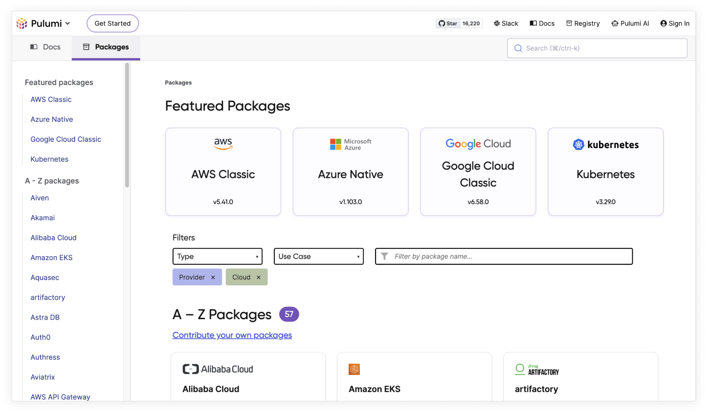

Engineers spend a lot of time searching documentation for answers. At Pulumi, we believe in exceptional documentation experiences that help people using Pulumi find what they need quickly and use it successfully. Today, we announce an improved Pulumi documentation experience dedicated to all developers.
<!--more-->

We prioritized search and navigation, so you can easily browse and search for precisely what you want. Enjoy faster and more accurate searches, with lovely user experience touches to guide you to the right place. We also planned for the future, using design patterns that will grow with content and concepts.

Let's showcase a few types of Pulumi documentation:

## Quickstart experience

The [Pulumi quickstart](/docs/quickstart/) experience  is for new users to get up and running quickly.

## Cloud get started tutorials

The [Pulumi cloud get started tutorials](/docs/clouds/) are for users who want a detailed walkthrough the first time they use Pulumi.

## Concept docs

The [Pulumi concept docs](/docs/concepts/) are where you can dive into Pulumi concepts, how they work together, and how to effectively use them to ship infrastructure.

## Packages

The [package documentation](/docs/registry/) is where to find config and API documentation for Pulumi supported clouds, version control, databases, & infrastructure, monitoring, and networking tools. We support 119 providers today, and we add new providers every week!

Head to [Pulumi docs](/docs/), learn something new, and send us your feedback!
