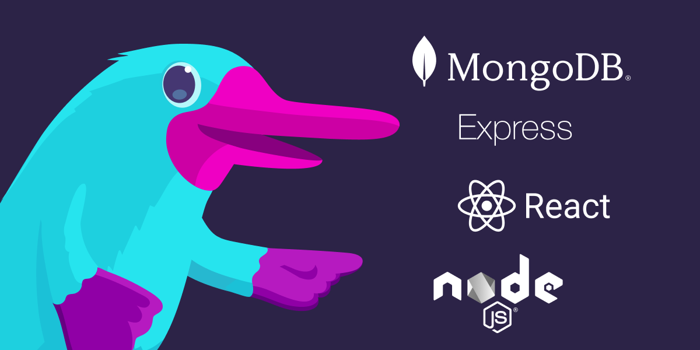

As a developer, I get a lot of ideas for web applications. Maybe you do, too. Most of my ideas tend to hang out in the realm of the trivial --- clever ways to keep track of my kids' allowances, managing workout routines or shopping lists --- and to be honest, the vast majority never see the light of day. But once in a while, an idea will hang around long enough to convince me to do something about it, and I'll be forced to confront the dreaded decision of what to use for the technology stack.

As a JavaScript developer, I have plenty of options --- too many, in fact. Thanks to the massive and constantly expanding JavaScript community and ecosystem, we JS developers have roughly a hundred and fifty million front-end and back-end libraries and frameworks to choose from, and keeping up with even the most popular ones is pretty much impossible. Which is why, when I just want to get something done, I'll often reach for a familiar combination of tools known as [the MERN stack](https://www.mongodb.com/mern-stack).

MERN-stack apps are three-tier web applications built with [MongoDB](https://www.mongodb.com/), [Express](https://expressjs.com/), [React](https://reactjs.org/), and [Node.js](https://nodejs.org/). You can read all about them (and their variations) [in the MongoDB docs](https://www.mongodb.com/mern-stack), but the gist is that they let you use one language --- JavaScript (or TypeScript, if you like) --- to manage all three layers of the application stack: the front end, as a single-page app built statically with React; the back end, as a REST API managed with Express; and the database, as a collection of JSON-like documents with MongoDB. MERN might not always be the right tool for the job, but for the kinds of apps I tend to find myself building, it often works out pretty well.



## Into the cloud

Of course, once I'm _finished_ building a MERN app, or any kind of web app for that matter, I'm faced with a whole other problem: figuring out how to get it off of my laptop and onto the web.

The cloud, for all its glory, hasn't made this easy for developers. For someone who just wants to bring an application into the cloud, the process of choosing a provider, understanding how to translate the components of the application into the right set of provider-specific resources, setting up networking, debugging permissions, deciphering billing, and so on, can be dizzying --- and the truth is that as a developer, I really don't want to care about _any_ of it. What I want is to focus on what I do care about --- building my app --- and when I'm ready to deploy, push my code to a repository, maybe run a command or two (or better, not even have to do that), and wait patiently for a URL to emerge that I can paste into a browser and have everything _just work_.

Which is why I was so happy when I discovered the [DigitalOcean App Platform](https://www.digitalocean.com/products/app-platform).

If you've used DigitalOcean before, then you know they put a lot of care into making infrastructure approachable for developers. What you might not know, though (or at least I didn't until recently), is that you can do a lot more with DigitalOcean than just manage virtual machines. The [relatively new](https://www.digitalocean.com/blog/introducing-digitalocean-app-platform-reimagining-paas-to-make-it-simpler-for-you-to-build-deploy-and-scale-apps) App Platform exposes a set of high-level abstractions --- _static site_, _service_, _database_, _worker_ --- that map perfectly to the components of a typical web application, properly configured and easily scalable out of the box. If what you want is an easy way to deploy a MERN-stack app (or really any web app) into the cloud, App Platform is a compelling choice --- and as you'll see, with Pulumi and a little bit of TypeScript, you can drive the whole process without ever having to leave the comfort of your IDE.

So let's build ourselves a MERN-stack app and deploy it on DigitalOcean with Pulumi. To keep focused, we'll skip over the application-development work and start with a working app (one that should be fairly representative of MERN apps in general) that we can use as a jumping-off point. We'll first walk through the process of mapping the layers of that app --- a grocery list --- to App Platform constructs, then wire it all up with Pulumi and deploy.

## First steps: setting up {#setting-up}

The code for this walkthrough is [available as a template repository on GitHub](https://github.com/cnunciato/fullstack-pulumi-mern-digitalocean), so if you want to follow along (and you should!), you should [obtain a copy of your own](https://github.com/cnunciato/fullstack-pulumi-mern-digitalocean/generate) to work with, either by forking it or creating it from a template. Once you've done that, make sure to:

* [Clone the repository](https://github.com/cnunciato/fullstack-pulumi-mern-digitalocean) to your local machine
* [Install and configure Pulumi and Node.js](https://www.pulumi.com/docs/get-started/aws/begin/?language=nodejs) (we'll use TypeScript)
* Optionally, if you'd like be able to run the web app locally as well, [install and configure MongoDB Community Edition](https://docs.mongodb.com/manual/tutorial/install-mongodb-on-os-x/)
* [Sign into DigitalOcean](cloud.digitalocean.com/) and obtain a [personal access token](https://cloud.digitalocean.com/account/api/tokens) with read-write permissions

One thing to note: because we'll be creating real DigitalOcean resources, you may incur a cost. But since we'll be using the least expensive plan settings available, and destroying all of our resources when we're through, the cost shouldn't amount to more than a penny or two.

Let's get started.

## Cloning and inspecting the repository

After you've cloned the repository and navigated to the root, you'll see a couple of folders and files that look something like this:

```bash
├── frontend
├── backend
├── Makefile
└── package.json
```

### The front end

The `frontend` folder contains the React application, and its job is to render the list of groceries and allow us to interact with it (adding items, checking them off, and so on). I used a tool called [Vite](https://vitejs.dev/) to generate the scaffolding for it, and all of its logic --- form fields, click handlers, API calls --- is contained in `src/App.tsx`.

### The back end

The `backend` folder contains the Express application that defines the REST API. It sets up four API routes to handle the basic set of [CRUD](https://en.wikipedia.org/wiki/Create,_read,_update_and_delete) operations you'd expect to find in an application like this one:

* `GET /api/items` fetches all items from the database and returns them as a JSON array
* `POST /api/items` accepts a new item and writes it to the database
* `PUT /api/items/:id` updates an existing item (e.g., to toggle its checked/unchecked status)
* `DELETE /api/items/:id` deletes an item

The back end supports three configurable properties, all of which are exposed as optional environment variables:

* `BACKEND_SERVICE_PORT`, which defaults to `8000`
* `BACKEND_ROUTE_PREFIX`, which defaults to `/api`
* `DATABASE_URL`, which defaults to `mongodb://127.0.0.1`, to facilitate local development

## Running the application locally

I'm a fan of using [Makefiles](https://www.gnu.org/software/make/manual/html_node/Introduction.html) for dev tasks, so I've included one here as well. Once you've [installed MongoDB locally and started the service](https://docs.mongodb.com/manual/administration/install-community/), you can install all dependencies and start the development server:

```bash
make ensure   # installs all front-end, back-end, and development dependencies.
make dev      # starts the front-end and back-end development servers.
```

With the development server running, you can browse to [http://localhost:3000](http://localhost:3000) and see the app:


Both the front-end and back-end dev servers are configured to recompile your TypeScript to JavaScript automatically, and the front-end dev server is configured up to proxy the Express service from `localhost:8000` as `localhost:3000/api` (which means there's no need to mess with any CORS-related settings).

Try adding a few items and marking them off, just to make sure everything's working as expected. If you've got a MongoDB client installed as well (I generally like [MongoDB Compass](https://www.mongodb.com/products/compass)), you should also be able to see the `grocery-list` database and the `items` collection filling up with delicious foods:


## Charting a course

Now that you've got a working application, it's time to start thinking about how to deploy it. Earlier I mentioned how every cloud provider handles this differently, and that's true of DigitalOcean as well; you _could_ deploy the front end as a [DigitalOcean Space](https://www.digitalocean.com/products/spaces), or both front end and back end (and even the database) as a single [DigitalOcean Droplet](https://www.digitalocean.com/products/droplets), but the best fit for this particular application really is [App Platform](https://docs.digitalocean.com/products/app-platform/concepts/), and for several reasons.

One is that because App Platform apps are comprised of [_components_](https://docs.digitalocean.com/products/app-platform/concepts/) --- abstractions like [static site](https://docs.digitalocean.com/products/app-platform/concepts/static-site/), [service](https://docs.digitalocean.com/products/app-platform/concepts/service/), and [database](https://docs.digitalocean.com/products/app-platform/concepts/database/) --- they map really well to the tiers of a typical web application. And DigitalOcean deploys and manages each type of component in a specialized way, with static websites distributed and cached by its own CDN, services packaged and delivered as containers (backed by its [Kubernetes](https://www.digitalocean.com/products/kubernetes) platform), and databases as managed, configurable services. All of this means you're not only able to stay focused on the application itself, rather than the infrastructure, but you're also able to scale these services up, down, and out as needed, and even delegate your front-end and back-end build processes to DigitalOcean by referencing one or more external source-code repositories.

Defining an App Platform app happens in one of two ways:

* Manually, by creating components individually and associating them in the DigitalOcean console
* Programmatically, in the form of an [_App Spec_](https://docs.digitalocean.com/products/app-platform/concepts/app-spec/), a YAML or JSON document that can be uploaded to the DigitalOcean App Platform API

In our case, we'll take the latter path, and use Pulumi and the [DigitalOcean package](https://www.pulumi.com/registry/packages/digitalocean/) to spec out an App Platform app that uses a managed MongoDB cluster and deploys automatically on every GitHub commit. And we'll start by creating a new Pulumi project.

## Creating the project

In the root of the repository, make a new folder called `infra` and change to it, then run `pulumi new`, using the `digitalocean-typescript` project template:

```bash
mkdir infra && cd infra
pulumi new digitalocean-typescript
```

Step through the configuration prompts, applying the following suggested values:

* For project name, use `grocery-list`
* For project description, use `An example of how to deploy a MERN stack app to DigitalOcean`
* For stack name, leave the default (it should be `dev`)

A few last things, in terms of configuration. First, the Pulumi DigitalOcean provider needs to be given the credentials it needs to communicate with DigitalOcean on your behalf --- specifically to provision your app and its resources. For this, you can use the access token you obtained [earlier](#setting-up) from the DigitalOcean console, and you can apply it by setting the `DIGITALOCEAN_TOKEN` environment variable:

```bash
export DIGITALOCEAN_TOKEN="your-access-token"
```

Finally, App Platform needs to know where to find the source code for the front-end and back-end components. As we're working with GitHub, we can supply that information with Pulumi configuration settings:

```bash
pulumi config set repo "your-github-org/your-github-repo" # e.g., cnunciato/fullstack-pulumi-mern-digitalocean
pulumi config set branch "your-main-branch"               # e.g., main
```

Once those values are set, you're ready to start writing the program.

## Writing the program

In your IDE of choice, open the folder containing the repository and remove the sample code from `index.ts`, replacing it with the modules you'll need and a few lines to read the configuration values you just set:

```typescript
import * as pulumi from "@pulumi/pulumi";
import * as digitalocean from "@pulumi/digitalocean";

const config = new pulumi.Config();
const repo = config.require("repo");
const branch = config.require("branch");
```

We'll be using...


## Deploying

## Tidying up

## Conclusion
