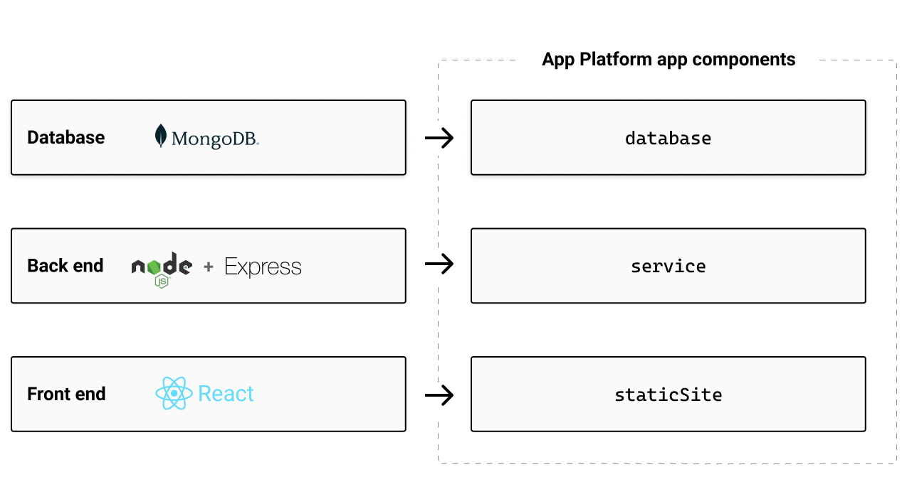
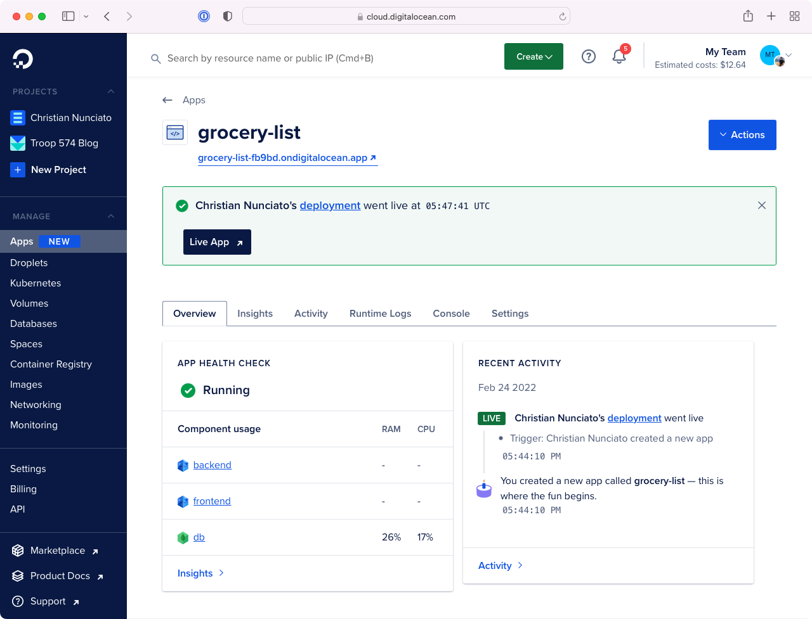

As a developer, I get lots of ideas for web applications --- little things, usually: crafty ways to keep track of my kids' allowances, managing workout routines or shopping lists, and be honest, most of them never see the light of day. Once in a while, though, an idea will hang around long enough to convince me to do something about it, and I'll be forced to confront the dreaded decision of what to use for the technology stack.

As a JavaScript developer, I have options --- arguably too many. Thanks to the massive JavaScript community and ecosystem, I've got roughly a hundred and fifty million libraries and frameworks to choose from, and keeping up them all is basically impossible. Which is why, when I just want to get something done, I'll often reach for a set of tools known as [the MERN stack](https://www.mongodb.com/mern-stack).

MERN-stack apps are three-tier web applications built with [MongoDB](https://www.mongodb.com/), [Express](https://expressjs.com/), [React](https://reactjs.org/), and [Node.js](https://nodejs.org/). You can read all about them [in the MongoDB docs](https://www.mongodb.com/mern-stack), but the gist is that they allow you use one language --- JavaScript (or if you like, TypeScript) --- to manage all three layers of the application stack: the front end, as a single-page app built statically with React; the back end, as a REST API managed with Express; and the database, as collections of JSON-like documents with MongoDB. It's definitely not _always_ the right tool for the job, but for the kinds of apps I tend find myself building, it usually works out pretty well.


Of course, once I'm _done_ building a MERN app, I'm faced with a whole other problem: figuring out how to get it off of my laptop and onto the web.

The cloud hasn't made this very easy for developers. Even if all you want is to deploy a simple app like this one into the cloud, choosing a provider, figuring out which provider-specific resources to use (and how to use them), setting up networking, permissions, etc., can be dizzying --- and the truth is that as a developer, I'd really prefer not to deal with any of it. What I want is to focus on my app, and when I'm ready to ship it, push my code to a repository and wait patiently for a URL that I can paste into a browser and have everything _just work_.

Which is why I was so delighted to discover the [DigitalOcean App Platform](https://www.digitalocean.com/products/app-platform).

If you've used DigitalOcean before, you know they care about making infrastructure approachable for developers. But what you might not know (or at least I didn't myself until recently) is that you can do a lot more with DigitalOcean than just [virtual machines](https://www.digitalocean.com/products/droplets). App Platform is a [fairly new](https://www.digitalocean.com/blog/introducing-digitalocean-app-platform-reimagining-paas-to-make-it-simpler-for-you-to-build-deploy-and-scale-apps), fully-managed platform service that offers a set of high-level abstractions built to align with the tiers of a typical web application. If you're looking for way to deploy and manage a MERN app (or just about any kind of web app for that matter), App Platform can be an excellent way to go --- and as you'll see, with Pulumi and a little bit of code, you can drive the whole process without ever having to leave the comfort of your IDE.

So let's build ourselves a MERN app and deploy it to App Platform with Pulumi. As the aim is to focus on the infrastructure and how to code it, we'll start with a pre-baked app  --- a web-based grocery list --- map its tiers to App Platform constructs, and wire it all together with Pulumi.

Let's get started.

## First steps: setting up {#setting-up}

The code for this walkthrough is [available as a template repository on GitHub](https://github.com/cnunciato/fullstack-pulumi-mern-digitalocean), so if you want to follow along (and you should!), you should [grab a copy of your own](https://github.com/cnunciato/fullstack-pulumi-mern-digitalocean/generate) to work with, either by forking the repository or creating a new one from the template. Once you've done that:

* [Clone the repository](https://github.com/cnunciato/fullstack-pulumi-mern-digitalocean) to your local machine
* [Install and configure Pulumi and Node.js](https://www.pulumi.com/docs/get-started/aws/begin/?language=nodejs) (we'll use TypeScript)
* [Install and configure MongoDB Community Edition](https://docs.mongodb.com/manual/tutorial/install-mongodb-on-os-x/)
* [Sign into DigitalOcean](cloud.digitalocean.com/) and get a [personal access token](https://cloud.digitalocean.com/account/api/tokens) with read-write permissions
* Grant DigitalOcean access to your GitHub repository. To do that, [visit the Apps page](https://cloud.digitalocean.com/apps), choose Create App, and following the steps to install the GitHub app and return to the Console

One thing to note: we'll be creating real DigitalOcean resources, here, so there's a chance you'll incur a slight cost for the resources you use. But since we'll be using the least expensive plan settings available, and tearing everything down when we're done, that cost shouldn't amount to more than a penny or two at most.

## Cloning and inspecting the repository

Once you've cloned your copy of the template repository and navigated to the root, you'll see a couple of folders and files that look something like this:

```bash
├── frontend
├── backend
├── Makefile
└── package.json
```

The `frontend` folder contains the React application. Its job is to render the list of groceries and give us something to interact with (adding items, checking them off, deleting them, and so on). I generated the scaffolding for this app with a tool called [Vite](https://vitejs.dev/), and all of its logic --- form fields, click handlers, API calls, etc. --- is contained in `src/App.tsx`.

The `backend` folder contains the Express application that defines the REST API. It sets up four API routes to handle the [CRUD](https://en.wikipedia.org/wiki/Create,_read,_update_and_delete) operations you'd expect in an app like this one:

* `GET /api/items` fetches all items from the database and returns them as a JSON array
* `POST /api/items` takes a new item and writes it to the database
* `PUT /api/items/:id` updates an existing item (e.g., to toggle its checked/unchecked status)
* `DELETE /api/items/:id` deletes an item

The back end supports three configurable properties, all of which are exposed as optional environment variables:

* `BACKEND_SERVICE_PORT`, which defaults to `8000`
* `BACKEND_ROUTE_PREFIX`, which defaults to `/api`
* `DATABASE_URL`, which defaults to `mongodb://127.0.0.1` to facilitate local development

## Running the application locally

I'm a big fan of using [Makefiles](https://www.gnu.org/software/make/manual/html_node/Introduction.html) to simplify dev tasks, so I've included for you one here as well. Once you've [installed MongoDB locally and started the service](https://docs.mongodb.com/manual/administration/install-community/) (which by default should be listening on port `27107`), you can install all front-end and back-end dependencies and start the development server:

```bash
$ make ensure  # installs front-end and back-end dependencies.
$ make dev     # starts the front-end and back-end development servers.
```

With the development server running, you can browse to [http://localhost:3000](http://localhost:3000) and see the app:


The front-end and back-end development servers are configured to recompile your TypeScript to JavaScript automatically, and the front-end server is set up to proxy the back-end service (which runs at `http://localhost:8000`) at the root-relative path of `/api`. Proxying the API in this way is an easy way to avoid having to wrestle with [CORS](https://developer.mozilla.org/en-US/docs/Web/HTTP/CORS)-related issues, and as you'll see when we deploy, App Platform supports it out of the box.

Try adding a few items and marking them off, just to make sure everything's working properly. If you've got a MongoDB client installed as well --- I generally like [MongoDB Compass](https://www.mongodb.com/products/compass) --- you should be able to see the `grocery-list` database, and the `items` collection, filling up with delicious foods:


Now let's have a look at how to deploy this stuff.

## Charting a course

Earlier I mentioned that every cloud provider handles web-app deployment a little differently, often in multiple ways, and that's true for DigitalOcean as well. You _could_ deploy the front end as a [DigitalOcean Space](https://www.digitalocean.com/products/spaces), or both the front end and back end (and even the database) with a single [Droplet](https://www.digitalocean.com/products/droplets). But given the shape of this application, the best fit is really is [App Platform](https://docs.digitalocean.com/products/app-platform/concepts/), for several reasons.

One is that because App Platform apps are comprised these of high-level [_components_](https://docs.digitalocean.com/products/app-platform/concepts/) --- abstractions like [static site](https://docs.digitalocean.com/products/app-platform/concepts/static-site/), [service](https://docs.digitalocean.com/products/app-platform/concepts/service/), and [database](https://docs.digitalocean.com/products/app-platform/concepts/database/) --- they're pretty much purpose-built for an application like this one, and DigitalOcean customizes the deployment of each component based on its type. Static websites are distributed and cached on DigitalOcean's CDN, services are packaged and delivered as containers (using its own [Kubernetes](https://www.digitalocean.com/products/kubernetes) platform), and databases are deployed as easily configurable managed services. All of this means you're not only able to stay focused on the application itself, but that you can scale each of these services up, down, or out as needed, and even delegate your front-end and back-end build processes to DigitalOcean to be triggered by commits on one or more external source-code repositories.



App Platform apps can be configured in one of two ways: manually, in the browser, by defining their components individually in the DigitalOcean web console, or programmatically, in the form of an [_App Spec_](https://docs.digitalocean.com/products/app-platform/concepts/app-spec/), a JSON document that can be submitted over DigitalOcean's [REST API](https://docs.digitalocean.com/reference/api/api-reference/). We'll go the latter route and use Pulumi and the [DigitalOcean provider package]() to define an app spec that contains:

* A `staticSite` component mapped to the `frontend` folder
* A `service` component mapped to the `backend` folder
* A `database` component mapped to a managed MongoDB cluster (whose access will also be restricted to only the `service` component)

And once deployed, it'll all be running at a single URL.

We'll start by creating new Pulumi project.

## Creating the project

In the root of the repository, make a new folder called `infra`, change to it, then run `pulumi new` using the `digitalocean-typescript` [project template](https://github.com/pulumi/templates):

```bash
$ mkdir infra && cd infra
$ pulumi new digitalocean-typescript
```

At the prompts, use the following values:

* For project name, use `grocery-list`
* For the description, use `Deploying a MERN-stack app on DigitalOcean`
* For stack name, use `dev`, the default

When the command completes, you'll have a new [Pulumi stack](), but you'll still have a few things to configure. The Pulumi DigitalOcean provider, for one, needs to be [configured]() to communicate with DigitalOcean on your behalf (to provision your app and its various resources). For this, you can use the access token you obtained [earlier](#setting-up) from the DigitalOcean console, and you can apply it by setting a single environment variable:

```bash
$ export DIGITALOCEAN_TOKEN="your-access-token"
```

Also, since the goal is to have App Platform deploy the app automatically on every GitHub commit, you'll need to tell it where to find the source code for your front- and back-end components. You could bake these settings right into the Pulumi program itself, but it'd be better to apply them as stack-specific configuration, as that'd let you deploy to different stacks (say, in CI) based on the branch of the commit. Everyone does this a little differently, so for now, let's configure the currently selected stack (which should be `dev`) to use the default branch of your GitHub repository:

```bash
$ pulumi config set repo "your-github-org/your-github-repo" # e.g., cnunciato/fullstack-pulumi-mern-digitalocean
$ pulumi config set branch "your-main-branch"               # e.g., main
```

With these values in place, you're ready to start writing the program.

## Writing the program

In your IDE of choice, open {} and replace the sample code with the following lines to import the Pulumi SDKs and the configuration values you just set, and add a line to specify the [DigitalOcean region](https://docs.digitalocean.com/products/platform/availability-matrix/) to deploy into:

```typescript
import * as pulumi from "@pulumi/pulumi";
import * as digitalocean from "@pulumi/digitalocean";

// Our stack-specific configuration.
const config = new pulumi.Config();
const repo = config.require("repo");
const branch = config.require("branch");

// The DigitalOcean region to deploy into.
const region = digitalocean.Region.SFO3;
```

Next, add a few lines to [declare the a managed MongoDB cluster](https://docs.digitalocean.com/products/databases/mongodb/how-to/create/). We'll use just one node for now --- additional replica nodes can be provisioned by increasing the `nodeCount` value --- and the least expensive [performance settings](https://www.digitalocean.com/pricing#managed-databases):

```typescript
// ...

// Our MongoDB cluster (currently just one node).
const cluster = new digitalocean.DatabaseCluster("cluster", {
    engine: "mongodb",
    version: "4",
    region,
    size: digitalocean.DatabaseSlug.DB_1VPCU1GB,
    nodeCount: 1,
});

// The database we'll use for our grocery list.
const db = new digitalocean.DatabaseDb("db", {
    name: "grocery-list",
    clusterId: cluster.id,
});
```

Now for the App Platform spec itself. Notice the `digitalocean.App` resource takes just one argument, `spec`, which defines all three of the components of the application: static site, service, and database. Both the static site and the service are configured to use the same GitHub repository (the `sourceDir` properties indicate their folders within the repository), and both are configured (with the `deployOnPush` flag) to be rebuilt and redeployed by DigitalOcean on every commit.

The service has a few additional settings that you can use to manage its runtime behavior and deployment topology. As in development, we'll configure it to listen on port 8000 and be available at `/api` --- the entire app will ultimately be proxied transparently by an [App Platform load balancer](https://docs.digitalocean.com/products/app-platform/concepts/load-balancer/) --- and it'll be powered by just one container instance, again using the least expensive [performance tier](https://docs.digitalocean.com/products/app-platform/).

```typescript
// ...

// The App Platform spec that defines our grocery list.
const app = new digitalocean.App("app", {
    spec: {
        name: "grocery-list",
        region: region,

        // The React front end.
        staticSites: [
            {
                name: "frontend",
                github: {
                    repo,
                    branch,
                    deployOnPush: true,
                },
                sourceDir: "/frontend",
                buildCommand: "npm install && npm run build",
                outputDir: "/dist",
            }
        ],

        // The Express back end.
        services: [
            {
                name: "backend",
                github: {
                    repo,
                    branch,
                    deployOnPush: true,
                },
                sourceDir: "/backend",
                buildCommand: "npm install && npm run build",
                runCommand: "npm start",
                httpPort: 8000,
                routes: [
                    {
                        path: "/api",
                        preservePathPrefix: true,
                    },
                ],
                instanceSizeSlug: "basic-xxs",
                instanceCount: 1,

                // To connect to MongoDB, the service needs a DATABASE_URL, which
                // is conveniently exposed as an environment variable thanks to its
                // membership in this app spec (below). The CA_CERT value enables
                // a secure connection between API service and database.
                envs: [
                    {
                        key: "DATABASE_URL",
                        scope: "RUN_AND_BUILD_TIME",
                        value: "${db.DATABASE_URL}",
                    },
                    {
                        key: "CA_CERT",
                        scope: "RUN_AND_BUILD_TIME",
                        value: "${db.CA_CERT}",
                    },
                ],
            },
        ],

        // Include the MongoDB cluster as an integrated App Platform component.
        databases: [
            {
                // The name `db` defines the prefix of the tokens used (above) to
                // read the environment variables exposed by the database cluster.
                name: "db",

                // MongoDB clusters are only available in "production" mode.
                // https://docs.digitalocean.com/products/app-platform/concepts/database/
                production: true,

                // A reference to the `DatabaseCluster` we declared above.
                clusterName: cluster.name,

                // The engine value must be uppercase, so we transform it with JS.
                engine: cluster.engine.apply(engine => engine.toUpperCase()),
            }
        ]
    },
});
```

Technically that's all we need to configure the application --- but it wouldn't be a bad idea to add one last thing.

By default, managed MongoDB clusters are configured to be publicly accessible --- which is great if you need to be able to connect one yourself, but not so great as a strategy for preventing internet miscreants from doing the same. You can fix this easily by adding a `DatabaseFirewall` resource to declare the app as a [_trusted source_](https://docs.digitalocean.com/products/app-platform/how-to/manage-databases/), thereby rejecting all inbound traffic originating from elsewhere:

```typescript
// ...

// Adding a database firewall setting grants access solely to our app.
const trustedSource = new digitalocean.DatabaseFirewall("trusted-source", {
    clusterId: cluster.id,
    rules: [
        {
            type: "app",
            value: app.id,
        },
    ],
});
```

And finally, we can add one last line to export the app URL (to be generated by DigitalOcean) as a Pulumi [stack output]():

```typescript
// ...

// The DigitalOcean-assigned URL for our app.
export const { liveUrl } = app;
```

With that, you're ready to deploy.

## Deploying

As a quick recap, here's what we've done so far:

* We took a pre-baked MERN app configured to run on `localhost`
* We mapped the tiers of that app to their corresponding App Platform components
* We wrote a Pulumi program to codify that mapping as an App Platform spec and a managed MongoDB cluster to go along with it

When you deploy this app in a moment with [`pulumi up`](), Pulumi will provision a new MongoDB cluster (which usually takes a few minutes), and then once that's available, DigitalOcean will take our spec and use it to fetch the components of the app from GitHub at the specified branch and build them. From that point forward, any commit you make to that branch will trigger DigitalOcean to fetch, rebuild, and redeploy the app.

Make sure you've installed the DigitalOcean GitHub app as described above --- you should see the app listed at <https://github.com/settings/installations>:


Then return to the command line and run `pulumi up`:

```bash
$ pulumi up

Previewing update (dev)

View Live: https://app.pulumi.com/cnunciato/grocery-list/dev/previews/605bf32a-95b1-4221-bc35-0e667b30f38a

     Type                                    Name              Plan
 +   pulumi:pulumi:Stack                     grocery-list-dev  create
 +   ├─ digitalocean:index:DatabaseCluster   cluster           create
 +   ├─ digitalocean:index:DatabaseDb        db                create
 +   ├─ digitalocean:index:App               app               create
 +   └─ digitalocean:index:DatabaseFirewall  trusted-source    create

Resources:
    + 5 to create

Do you want to perform this update?
> yes

Updating (dev)

View Live: https://app.pulumi.com/cnunciato/grocery-list/dev/updates/1

     Type                                    Name              Status
     pulumi:pulumi:Stack                     grocery-list-dev
 +   ├─ digitalocean:index:App               app               created
 +   └─ digitalocean:index:DatabaseFirewall  trusted-source    created

Outputs:
  + liveUrl: "https://grocery-list-fb9bd.ondigitalocean.app"

Resources:
    + 2 created
    3 unchanged

Duration: 2m30s
```

Again, it'll probably take a few minutes to get everything spun up for the first time, but when the process completes, you'll have a working app at the URL provided by DigitalOcean, emitted as a Pulumi stack output:

```bash
$ open $(pulumi stack output liveUrl)
```


You should also be able to explore your shiny new app in the DigitalOcean Console, with all three of its components (and their logs) now represented:



Now try making a commit to your repository (any commit will do), and watch as the app redeploys automatically:


Finally, if you're up for it, you might also try scaling the service by bumping the `instanceCount` from `1` to `2` in the code --- or better, making that value configurable by stack:

```diff
  const config = new pulumi.Config();
  const repo = config.require("repo");
  const branch = config.require("branch");
+ const serviceInstanceCount = config.requireNumber("service_instance_count");
  ...
        services: [
            {
                ...
+               instanceCount: serviceInstanceCount,
```

```bash
$ pulumi config set service_instance_count 2

$ pulumi up

Updating (dev)

     Type                       Name              Status      Info
     pulumi:pulumi:Stack        grocery-list-dev
 ~   └─ digitalocean:index:App  app               updated     [diff: ~spec]

Outputs:
    liveUrl: "https://grocery-list-fb9bd.ondigitalocean.app"

Resources:
    ~ 1 updated
    4 unchanged

Duration: 1m27s
```

When you're finished experimenting, you can tear everything down with a [`pulumi destroy`]():

```bash
$ pulumi destroy

Destroying (dev)

     Type                                    Name              Status
 -   pulumi:pulumi:Stack                     grocery-list-dev  deleted
 -   ├─ digitalocean:index:DatabaseFirewall  trusted-source    deleted
 -   ├─ digitalocean:index:DatabaseDb        db                deleted
 -   ├─ digitalocean:index:App               app               deleted
 -   └─ digitalocean:index:DatabaseCluster   cluster           deleted

Resources:
    - 5 deleted

Duration: 19s
```

## Wrapping up, and next steps

Hopefully this gives you an idea of the kinds of things you can build with Pulumi and DigitalOcean, and I encourage you to explore the [App Platform docs](https://docs.digitalocean.com/products/app-platform/) to dig deeper into these concepts and a few more we didn't cover. You'll find the [full source for this walkthrough on GitHub](https://github.com/cnunciato/fullstack-pulumi-mern-digitalocean), of course; see the [`finished` branch](https://github.com/cnunciato/fullstack-pulumi-mern-digitalocean/tree/main) for the final result.

A few things you might think about trying next:

* Adding a [`digitalocean.DnsRecord`]() to give your app a [custom domain name](https://docs.digitalocean.com/products/networking/dns/)

* Creating a second stack with [`pulumi stack init`]() and adjusting the program to make the source `branch` configurable --- a `production` stack, say, designed to deploy in response to commits to a `release` branch

* Using Pulumi's [GitHub Actions]() to run Pulumi previews and updates as part of a GitHub pull-request based workflow

Happy coding!
