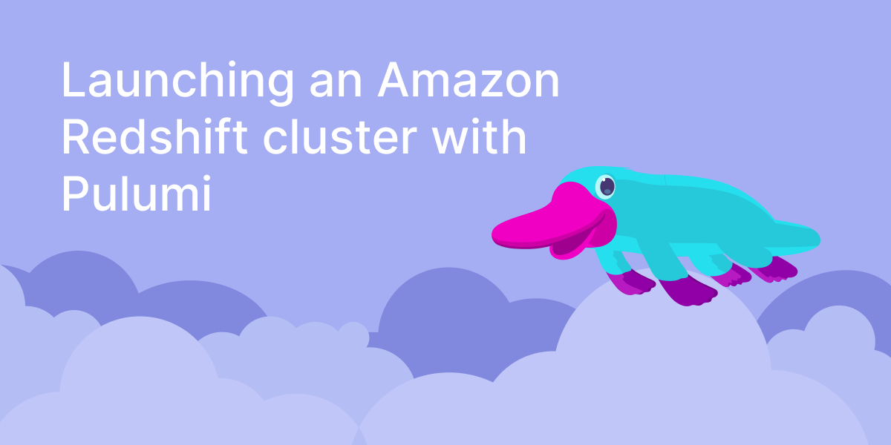

Infrastructure as code (IaC) enables us to manage cloud resources using a declarative approach. We keep declarations of the cloud environment in the text file of the specific format. So, instead of provisioning cloud resources using the Amazon Web Console (AWS), we can set up our cloud environment using a command-line interface and a declaration. This allows us to keep declarations in the source control system and deploy cloud resources as we would with our application.

AWS provides CloudFormation as an IaC tool. However, using CloudFormation isn’t always straightforward. We have a visual editor with the AWS console, enabling us to draw and configure cloud resources to deploy. This approach is very often difficult to learn and use.

To solve this problem and accelerate IaC adoption, Pulumi offers the cross-platform IaC approach, which allows us to choose among the most popular scripting or programming languages, including TypeScript, Python, Go, C#, and Java. With Pulumi, we declare and configure our cloud resources as we would create programming objects in your application code. We can use IaC much faster without learning complicated tools like CloudFormation.

This article shows you how to use Pulumi to deploy an Amazon Redshift cluster in a virtual private cloud in AWS. It also demonstrates how to set up an Amazon S3 bucket and configure the AWS identity and access management (IAM) role so the Amazon Redshift cluster can access objects in the S3 bucket.

Here’s a list of things you need to follow this article:

* [Pulumi](/docs/get-started/aws/) configured for AWS
* [Node.js](https://nodejs.org/en/download/)
* Code editor like Visual Studio Code.

You can find the project code [here](https://github.com/dawidborycki/pulumi-redshift).

## Setting up the Project

We use TypeScript to set up the project. So, start by creating the new Pulumi project using the `aws-typescript` template:

```bash
$ mkdir pulumi-aws-redshift && cd pulumi-aws-redshift
$ pulumi new aws-typescript
```

For the project name, keep `pulumi-aws-redshift`. For the project description, keep the default value, and for the stack name, keep `dev`. For the AWS region, type the name of the AWS region where you deploy your resources. Here, we use `us-east-1`.

The wizard generates the project, including several files described in the [Pulumi documentation](/docs/get-started/aws/review-project/). We perform all the subsequent steps under the `index.ts` file.

## Virtual Private Cloud

Deploying the Amazon Redshift cluster to the virtual private cloud (VPC) requires the same steps you take with the AWS console or the CloudFormation template. So, you conform to the same requirements. Specifically, the VPC must contain several items the Amazon Redshift cluster also requires.

First, the VPC must have the Internet gateway attached to enable the cluster nodes to access the Internet. Second, the VPC contains a subnet. The latter is part of the subnet group.

So, open the `index.ts` file and replace its contents with the following statements:

```typescript
import * as aws from "@pulumi/aws";

// VPC
const vpc = new aws.ec2.Vpc("pulumi-vpc", {
    cidrBlock: "10.1.0.0/16",
    tags: {
        Name: "pulumi-vpc"
    }
});
```

The above code creates the new VPC with IP ranges configured using the classless inter-domain routing (CIDR) address of 10.1.0.0/16. Note that we also use the Name tag to change the resource name to pulumi-vpc. This shows the general approach to creating resources with Pulumi and TypeScript.

To provision and configure resources, we create a TypeScript object. Usually, we would construct the latter using a function constructor accepting three parameters:

* `name` is the unique name of the resource.
* `args` is an anonymous object representing resource options.
* `opts` is an anonymous object you can use to add custom resource creation behavior, like setting up the custom provider.

Here, we only use the first two parameters. Pulumi uses the first parameter to set the logical name for the resource. Since this might differ from the physical resource name, we also use the AWS-specific approach of setting the resource name with the [Name tag](https://docs.aws.amazon.com/AWSEC2/latest/UserGuide/Using_Tags.html). In the above example, we pass this tag using the `args` parameter.

Now add the internet gateway to attach to the VPC:

```typescript
// Internet gateway
const internetGateway = new aws.ec2.InternetGateway("internet-gateway", {
    vpcId: vpc.id,
    tags: {
        Name: "pulumi-internet-gateway",
    },
});
```

To create the Internet gateway, we proceed as previously described. The only new thing is the additional parameter in the args object, where apart from tags, we also set the vpcId. The latter comes from the id property of the vpc object we declared earlier.

Now, deploy the resources by typing:

```bash
$ pulumi up
```

The output of this command looks as follows:

```

```

Use arrows to choose yes, then press Enter. Pulumi provisions the VPC and the Internet gateway. You can see all this under the AWS console. Here’s what the VPC console looks like:



And the Internet gateway:


## Subnet and Subnet Group

After creating the VPC, we add the subnet and the subnet group. We start by adding the subnet declaration.

Add the following statements to the index.ts (right below the declaration of the Internet gateway):

```typescript
// Subnet
const subnet = new aws.ec2.Subnet("pulumi-subnet", {
    cidrBlock: "10.1.1.0/24",
    availabilityZone: "us-east-1a",
    vpcId: vpc.id,
    tags: {
        Name: "pulumi-subnet",
    },
});
```

Note that subnets can currently only be created in the following availability zones: `us-west-2a`, `us-west-2b`, `us-west-2c`, `us-west-2d`. If you cannot create a subnet in one of these zones, try removing `availabilityZone` from the code.

To configure the subnet, we provide the Classless Inter-Domain Routing block, which represents the IP range. Then, we associate the subnet with the availability zone (`us-east-1a`) and the subnet with the VPC. Finally, we create the Name tag with the value pulumi-subnet.

To create the subnet group, add the following statements:

```typescript
// Subnet group
const subnetGroup = new aws.redshift.SubnetGroup("pulumi-subnet-group", {
    subnetIds: [
        subnet.id,
    ],
    tags: {
        Name: "pulumi-subnet-group",
    },
});
```

Under the subnet group, you must provide the collection of subnet identifiers that will join the group. You pass this collection using the `subnetIds` attribute.

Now, update our resource stack by typing:

```bash
$ pulumi up
```

The output should look as follows:

```

```

You can preview the subnet on the AWS console:


## Amazon Redshift Cluster

After provisioning the necessary resources, we can move forward to create the Amazon Redshift cluster. To do so, let’s supplement index.ts with the following statements:

```typescript
// Redshift cluter
const redshiftCluster = new aws.redshift.Cluster("pulumi-redshift-cluster", {
    clusterIdentifier: "pulumi-redshift-cluster",
    clusterType: "single-node",
    databaseName: "tempdb",
    masterPassword: "Passw0rD",
    masterUsername: "admin",
    nodeType: "dc2.large",
    clusterSubnetGroupName: subnetGroup.name,
    skipFinalSnapshot: true
});
```

We used the hardcoded credentials in the above declaration. In general, the best practice is to [use the Pulumi secret](/docs/intro/concepts/secrets/#secrets).

The above declaration spins up the single-node Redshift cluster using the dc2.large node type (2 vCPUs and 15 GB RAM). We also configure the database by setting its name to tempdb and the master credentials (username and password) to admin and Passw0rD, respectively. To pass the name of the subnet group, we use the clusterSubnetGroupName attribute. The last parameter, skipFinalSnapshot is set to true. By doing this, we can delete the cluster without taking its snapshot. The snapshot is useful for recreating the cluster using the previous state. By default, skipFinalSnapshot is false, so we have to provide the finalSnapshotIdentifier. Otherwise, we can’t delete the cluster.

Now provision the resource:

```bash
$ pulumi up
```

The output looks as follows. Note that cluster creation might take up to a few minutes, depending on the AWS region:


We can also preview the cluster creation status under the AWS console:


## Amazon S3 Bucket and the AWS IAM Role

Now, we move to declare the Amazon S3 bucket, which can store source data for the Amazon Redshift cluster. To enable the cluster to read objects from the Amazon S3 bucket, we also create the AWS Identity and Access Management (IAM) role. The role has the inline policy, enabling read-only access to Amazon S3.

We start by adding the declaration, which provisions the Amazon S3 bucket.

You must add this before the statements related to the Amazon Redshift cluster:

```typescript
// S3 bucket
const bucket = new aws.s3.Bucket("pulumi-s3-bucket");
```

The latter declaration provisions the new bucket.

Try this out by typing

```bash
$ pulumi up
```

We can see our bucket in the AWS console:


Now, declare the AWS IAM role:

```typescript
const iamRole = new aws.iam.Role("pulumi-iam-role", {
    assumeRolePolicy: JSON.stringify({
        Version: "2012-10-17",
        Statement: [{
            Action: "sts:AssumeRole",
            Effect: "Allow",
            Sid: "",
            Principal: {
                Service: "redshift.amazonaws.com",
            },
        }],
    }),
    inlinePolicies: [{
        name: "pulumi-policy",
        policy: JSON.stringify({
            Version: "2012-10-17",
            Statement: [{
                Action: ["s3:Get*", "s3:List*"],
                Effect: "Allow",
                Resource: "*",
            }],
        }),
    }]
});
```

Place those declarations after the statements related to the AWS S3 Bucket but before the statements declaring the Amazon Redshift cluster.

We declare the AWS IAM role similar to the AWS console. We use a JSON-formatted object containing version and statement attributes. As with all other AWS services, the version is the publication date. The statement contains the action, effect, and principal. Here, we set those to sts:AssumeRole, Allow, and redshift.amazonaws.com, respectively. Then, we define the inline policy, which enables the principal to have read-only access to Amazon S3.

Deploy those resources by typing:

```bash
$ pulumi up
```

We can then see the new role under the IAM console:


## Updating the Amazon Redshift Cluster with the AWS IAM Role

In the last step, we assign the AWS IAM role to the Amazon Redshift Cluster. We add the iamRoles attribute to the Amazon Redshift cluster declaration:

```typescript
// Redshift cluster
const redshiftCluster = new aws.redshift.Cluster("pulumi-redshift-cluster", {
    clusterIdentifier: "pulumi-redshift-cluster",
    clusterType: "single-node",
    databaseName: "tempdb",
    masterPassword: "Passw0rD",
    masterUsername: "admin",
    nodeType: "dc2.large",
    clusterSubnetGroupName: subnetGroup.name,
    skipFinalSnapshot: true,
    iamRoles: [iamRole.arn]
});
```

Specify the roles using their Amazon Resource Names (ARNs). Here, we use just one role and obtain its ARN by reading the arn property of the object created previously.

We can now update the cluster to confirm that we assigned the AWS IAM role to the cluster:

```bash
$ pulumi up
```

To see the IAM role go to the properties of the cluster and scroll down to **Associated IAM roles**:


After preparing the infrastructure, we can now use it to process data. The first step is to load data from the S3 source, [as demonstrated in the AWS documentation](https://docs.aws.amazon.com/redshift/latest/dg/tutorial-loading-data.html).

Now remove all deployed cloud resources using the single command:

```bash
pulumi destroy
```

## Summary

This article demonstrated how to use Pulumi to declare and provision several AWS resources using IaC. It started with the Pulumi AWS project template. It then updated it to provision a virtual private cloud, Internet gateway, subnet, subnet group, S3 bucket, IAM role, and the Amazon Redshift cluster. Doing so achieved a declaration of cloud resources, which we can keep in the git repository and track all changes.

Though we could achieve similar results using CloudFormation, the AWS-specific IaC tool, declaring cloud resources with TypeScript is much more straightforward. We don’t need to learn any new programming language — as we would with CloudFormation — and we can rapidly provision our cloud resources. Pulumi is a great solution for developers or DevOps who are familiar with programming languages.

Hopefully, this article encourages you to [try Pulumi](/docs/get-started/) for your project today!
