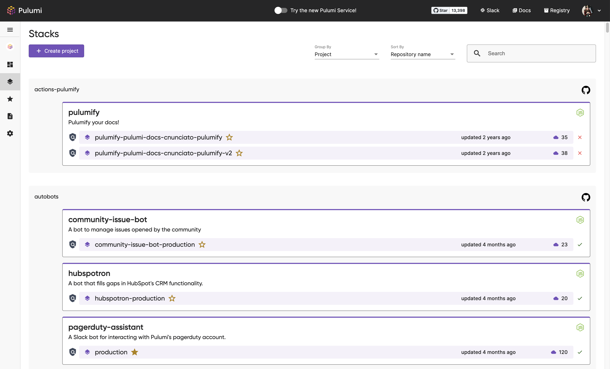

It’s been nearly four years since the Pulumi Service console launched back in 2018. The [Pulumi Service]() is the easiest way to use Pulumi’s open source, universal infrastructure as code SDK at scale and provides a fully managed experience. It handles infrastructure state and secrets, sets up SAML SSO, integrates with CI/CD pipelines, and enforces compliance rules.

In these last four years, the Service’s features and capabilities have grown quickly. We’ve added features like x, y, and z. But throughout all these changes, the look and feel of the Service has largely stayed the same—until now!

<!--more-->

Today we’re excited to launch a set of improvements to the overall user experience of the Pulumi Service. These updates include:

- Easier navigation around the Service
- Quick access to the stacks you care about most with a new Favoriting feature
- Increased organizational insights on the Service Dashboard

Want to try these features out for yourself? Next time you sign in to your Pulumi Service account, select the toggle in the black utility toolbar at the top of the page to “Try the new Pulumi Service!” You can take these new changes for a ride, or return to the old experience at any time.

## Easily navigate across the Pulumi Service with the new left navigation pane

Among the biggest changes to the feel of the Service is our new left navigation pane. Navigation items like your Dashboard, Stacks, and Settings are accessible in the new pane from anywhere in the Service.

The navigation pane consolidates actions and information so it's easy for you to find common items. You'll find options in the pane to:

- switch between your individual account and any other organizations you're part of
- create new organizations
- access your favorite stacks (read on to find out more!)
- directly access sub-pages like Billing or Access Tokens
- send us your feedback!

These changes will help you move through the Pulumi Service without losing your place and to ensure convenient access to key pages. You can even collapse the navigation pane for more screen real estate and still access any page you need.

If you're looking for your account details, they have moved into the black utility toolbar. To access your account settings or logout of the Pulumi Service, select your profile image at the top right of your browser window.

## Stack Favorites

Many Pulumi users have access to dozens of hundreds of stacks. But only a few of those stacks may require regular interaction. We've introduced a new Stack Favorites feature to let you flag the stacks that are most important. This way you can access those stacks from anywhere in the Service.

Your favorites list is your own. Even if you're part of an organization, your favorites won't be shared with anyone other than you. And you can have as many favorites as you like!

Look for the star icon next to any stack name and select it to start building your favorites list.

You can access the favorites list from two key locations in the Service: the left navigation pane and the dashboard. All your favorites will appear in the navigation pane under the “Stacks” heading. You'll also have your list of favorites in a new dashboard card.

## Richer Insights in the New Pulumi Service Dashboard

Lastly, we’ve made significant changes to the Pulumi Service dashboard. Now you can access more information to help survey your operations at a glance.

Organizations can access some quick usage statistics at the top of their dashboards:

- member count and +/- change in the past week
- total stack count and percent change in the past week
- total resource count and percent change in the past week
- number of successful updates in the past day, week, month, and year

If you're part of an organization, you'll also see a “Members” card that tracks recently joined members. If you're an admin, you can manage any pending invites from this card.

We've also exposed more operation updates in the “Latest Stack Activity” card. You can see up to ten most recent updates and favorite those stacks directly from the dashboard card.

## Try out the Pulumi Service today

We'd love for you to take this new and improved Pulumi Service for a ride! If you haven't already, you can [create a free account](https://app.pulumi.com/signup) and experience these changes for yourself when you toggle on the new experience at the top of the page. Don't hesitate to reach out on the [Pulumi Community Slack](https://slack.pulumi.com/?_gl=1*abbv2y*_ga*MTgxNzE0MTI3LjE2NDM3MzcwNTU.*_ga_FQHG5CVY2D*MTY1NzY0ODc4NC4xMzMuMC4xNjU3NjQ4Nzg0LjYw) about any thoughts and feelings you have about these changes or any and all things Pulumi! We also have a [public GitHub repo](https://github.com/pulumi/service-requests/issues) to track any requests related to the Service. We're more than happy to learn from our community.

These changes wouldn’t be possible without the users who generously gave their time to have a conversation with us. We'll continue to translate user feedback into a better Pulumi experience. Know that this is just the start to even more improvements across the Service and the Pulumi platform!
