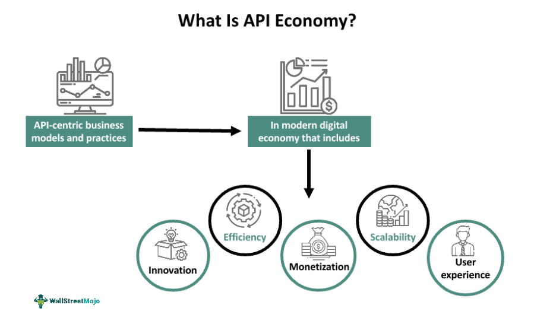
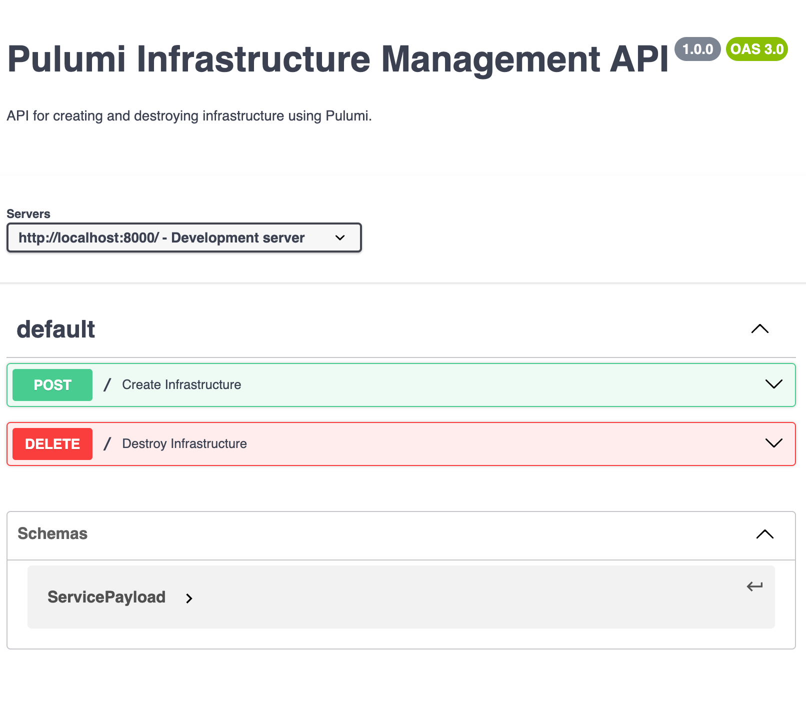

When I am talking with community members, who are not using Pulumi yet, I often get asked what would be a good way to include their Infrastructure as Code (IaC) into existing software like a REST API. And my answer is always the same: Use our Pulumi Automation API.

With the Pulumi Automation API you can include Pulumi IaC into your existing software, and this for any of the Pulumi supported programming languages like TypeScript, Python, Go, or C#. This gives you a greater flexibility and control, which you will not have with other IaC tools like CloudFormation or Terraform.

This opens now many doors of opportunity to expose your services as an API, it could be internally to your organization or externally to your potential customers. This opportunity for innovation fuels what is known as the [API Economy](https://konghq.com/blog/enterprise/api-economy).

## What is API Economy?



As a matter of fact: — APIs enable innovation.

> Over [40% of large organizations](https://www.forbes.com/sites/patricksalyer/2021/05/04/api-stack-the-billion-dollar-opportunities-redefining-infrastructure-services--platforms/?sh=2d6c47f043f9) have 250+ APIs. And 71% plan to use even more APIs this year.

API Economy is a term that is used to describe the way that organizations are using APIs to create new business models and revenue streams. APIs are the building blocks of modern software development, and they allow developers to build on  top of existing services and create new services that are greater than the sum of their parts.

Major international corporations leveraging the API economy through robust API strategies include Google, Amazon, Stripe, Twilio, Slack, and many other renowned brands. Google's initial Maps service, for instance, has evolved into a comprehensive platform offering Maps, Routes, and Places APIs and SDKs. These tools enable companies to incorporate both dynamic and static maps into their applications and websites, offer navigational guidance, access 360° Street View images, utilize geolocation services, and more. This transformation exemplifies the concept of value multiplication in the API economy, as described by [Gartner Vice President Kristin Moyer](https://www.gartner.com/smarterwithgartner/welcome-to-the-api-economy):

> "The API economy is an enabler for turning a business or organisation into a platform. Platforms multiply value creation because they enable business ecosystems inside and outside of the enterprise to consummate matches among users and facilitate the creation and exchange of goods, services and social currency so that all participants are able to capture value."

## What is Pulumi Automation API in a nutshell?

Pulumi Automation API is a set of SDKs that allow you to interact with your Pulumi stacks programmatically. This means that you can use the Automation API to create, update, and delete stacks, as well as to query their current state. The Automation API is built on top of the Pulumi engine, which means that it is fully compatible with all of the existing Pulumi providers and resources.

And it is this capability that allows you to build your own Service API on top of Pulumi. We can now build a REST or gRPC API endpoint that, depending on the request parameters, will create, update, or delete a Pulumi stack. This API can then be exposed to the rest of the organization, allowing developers to interact with their infrastructure in a programmatic way.

## How to build your own Service API with Pulumi Automation API?

Let's take a look at how you can build your own Service API with Pulumi Automation API.

For this purpose, we will build two basic REST services writen in [TypeScript](https://www.typescriptlang.org/) and in [Python](https://www.python.org/).



{}

```typescript
import express from "express"
import * as dotevnv from "dotenv"
import cors from "cors"
import helmet from "helmet"
import {fullyQualifiedStackName, RemoteWorkspace} from "@pulumi/pulumi/automation";

dotevnv.config()

if (!process.env.PORT) {
    console.log(`No port value specified...`)
}

const PORT = parseInt(process.env.PORT as string, 10)

const app = express()

app.use(express.json())
app.use(express.urlencoded({extended: true}))
app.use(cors())
app.use(helmet())


interface ServicePayload {
    name: string;
    org: string;
    project: string;
    stack: string;
    region: string;
}

async function setUpPulumiProgram(payload: ServicePayload) {
    const org = payload.org;
    const project = payload.project;
    const stackName = fullyQualifiedStackName(org, project, payload.stack);
    const awsRegion = payload.region;

    return await RemoteWorkspace.createOrSelectStack({
        stackName,
        url: "https://github.com/pulumi/examples.git",
        branch: "refs/heads/master",
        projectPath: project,
    }, {
        envVars: {
            AWS_REGION: awsRegion,
            AWS_ACCESS_KEY_ID: process.env.AWS_ACCESS_KEY_ID ?? "",
            AWS_SECRET_ACCESS_KEY: {secret: process.env.AWS_SECRET_ACCESS_KEY ?? ""},
            AWS_SESSION_TOKEN: {secret: process.env.AWS_SESSION_TOKEN ?? ""},
        },
    });
}

app.post('/', async (req, res) => {
    const payload: ServicePayload = req.body;

    if ((payload.name) || !payload.org || !payload.project || !payload.stack || !payload.region) {
        res.status(400).send('Name, org, project, stack and region are required');
        return;
    }

    const stack = await setUpPulumiProgram(payload);

    const upRes = await stack.up({onOutput: console.log});
    res.status(200).send(`url: ${upRes.outputs.websiteUrl.value}`);
});

app.delete('/', async (req, res) => {
    const { name, org, project, stack, region } = req.query;

    if (!name || !org || !project || !stack || !region) {
        res.status(400).send('Name, org, project, stack, and region are required');
        return;
    }

    const payload: ServicePayload = {
        name: name as string,
        org: org as string,
        project: project as string,
        stack: stack as string,
        region: region as string
    }

    const prog = await setUpPulumiProgram(payload);
    await prog.destroy({onOutput: console.log});
    res.status(200).send('Stack destroyed');;
});


app.listen(PORT, () => {
    console.log(`Server is listening on port ${PORT}`)
})
```

{}

{}

```python
from fastapi import FastAPI, HTTPException
from pydantic import BaseModel
import pulumi.automation as auto
import os


app = FastAPI()

class ServicePayload(BaseModel):
    name: str
    org: str
    project: str
    stack: str
    region: str


def setup_pulumi_program(payload: ServicePayload):
    org = payload.org
    project = payload.project
    stack_name = auto.fully_qualified_stack_name(org, project, payload.stack)
    aws_region = payload.region

    return auto.create_or_select_remote_stack_git_source(
        stack_name=stack_name,
        url="https://github.com/pulumi/examples.git",
        branch="refs/heads/master",
        project_path=project,
        opts=auto.RemoteWorkspaceOptions(
            env_vars={
                "AWS_REGION":            aws_region,
                "AWS_ACCESS_KEY_ID":     os.environ["AWS_ACCESS_KEY_ID"],
                "AWS_SECRET_ACCESS_KEY": auto.Secret(os.environ["AWS_SECRET_ACCESS_KEY"]),
                "AWS_SESSION_TOKEN":     auto.Secret(os.environ["AWS_SESSION_TOKEN"]),
            },
        ),
    )

@app.post("/")
async def create(payload: ServicePayload):
    stack = setup_pulumi_program(payload)
    up_res = stack.up(on_output=print)
    return {"url": up_res.outputs['websiteUrl'].value}

@app.delete("/")
async def delete(name: str, org: str, project: str, stack: str, region: str):
    payload = ServicePayload(name=name, org=org, project=project, stack=stack, region=region)
    stack = setup_pulumi_program(payload)
    stack.destroy(on_output=print)
    return {"message": "Stack destroyed"}
```

{}

To test the REST services, you can use a tool like `curl` or Postman. Here is an example of how you can create a new stack using `curl`:

```bash
curl -X POST -H "Content-Type: application/json" -d '{"name": "myexample", "org": "myorg", "project": "myproject", "stack": "mystack", "region": "us-west-2"}' http://localhost:3000
```

And here is an example of how you can delete a stack using `curl`:

```bash
curl -X DELETE "http://localhost:8000/?name=myexample&org=myorg&project=myproject&stack=mystack&region=us-west-2"
```

## Next Steps

Now that we have our basic REST services, we can deploy them on a server (using a service like AWS Lambda, Google Cloud Functions, or Azure Functions) and expose them to the rest of the organization via an API Gateway. Parallel you can publish release notes and documentation to your organization, so that they can start using your new Service API.

On way could be to create an OpenAPI specification for your Service API and use a tool like Swagger to generate a client library for your organization. This way, developers can interact with your Service API in a programmatic way, without having to write any code.

Here is an example of an OpenAPI specification for our Service API:

```yaml
openapi: 3.0.0
info:
  title: My Organization Service API
  description: API for creating and destroying a specific piece of infrastructure
  version: 1.0.0
servers:
  - url: 'http://localhost:8000/'
    description: Development server
paths:
  /:
    post:
      summary: Create Infrastructure
      operationId: createInfrastructure
      requestBody:
        required: true
        content:
          application/json:
            schema:
              $ref: '#/components/schemas/ServicePayload'
      responses:
        '200':
          description: Infrastructure successfully created
          content:
            application/json:
              schema:
                type: object
                properties:
                  url:
                    type: string
                    description: URL of the created infrastructure
        '400':
          description: Bad request if the input payload is incorrect
        '500':
          description: Internal server error
    delete:
      summary: Destroy Infrastructure
      operationId: destroyInfrastructure
      parameters:
        - in: query
          name: name
          schema:
            type: string
          required: true
          description: Name of the service
        - in: query
          name: org
          schema:
            type: string
          required: true
          description: Organization in Pulumi
        - in: query
          name: project
          schema:
            type: string
          required: true
          description: Project name in Pulumi
        - in: query
          name: stack
          schema:
            type: string
          required: true
          description: Stack name in Pulumi
        - in: query
          name: region
          schema:
            type: string
          required: true
          description: AWS region where the service will be deployed
      responses:
        '200':
          description: Infrastructure successfully destroyed
          content:
            application/json:
              schema:
                type: object
                properties:
                  message:
                    type: string
                    description: Confirmation message of the destruction
        '400':
          description: Bad request if the required parameters are missing
        '500':
          description: Internal server error
components:
  schemas:
    ServicePayload:
      type: object
      required:
        - name
        - org
        - project
        - stack
        - region
      properties:
        name:
          type: string
          description: Name of the service
        org:
          type: string
          description: Organization in Pulumi
        project:
          type: string
          description: Project name in Pulumi
        stack:
          type: string
          description: Stack name in Pulumi
        region:
          type: string
          description: AWS region where the service will be deployed
```

Navigate to the [Swagger Editor](https://editor.swagger.io/) and paste the above OpenAPI specification to see how it looks like.



## Conclusion

In this blog post, we have seen how you can use Pulumi Automation API to build your own Service API and expose it to your organization.

We have also seen how you can use API Economy to create new business models and revenue streams by exposing your infrastructure to the rest of the organization.

I hope that this blog post has given you some ideas on how you can take your IaC to the next level and make it more accessible to your organization.
