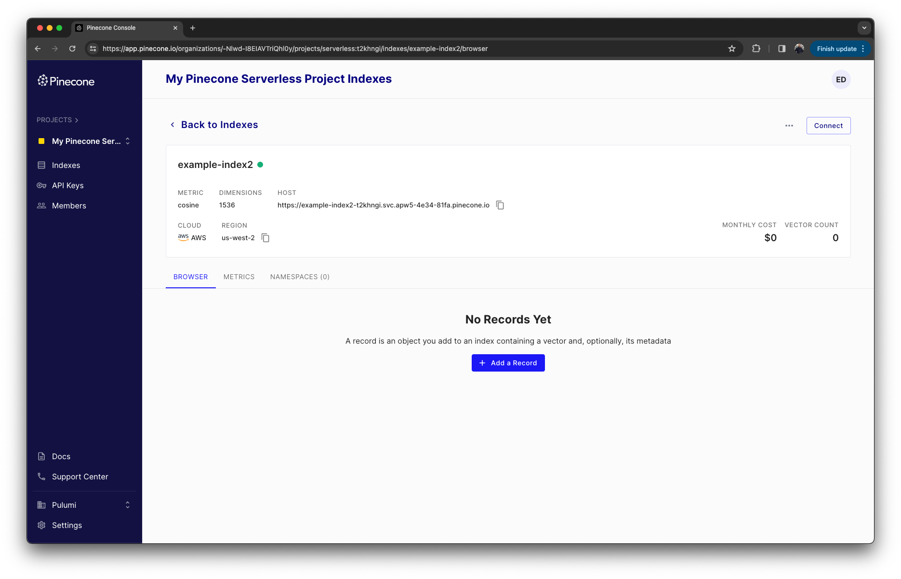

## Hello, Pulumi Pinecone Provider!  👋

The [Pinecone](https://pinecone.io/) integration with [Pulumi](https://www.pulumi.com) offers now a native way to manage Pinecone Serverless indexes. Utilize any of Pulumi's [supported languages](https://www.pulumi.com/docs/languages-sdks/) to effortlessly create, update, and remove your Pinecone indexes. This integration facilitates the application of [Infrastructure as Code](https://www.pulumi.com/what-is/what-is-infrastructure-as-code/) principles, helping you to work even more efficiently. Furthermore, this gives you the benefit of tapping into Pulumi's wide range of [providers](https://www.pulumi.com/product/), offering you a diverse and powerful set of tools to enhance your development work.

## What is Pinecone (Serverless)? 🧐

Pinecone is a fully managed [vector database](https://www.pinecone.io/learn/vector-database/) with an easy-to-use API that allows you to build and deploy high-performance AI applications. Applications involving large language models, generative AI, and semantic search require a vector database to store and retrieve [vector embeddings](https://www.pinecone.io/learn/vector-embeddings-for-developers/). Vector embeddings enable AI applications to gain a deeper understanding of the data and maintain a long-term memory to draw upon.

The backbone of Pinecone is the [vector index](https://docs.pinecone.io/docs/overview#pinecone-indexes-store-records-with-vector-data). A vector index allows you to store and retrieve vector embeddings. What makes Pinecone indexes so powerful is their low latency for billions of vectors.

Starting from January 2024, Pinecone has introduced a new serverless indexing option, complementing their existing pod-based index system. This new feature streamlines the indexing process by removing the necessity to select pod types, shards, or sizes. Its flexibility allows for seamless scaling according to your needs.

A key advantage of this serverless approach is its cost-effectiveness, achieved through a "pay for what you use" pricing strategy.

## Getting Started 🤖

Using the Pinecone Provider for Pulumi is as easy as it can be. You can install the Pinecone Provider following the documentation for the Pinecone Provider in the [Pulumi Registry](https://www.pulumi.com/registry/packages/pinecone/) or by using dedicated starter templates.

The starter templates are specially designed for you to bootstrap a Pulumi program with a Pinecone index. Once you have your bootstrap program, you can use this as a starting point to create your own Pinecone Serverless indexes.

### Deploying a Pinecone Serverless Index

```shell
pulumi new pinecone-serverless-<language>
```

Will create a new Pulumi project with a Pinecone serverless index. Let's take a look at the Typescript example:

```shell
pulumi new pinecone-serverless-typescript
```

This will create a new Pulumi project and all the necessary files to deploy a Pinecone index. The `index.ts` file contains the following code:

```typescript
import * as pulumi from "@pulumi/pulumi";
import * as pinecone from "@pulumi/pinecone";

const myPineconeIndex = new pinecone.PineconeIndex("my-pinecone-index", {
    name: "my-pinecone-index",
    dimension: 512,
    metric: pinecone.IndexMetric.Cosine,
    spec: {
        serverless: {
            cloud: pinecone.ServerlessSpecCloud.Aws,
            region: "us-west-2",
        },
    },
});
export const output = {
    value: myPineconeIndex.host,
};
```

In this code, we define a new Pinecone Serverless index with the name `my-pinecone-index` and a dimension of `512`. We use `cosine` as the distance metric and define the index to be serverless and to be deployed in the `us-west-2` region of AWS.

To deploy this example, you need to set your Pinecone API key as an environment variable:

```shell
export PINECONE_API_KEY="xxxxx-xxxx-xxxx-xxxx-xxxxx"
```

Then you can run the following Pulumi command to deploy the example:

```shell
pulumi up
```

You will get a preview of the changes that will be applied to your Pinecone account. If you are happy with the changes, you can confirm them by typing `yes`. This will create the Pinecone index and output the host name of the index to use in your application.

```shell
pulumi up
Previewing update (dev)

     Type                             Name               Plan
 +   pulumi:pulumi:Stack              pinecone-ts-dev    create
 +   └─ pinecone:index:PineconeIndex  my-pinecone-index  create

Outputs:
    output: {
        value: output<string>
    }

Resources:
    + 2 to create

Do you want to perform this update? yes
Updating (dev)

     Type                             Name               Status
 +   pulumi:pulumi:Stack              pinecone-ts-dev    created (6s)
 +   └─ pinecone:index:PineconeIndex  my-pinecone-index  created (3s)

Outputs:
    output: {
        value: "my-pinecone-index-t2khngi.svc.apw5-4e34-81fa.pinecone.io"
    }

Resources:
    + 2 created

Duration: 8s
```

Have a look into your Pinecone console, you should see newly created serverless index appear and ready to use.



### Deleting a Pinecone Index

Deleting a Pinecone index is as simple as creating one. You can delete a Pinecone Serverless index by simply running following command:

```shell
pulumi destroy
```

This will delete the Pinecone index for you.

>Be aware that this will also delete all the data stored in the index.

### Programmatically Creating a Pulumi Pinecone Provider

There are situations where you might want to create a Pinecone index programmatically as part of multiple providers in one Pulumi program. Examples of this could be the creation additional infrastructure in AWS or a GitHub repository to hold your application code.

You can do this by creating a Pinecone Provider programmatically and passing the provider in the resource creation. Here is an example code on how this could look like.

```typescript
const myPinceconProvider = new pinecone.Provider("my-pinecone-provider", {
    APIKey: "my-pinecone-api-key",
});

const myPineconeIndex = new pinecone.PineconeIndex("my-pinecone-index", {
    name: "my-pinecone-index",
    dimension: 512,
    metric: pinecone.IndexMetric.Cosine,
    spec: {
        serverless: {
            cloud: pinecone.ServerlessSpecCloud.Aws,
            region: "us-west-2",
        },
    },
}, {
    provider: myPinceconProvider,
});
```

## Conclusion 💡

As shown in this blog post, the Pinecone Provider for Pulumi allows you to seamlessly integrate and manage your Pinecone  using any Pulumi-supported language. This enables platform engineers and developers to maintain easily manageable and reproducible infrastructure as code for their Pinecone indexes.

As always, we welcome your feedback and contributions in the [Pulumi Community Slack](https://slack.pulumi.com/), [GitHub repository,](https://github.com/pulumi/pulumi) and [Pulumi Community Discussions](https://github.com/pulumi/pulumi/discussions).

New to Pulumi? Signing up is easy and free. [Get started today](http://localhost:1313/docs/get-started/)!

Happy AI building!
