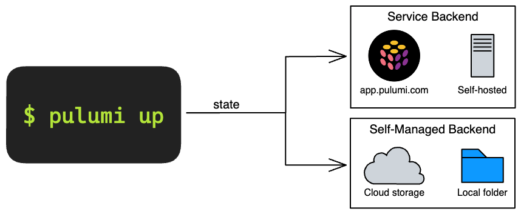
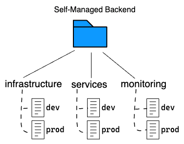
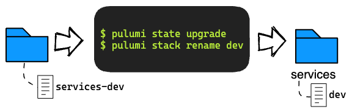

Pulumi's Self-Managed Backend has long been constrained in that
it only recognized stacks, and didn't have a concept of projects.
This made it less flexible and occasionally required involved workarounds.
Indeed, we heard from many of you that this limitation got in your way.

We've listened to your feedback,
and we're very excited to announce that we've added
support for **Project-Scoped Stacks** in Pulumi's Self-Managed backend!

<!--more-->

This change makes the Self-Managed Backend consistent with how
the Pulumi Service Backend operates and scopes stacks.

## What are State Backends?

Each [Pulumi stack](/docs/intro/concepts/stack/) has its own metadata about
your infrastructure so it can manage your cloud resources.
This metadata is called [_state_](/docs/intro/concepts/state/)
and it is stored in a _backend_ of your choosing:
**Service** or **Self-Managed**.

The **Service** Backend is hosted at [`app.pulumi.com`](https://app.pulumi.com)
or [on your own server](https://www.pulumi.com/product/self-hosted/),
and provides the best combination of usability, safety, and security for most users.

The **Self-Managed** Backend stores state in a JSON file,
deferring to you to manage persistence of this information.
You can store it in AWS S3, Azure Blob Store, Google Cloud Storage,
a system such as Minio or Ceph with an API compatible with AWS S3,
or on your local filesystem.
Using this backend trades reliability and convenience of the Service Backend
for additional control over where the information is stored.



See [Deciding On a State Backend](/docs/intro/concepts/state/#deciding-on-a-state-backend)
for more on how to choose a state backend.

Up until now, there was a discrepancy between how
the Service backend and self-managed backends stored state for a Pulumi stack:
the Service backend stores stack information scoped by organization and project
(e.g., `myorg/myproject/dev`),
whereas the self-managed backend performed no scoping.


In practice, this meant that you could not re-use stack names like "dev" or "prod"
between different Pulumi projects stored in the same self-managed backend.
You had to work around this by manually writing unique, project-qualified stack names
(e.g. "myproject-dev", "otherproject-dev").

We're pleased to announce that such workarounds are no longer necessary!

## Project-Scoped Stacks in Self-Managed Backends

With the latest release of Pulumi,
we've added support for project-scoped stacks to the Self-Managed Backend.
Stacks created in new or empty self-managed backends
will now be scoped under the project they belong to.

You no longer have to include the project name in the name of the stack.
You can create a new project and continue to use the short, simple names
that you're used, such as "dev", "staging", "production", etc.
across various projects, without risk of conflict with other projects.



### Upgrading existing backends

As mentioned in the previous section,
only stacks created in new or empty self-managed backends
will be scoped to their projects.
Existing backends will continue to operate as they do today.

If you have an existing self-managed backend that you'd like to upgrade
to use project-scoped stacks,
you can do so with the new `pulumi state upgrade` command,
which upgrades all stacks in the backend to use the new project-scoped layout.

```
$ pulumi state upgrade
This will upgrade the current backend to the latest supported version.
Older versions of Pulumi will not be able to read the new format.
Are you sure you want to proceed?
Please confirm that this is what you'd like to do by typing `yes`:
```

{}
Once a self-managed backend is upgraded,
older versions of the Pulumi CLI will be unable to access this backend.
This change cannot be reverted.
{}

If you previously included the project name in your stack names
as a way of making them unique across the self-managed backend,
you can use the `pulumi stack rename` command to clean up these names
after the upgrade.

```
$ pulumi stack rename --stack myproject-dev dev
```



## Referencing Project-Scoped Stacks

Project-scoped stacks in self-managed backends
are scoped under a virtual organization named "organization".
This value is constant and cannot be changed.
This allows for a consistent stack identity format
across both the Service Backend and the Self-Managed Backend.

For example, with self-managed backends,
you can refer to a fully-qualified stack with `organization/my-project/my-stack`.
If the currently selected project is 'my-project',
you can also use the shorthands `organization/my-stack` and `my-stack`&mdash;just
like the Service Backend.

    organization/my-project/my-stack
    organization/my-stack  // if inside my-project
    my-stack               // if inside my-project

## Availability

Support for project-scoped stacks in self-managed backends is now available in Pulumi v3.61.0.
Give it a try and share your thoughts with us on the [Pulumi Community Slack](https://slack.pulumi.com/)!
