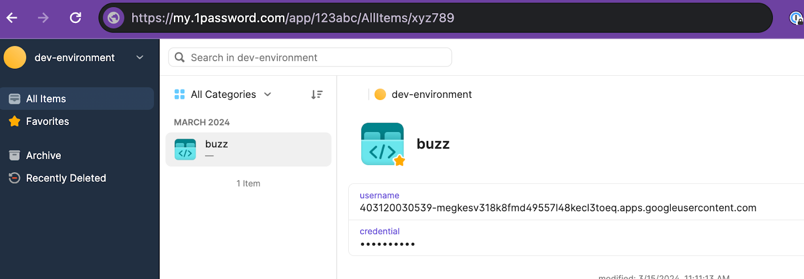
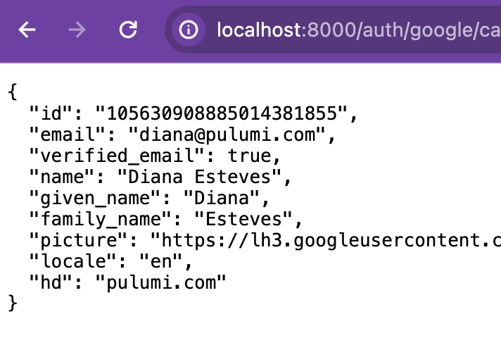
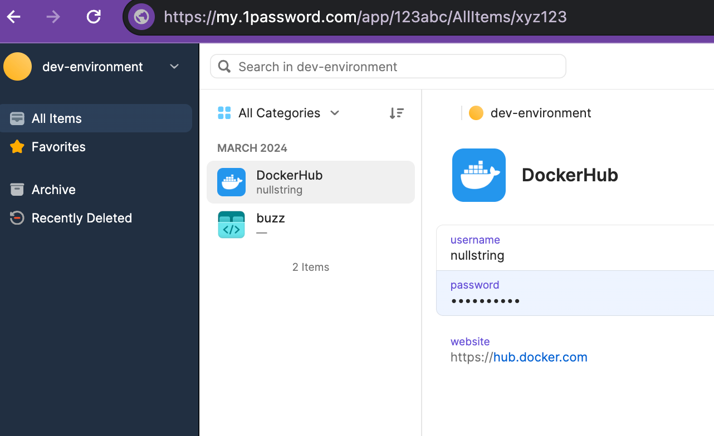

Today, we extend the capabilities of Pulumi ESC (Environments, Secrets, and Configuration) by integrating with 1Password, a developer-friendly secrets management solution.

<!--more-->

At Pulumi, we use several 1Password vaults to share common credentials across and within teams. Integrating 1Password with Pulumi ESC underscores our dedication to enhancing the developer experience and addresses the most requested integration since the launch of ESC. The integration is now available to our users in public preview.

We invite developers to explore these new capabilities and experience how they can streamline their workflows. Adding 1Password to our list of supported providers aims to address the growing demand for effective secrets management in the dynamically evolving cloud environment.  

## See it in action



In the video above,  

1. Mr. Keys generates and stores Google OAuth 2.0 Client IDs in 1Password

2. Mr. Keys configured Pulumi ESC with 1Password.

    ```yaml
    values:
      1password:
        secrets:
          fn::open::1password-secrets:
            login:
              serviceAccountToken:
                fn::secret:
                  ciphertext: ZXN*not shown*...=
            get:
              google_oauth_client_id:
                ref: "op://dev-environment/buzz/username"
              google_oauth_client_secret:
                ref: "op://dev-environment/buzz/credential"
      environmentVariables:
        GOOGLE_OAUTH_CLIENT_ID: ${1password.secrets.google_oauth_client_id}
        GOOGLE_OAUTH_CLIENT_SECRET: ${1password.secrets.google_oauth_client_secret}
    ```

3. Ms. Code tests her Golang application locally with the dynamically retrieved Google OAuth credentials.

    ```bash
    # sans secrets management, expected to fail
    $ go run main.go
    2024/03/21 14:32:09 Starting HTTP Server. Listening at ":8000"
    Missing required parameter: client_id
    Error 400: invalid_request

    # with pulumi esc + 1password integration ✨🔐✨
    $ esc run buzz-dev-environment go run main.go
    2024/03/21 14:32:09 Starting HTTP Server. Listening at ":8000"
    ```

4. Ms. Code successfully authenticates with her Google OAuth credentials.

5. At a later point, Ms. Code needs DockerHub credentials to push her image, so she asks Mr. Keys to add these. Mr. Keys stores the Docker username and personal access token in 1Password. (This part is not shown in the demo clip.)

6. Mr. Keys updates the Pulumi ESC Environment, `​​buzz-dev-environment`

    ```yaml
    values:
      1password:
        secrets:
          fn::open::1password-secrets:
            login:
              serviceAccountToken:
                fn::secret:
                  ciphertext: ZXN*not shown*...=
            get:
              google_oauth_client_id:
                ref: "op://dev-environment/buzz/username"
              google_oauth_client_secret:
                ref: "op://dev-environment/buzz/credential"
              docker_pat:
                ref: "op://dev-environment/dockerhub/password"
              docker_usr:
                ref: "op://dev-environment/dockerhub/username"
      environmentVariables:
        GOOGLE_OAUTH_CLIENT_ID: ${1password.secrets.google_oauth_client_id}
        GOOGLE_OAUTH_CLIENT_SECRET: ${1password.secrets.google_oauth_client_secret}
        DOCKER_PAT: ${1password.secrets.docker_pat}
        DOCKER_USR: ${1password.secrets.docker_usr}
    ```

7. Lastly, Ms. Code then consumes the credentials via Pulumi ESC to log in and push the image

    ```bash
    $ esc run buzz-dev-environment  -- bash -c 'echo "$DOCKER_PAT" | docker login -u $DOCKER_USR --password-stdin'
    Login Succeeded

    $ TAG="nullstring/buzz:dev"
    $ docker build . -t $TAG
    $ docker push $TAG
    ```

## Summary

By joining forces with 1Password, Pulumi ESC strives to offer a "secrets agnostic" tool that effortlessly integrates with various secrets management solutions. This integration is poised to become an essential component in developers' toolkits, allowing for an easy-to-use developer experience while elevating security standards in their cloud infrastructure management.

* Visit the [1Password+Pulumi ESC docs](https://www.pulumi.com/docs/esc/providers/1password-secrets/) to learn more about the syntax.
* Visit the [Pulumi ESC docs](https://www.pulumi.com/docs/esc/environments/ ) to learn more about Pulumi ESC and a complete list of supported providers.

## Next Steps

Stay tuned as we evolve Pulumi ESC, ensuring it remains at the forefront of platform engineering innovation. To further enrich your skills and knowledge, we invite you to register for our upcoming workshop, ["Managing team secrets with 1Password & Pulumi ESC"](https://www.pulumi.com/resources/managing-team-secrets-1password-pulumi-esc/), designed to help you start with Pulumi ESC and its integration with 1Password.
