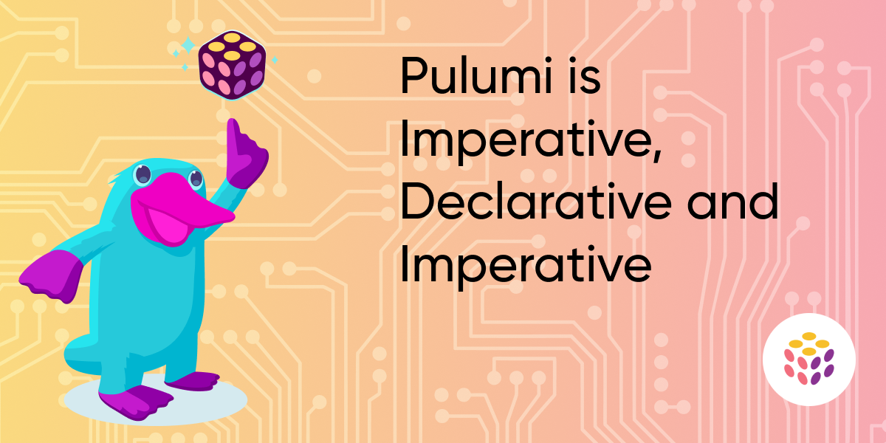

<!--
Summary:
- show single binary setup of Terraform: HCL processing & Engine
- show double binary setup of Pulumi: Language Host & Engine
- indicate that the chosen language (imperative or not) doesn't have any implications of the engine remaining declarative
- we chose a gRPC protocol, rather than an in-process call to request creation of resources to the engine
- the provisioning magic happens in the engine & the providers
- now comes the nifty part
- with this separation, Pulumi brings cloud engineering closer to developers
- we allow for components (Pulumi Packages) to be written in any language given a component is a resource by itself.
- we allow for policies to be written with the same ease as abstractions.
- we mix it all in a single setup

Sketch the setup of the article as the description of the PR for reviewers
-->

On a weekly basis, articles and tweets pass by discussing whether or not some specific tool is imperative or declarative.
It's no surprise that Pulumi is often the tool being debated. What if I tell you that Pulumi is imperative, declarative and imperative?

<!--more-->

When we look at our [Frequently Asked Questions](/docs/support/faq/#is-pulumi-imperative-or-declarative), we read the following on the declarative versus imperative topic:

> Pulumi is a declarative tool that uses imperative languages to define your end state. The language is used for authoring your program.
> It’s not used for talking to the cloud provider API.

The title of the article mentions `imperative` and `declarative` both. Pulumi leverages the best of both worlds
into our product.



Pulumi tries to offer a solution where our customers are only limited by their imagination rather than the tool at hand.
Let me use the Pulumi architecture to highlight why I mention *imperative* twice.

## Pulumi Architecture

If you don't know the Pulumi architecture, here is the diagram from our [How Pulumi Works](/docs/intro/concepts/how-pulumi-works/) page:


You code your infrastructure in your preferred programming language. When you are done coding, you run `pulumi up` and the Pulumi CLI starts
the language host for your selected programming language, as well as the required providers. The interaction between these 3 parts of
the architecture results in the actual creation or modification of your infrastructure.

### Language Host

**TL;DR** Imperative, no doubt!

Under the hood, our Pulumi CLI does a lot of things, but one of the first actions is starting the language runtime which is configured in
the `Pulumi.yaml` project file. Here is a small Python example:

```python
from pulumi_aws import s3

bucket = s3.Bucket('bucket')

for i in range(10):
    s3.BucketObject(
        f'object-{i}',
        s3.BucketObjectArgs(
            bucket=bucket.id,
            key=str(i),
        )
    )
```

A Pulumi program models the to-be state of your infrastructure. If you read the program above, you can see that
we define 11 resources as our to be infrastructure:

* 1 AWS S3 bucket
* 10 Objects in the bucket created in the previous step

While this is definitely an imperative program, there is one important thing to understand: instantiating an
`s3.Bucket`, `s3.BucketObject` or any other Pulumi resource should not be interpreted as an imperative creation
of the resource in the language host. Behind the scenes, any resource instantiation in the language host triggers a
`Register Resource` request to the Pulumi engine.

When the program has been executed, no resources have been created (or updated) yet. Where is the magic happening then?

### CLI and Engine

**TL;DR** Declarative, non-negotiable!

In the previous step, you found out that the language host sends requests to the engine to fullfil your to be
infrastructure.

It is now that our Pulumi engine gets to work. The engine combines the intended model of the infrastructure
received from the language host, the current state recorded in the state backend and the actual resource state
to compute which actions need to be executed to bring the actual state in line with the intended model.

The engine creates a directed acyclic graph (DAG) of all the resources, in a way to find out about
any dependencies between the modeled resources. Our little example contains dependencies:
every `s3.BucketObject` uses the `bucket.id` as way to define in which bucket these objects should be stored.
The property `id` is an `Output`, a type we introduced for a single need:

On a first run of `pulumi up`, the comparison between the intended model and an empty state makes the engine

TODO: first run / second run, no change / third run, change to nr of objects

Although you create the intended model of your infrastructure with an imperative language, our engine definitely
processes this in a declarative way.

### Providers

**TL;DR** Imperative, no doubt!

More text here.

<!--
And then everything _after_ that comment will appear on the post page itself.

Either way, avoid using images or code samples [in the first 70 words](https://gohugo.io/content-management/summaries/#automatic-summary-splitting) of your post, as these may not render properly in summary contexts (e.g., on the blog home page or in social-media previews).

## Writing the Post

For help assembling the content of your post, see [BLOGGING.md](https://github.com/pulumi/pulumi-hugo/blob/master/BLOGGING.md). For general formatting guidelines, see the [Style Guide](https://https://github.com/pulumi/pulumi-hugo/blob/master/STYLE-GUIDE.md).

## Code Samples

```typescript
let bucket = new aws.s3.Bucket("stuff");
...
```

## Images



## Videos



Note the `?rel=0` param, which tells YouTube to suggest only videos from same channel.

## Tweets



-->
