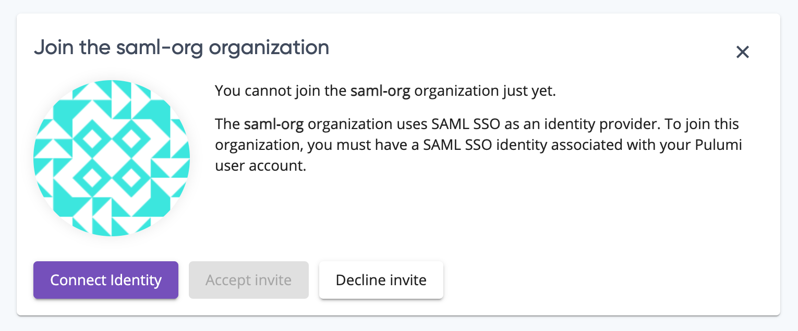

We release new versions of the Pulumi CLI every two weeks, new versions of the Pulumi Service multiple times a week, and new and updated cloud providers frequently. To keep up with all of these changes, you used to have to find the `CHANGELOG.md` files in the repo (or repos!) that you care about, which could get unwieldy. So, we're trying something new: a tri-weekly rollup of Pulumi news, features, and updates. If you find it useful, or have ideas on how we could improve it, let us know [on Twitter](https://twitter.com/pulumi) or in the [Pulumi Community Slack](https://slack.pulumi.com)!

In this update:

- New and updated cloud providers
  - Pulumi supports Amazon ECS Anywhere and Amazon App Runner
  - Pulumi supports Sumo Logic
  - 100 new resources in the Azure Native provider
- Pulumi engine and core technologies
  - Pulumi Packages schema documentation now available
  - Pulumi Packages schemas can reference other packages' types
  - Input parameters can now be marked as secret
  - Plugin install output now goes to `stderr`
  - Additional safety checks during `pulumi import`
- Pulumi Service and Pulumi.com
  - Easier acceptance of invites to organizations
  - Faster resource docs
  - Self-Hosted Pulumi Service now supports Azure Storage and Minio backends

<!--more-->

## New and updated cloud providers

### Pulumi supports Amazon ECS Anywhere and Amazon App Runner

Earlier this month, Amazon announced a [new version of their Elastic Container Service](https://aws.amazon.com/blogs/containers/introducing-amazon-ecs-anywhere/) that allows you to deploy containers to almost any server and a new fully-managed container-native service called [AWS App Runner](https://aws.amazon.com/blogs/containers/introducing-aws-app-runner/). Pulumi had full same-day support for both new services.

Learn how to get started with [ECS Anywhere]() and [App Runner]().

### Pulumi supports Sumo Logic

The new Sumo Logic provider for Pulumi allows you to manage Sumo Logic's big data and analytics services with Pulumi infrastructure-as-code.

Get started in the [SumoLogic provider docs]().

### 100 new resources in the Azure Native provider

We shipped 3 new versions of the Azure Native provider (1.10.0, 1.9.0, and 1.8.0) that collectively added 100 new resources that you can manage with the Azure Native provider. These include new analytics, machine learning, and security capabilities across the breadth of the Azure platform.

[See the full list](https://github.com/pulumi/pulumi-azure-native/blob/v1.10.0/CHANGELOG.md)

## Pulumi engine and core technologies

In this milestone, we shipped Pulumi versions [3.3.0](https://github.com/pulumi/pulumi/releases/tag/v3.3.0), [3.3.1](https://github.com/pulumi/pulumi/releases/tag/v3.3.1), and [3.4.0](https://github.com/pulumi/pulumi/releases/tag/v3.4.0). This section highlights key changes in those versions; for the full list, click the links for each version to visit the changelog for that version.

### Pulumi Packages schema documentation now available

Pulumi Packages, released at [PulumiUP earlier this year]() enable you to share Pulumi components with your colleagues and with the Pulumi community. But previously, it could be difficult to [author a Pulumi Package]() because the schema you use to define your package wasn't fully documented. Now, comprehensive schema documentation is available [in the docs]().

### Pulumi Packages schemas can reference other packages' types

For more complex Pulumi Package scenarios, you may want to be able to reference the types in one Pulumi Package from another Pulumi Package. Previously, this was only possible if you authored your Pulumi Package in Go; now, it's possible in all Pulumi Languages.

[#6777](https://github.com/pulumi/pulumi/issues/6777)

### Input parameters can now be marked as secret

It's now possible to mark any input parameter as a secret, which can be helpful when you need to pass in secret data, like when creating a Kubernetes Secret resource. Pulumi will protect these input parameters by encrypting them in the state and obfuscating them in outputs.

[pulumi/pulumi#7062](https://github.com/pulumi/pulumi/issues/7062)

## Pulumi Service and Pulumi.com

### Easier acceptance of invites to organizations

Previously, you could accept an invitation to join an organization even if you didn't have the required identity provider (say, a SAML identity) associated with your Pulumi account. This left you unable to access the organization to which you just accepted an invite. Now, the Pulumi Service will prompt you to connect the required identity provider to your existing Pulumi account so you can successfully accept the invitation and join the organization.

### Self-Hosted Pulumi Service now supports Azure Storage and Minio backends

TODO?
