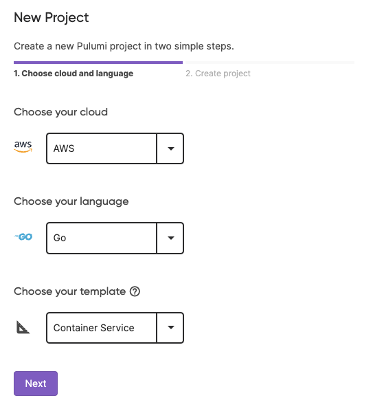

In addition to our [Cloud Engineering Days launches](/blog/nov-2022-launches), we have been busy shipping improvements in the last 2 months. Let's walk through the release highlights across Pulumi engineering areas from September and October so far. If you want to learn more between release blogs, follow the CLI improvements in the [pulumi/pulumi repo changelog](https://github.com/pulumi/pulumi/blob/master/CHANGELOG.md) and Pulumi Service features in the [new features blogs](/blog/tag/features).

<!--more-->

- Cloud Engineering Days Launches
- Cloud Providers and Packages
  - [New Resources in our Providers](#new-resources-in-our-providers)
  - [Pulumi+Kubernetes Improvements](#pulumikubernetes-improvements)
- Pulumi CLI and core technologies
  - [Pulumi CLI now displays time elapsed per resource](#pulumi-cli-now-displays-time-elapsed-per-resource)
  - [Automation API NodeJS parallel inline programs](#automation-api-nodejs-parallel-inline-programs)
  - [Add Output.format to the Python SDK](#add-outputformat-to-the-python-sdk)
  - [Cloning Pulumi templates from Azure DevOps](#cloning-pulumi-templates-from-azure-devops)
  - [Skip Checkpoints Experimental Flag](#skip-checkpoints-experimental-flag)
  - 
- Pulumi Service & Pulumi.com
  - [Pulumi Deployments](#pulumi-deployments)
  - [Architecture Templates Support](#architecture-templates-support)

## Cloud Providers and Packages

### New resources in our providers

We shipped new versions of the AWS Native provider, Google Native provider and the Azure Native provider that added support for 698 new resources in the last two months. 662 of the new resources were added in the Google Native provider, 17 new resources when excluding IAM policy binding improvements, 29 resources were added to the AWS Native provider and 7 were added to the Azure Native provider.

### Pulumi+Kubernetes Improvements

In October we announced a set of major updates which deepen and extend Pulumi’s support for Kubernetes and the Kubernetes ecosystem. Here are a few of these exciting enhancements:

- [Pulumi Kubernetes Operator v1.10](https://github.com/pulumi/pulumi-kubernetes-operator/#readme): New integration with Flux for richer GitOps support, and ability to deploy Pulumi stacks from directly within the Kubernetes resource model
- [New Pulumi Provider for Flux](https://www.pulumi.com/registry/packages/flux/): Manage Flux with Infrastructure as Code
- [Pulumi Kubernetes Provider v3.22](/registry/packages/kubernetes): Server Side Apply and Resource Patch
  
👉  Learn more in the [Pulumi+Kubernetes: New Flux Integration and Inline Programs blog](/blog/pulumi-kubernetes-new-2022).

## Pulumi CLI and core technologies

## Cloud Engineering Days Launches

In the Pulumi Cloud Engineering Days 2022 we are announced a set of important new advancements in the Pulumi platform designed to help organizations scale with their infrastructure as code needs. These announcements were as follows:

- [Pulumi Deployments](/blog/pulumi-deployments): The Pulumi Service now supports executing infrastructure deployments as a managed service, driven by click-to-deploy in the Console, Git push-to-deploy from GitHub, programmatic deployments via the Pulumi Service REST API as well as automation via the Pulumi Automation API. [Pulumi Deployments](/blog/pulumi-deployments) enables organizations to scale up their infrastructure automation. Learn more in the [Pulumi Service section](#pulumi-service--pulumicom) below!
- [Pulumi YAML GA](/blog/pulumi-yaml-ga): In addition to supporting rich general purpose programming languages like TypeScript, Python, Go, .NET and Java, Pulumi added support last May for Pulumi YAML as a simple, declarative interface for accessing the full breadth of the Pulumi Universal Infrastructure as Code platform. Pulumi YAML is now Generally Available as part of its 1.0 release, enabling everyone in an organization to use Pulumi to manage cloud infrastructure.
- [Architecture Templates](/blog/intro-architecture-templates): New templates providing architecture-specific starting points for the most common infrastructure as code use cases - Containerized Services, Kubernetes Clusters, Serverless Applications, Static Websites and Virtual Machines - available across all major cloud platforms and supported languages.
- [Project Level Configuration](/blog/project-config-mvp): As cloud infrastructure projects grow in complexity, Pulumi provides many tools to manage the complexity of the software that defines these projects. But the configuration of that software also grows in complexity. New support for Project-Level Configuration across all Pulumi languages makes it easier to manage complex configuration as cloud projects scale up.

👉  Learn more in the [Cloud Engineering Days Announcements blog](/blog/nov-2022-launches).

### Pulumi CLI now displays time elapsed per resource

When you modify a resource the Pulumi CLI will display the time elapsed so you can determine how long the modification elapsed for. This change helps surface for each resource the time it takes to create or modify allowing you to plan for it next time. See it in action below!

[](https://asciinema.org/a/XHYWenULkugoY57kStsadcBH8)

👉  Learn more in the [Elapsed Time per Resource blog post](blog/pulumi-cli-time-elapsed) and in the [resource creation times GitHub issue](https://github.com/pulumi/pulumi/issues/10534).

### Automation API NodeJS parallel inline programs

Automation API now supports parallel execution of NodeJS inline programs in addition to the existing Python inline program support. Now users can run multiple NodeJS Pulumi programs in parallel when they are using Automation API. It uses NodeJS AsyncLocalContext to isolate state away from process environments and into context-specific stores owned by LocalWorkspaces.

👉  Learn more in the [support parallel execution of NodeJS inline programs GitHub issue](https://github.com/pulumi/pulumi/issues/5449).

### New --remove flag for `pulumi destroy`

A [`pulumi destroy`](/docs/reference/cli/pulumi_destroy) operation destroys all existing resources in the stack, but not the stack itself. If you then wanted to delete the stack itself, once all the resources were destoryed, you would run a [`pulumi stack rm`]. A community member, [mrod-io](https://github.com/mrod-io) added a flag for `pulumi destroy` for when you want to remove the stack after its resources are destroyed: `pulumi destroy --remove`.

**See it in action below:**

```console
meagancojocar@Meagans-MacBook-Pro demo % pulumi destroy --remove
Previewing destroy (demo/dev)

View Live: https://app.pulumi.com/meagan/demo/dev/previews/632658ed-41e0-411d-b8a8-f41cc6122ef4

     Type                 Name                  Plan       
 -   pulumi:pulumi:Stack  dev                   delete     
 -   └─ aws:s3:Bucket     my-bucket             delete     
 
Outputs:
  - bucketName: "my-bucket-ad305ba"

Resources:
    - 2 to delete

Do you want to perform this destroy? yes
Destroying (meagan-gh-p2d/dev)
```

👉  Learn more in the [Add --remove as an option for `pulumi destroy` GitHub issue](https://github.com/pulumi/pulumi/issues/10484).

### Add Output.format to the Python SDK

We added Output.format to the Python SDK. TODO: buff out somehow.

👉  Learn more in the [Add Output.format to python SDK ](https://github.com/pulumi/pulumi/pull/10919).

### Cloning Pulumi templates from Azure DevOps

We now support cloning Pulumi templates (`pulumi new`) from Azure DevOps repositories. When given a URL with a hostname of `dev.azure.com`, it will use system-installed git and will clone the master/main branch.

### Skip Checkpoints Experimental Flag

We have added a new experimental flag to improve performance for certain use cases. This flag makes Pulumi skip saving [state checkpoints](/docs/intro/concepts/state/#checkpoints) as it modifies resources and instead only save the final state of a deployment. This is an experimental feature that also requires PULUMI_EXPERIMENTAL=true to be set. Using the feature introduces risk that in the case of network disconnect or crash state edits will be lost and may require manual recovery. When this risk is acceptable, using the feature can speed up Pulumi deployments. As it is in experimental we may make changes to how it has been implemented down the track.

👉 Learn more by reviewing the [Skip checkpoints pull request](https://github.com/pulumi/pulumi/pull/10750).

### Token Authentication in Go Providers

TODO Added support for token authentication in the go providers which use git. #[10628](https://github.com/pulumi/pulumi/pull/10628)

### Updated the vendored version of TypeScript in the NodeJS SDK and runtime from v3.7.3 to v3.8.3

TODO letting you use newer TS features #[10618](https://github.com/pulumi/pulumi/pull/10618)

### Display outputs last in diff view

TODO #[10535](https://github.com/pulumi/pulumi/pull/10535)

### Support lazy-loading Node modules.

TODO #[10538](https://github.com/pulumi/pulumi/pull/10538)

## Pulumi Service & Pulumi.com

### Pulumi Deployments

With Pulumi Deployments, you can run a Pulumi infrastructure as code action (a preview, update, destroy or refresh) inside Pulumi’s managed service. Pulumi provides scalability, observability, and security for deployments. It consists of five components:

1. **The Deployments REST API** - A fully managed REST API to execute Pulumi programs with the Pulumi Service. This includes APIs to observe your deployment and all associated logs.
2. **Deployment Visualization** - A dashboard for deployment observability including deployment status, logs, and queueing via the Pulumi Service console.
3. **Click to Deploy** - Deploy infrastructure with the click of a button from the Pulumi Service console.
4. **git push to Deploy** - Configure automatic infrastructure deployments in response to git push events by installing and configuring the Pulumi GitHub App.
5. **Remote Automation API** - Our strongly typed infrastructure orchestration technology can now run deployments remotely in the cloud.

Click to Deploy


Pulumi Deployments removes the cloud as a bottleneck and unlocks it as an accelerant for your business. It is available in preview today. Deployments are free during the preview, with usage-based pricing to come. Check out these resources to get started today:

- [Request access](/product/pulumi-deployments) to the Pulumi Deployments preview
- [The Pulumi Deployments demo video](https://www.youtube.com/watch?v=v48U7CNWutc&ab_channel=PulumiTV)
- [Pulumi Deployments documentation](/docs/intro/pulumi-service/deployments)
- [Pulumi Deployments REST API documentation](/docs/reference/deployments-rest-api)
- [Automation API examples](https://github.com/pulumi/automation-api-examples)

👉  Learn more in the [Pulumi Deployments launch blog post](/blog/pulumi-deployments).

### Architecture Templates Support

We added Architecture Templates support to the new project experience in the Pulumi Service console. Now in addition to selecting your cloud provider and language of choice you can select a template for your new project. We currently have Static Website, Serverless, Container Service and Virtual Machine templates with more to come!


