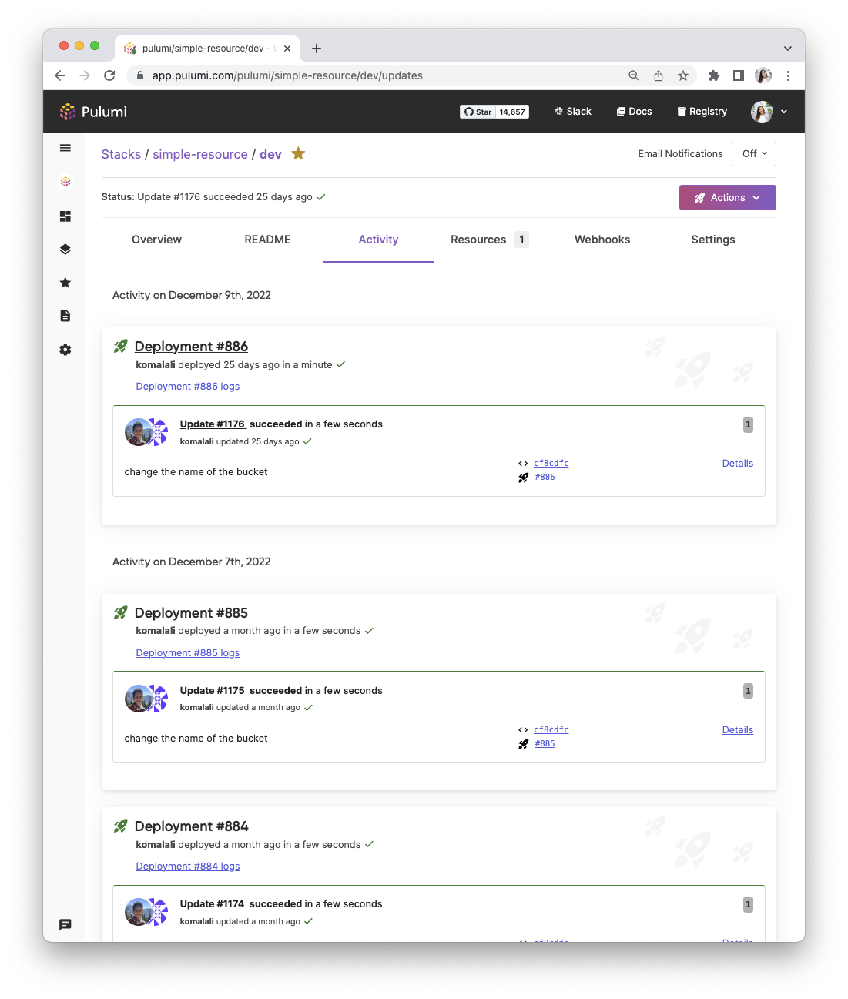

Happy new year from the Pulumi team! We are excited to tell you all about the improvements we made before 2022 wrapped up, including x,y and z.

<!--more-->

- Cloud Providers and Packages
  - [New Resources in our Providers](#new-resources-in-our-providers)
  - [Crosswalk for AWS 1.0](#crosswalk-for-aws-1.0)
  - [AWS Lambda SnapStart support](#aws-lambda-snapstart-support)
- Pulumi CLI and core technologies
  - [New CLI prompt to use Update Plans](#new-cli-prompt-to-use-update-plans)
- Pulumi Service & Pulumi.com
  - [Pulumi Deployments Improvements](#pulumi-deployments)
  - [Bulk stack transfers](#bulk-stack-transfers)
  - [Architecture Templates Support](#architecture-templates-support)
  - [Favicons based on update status](#favicons-based-on-update-status)

## Cloud Providers and Packages

### New resources in our providers

We shipped new versions of the AWS Native provider, Google Native provider and the Azure Native provider that added support for 698 new resources in the last two months. 17 new resources were added to Google Native, 662 when [including IAM binding and IAM member resources](https://github.com/pulumi/pulumi-google-native/pull/653), 29 resources were added to the AWS Native provider and 7 were added to the Azure Native provider.

### Crosswalk for AWS 1.0

The 1.0 releases of the `awsx`, `eks` and `aws-apigateway` packages offer a stable and supported foundation, available in all Pulumi languages, for these rich infrastructure components. They are available in the Pulumi Registry, and in all of the supported Pulumi package managers.
  
👉  Learn more in the [Pulumi Crosswalk for AWS 1.0: AWSX, EKS, and AWS API Gateway blog post](/blog/crosswalk-for-aws-1-0).

### AWS Lambda SnapStart support

AWS released a major improvement for Java-based functions that specifically addresses the latency incurred from cold starts in Java functions: [AWS Lambda SnapStart](https://aws.amazon.com/blogs/aws/new-accelerate-your-lambda-functions-with-lambda-snapstart). In the following example, we use the AWS Native provider to provision our function with SnapStart. The AWS Native provider uses the new Cloud Control API behind the scenes and has same-day support for new resources included in Cloud Control API - like SnapStart. This example also uses the AWS Classic provider and the Pulumi Command Provider.

```typescript
import * as pulumi from "@pulumi/pulumi";
import * as awsNative from "@pulumi/aws-native";
import * as aws from "@pulumi/aws";
import * as command from "@pulumi/command";

const role = new aws.iam.Role("role", {
  assumeRolePolicy: JSON.stringify({
    "Version": "2012-10-17",
    "Statement": [{
      "Effect": "Allow",
      "Principal": {
        "Service": "lambda.amazonaws.com",
      },
      "Action": "sts:AssumeRole",
    }],
  }),
});

new aws.iam.RolePolicyAttachment("role-policy-attachment", {
  role: role.name,
  policyArn: "arn:aws:iam::aws:policy/service-role/AWSLambdaBasicExecutionRole",
});

const bucket = new aws.s3.Bucket("snapstart-bucket", {
  versioning: {
    enabled: true,
  }
});

const functionCode = new aws.s3.BucketObject("function-code", {
  bucket: bucket.bucket,
  source: new pulumi.asset.FileArchive("../petstore.zip"),
});
```

👉  Learn more in the [AWS Lambda SnapStart with Pulumi blog post](/blog/aws-lambda-snapstart).

## Pulumi CLI and core technologies

### New CLI prompt to use Update Plans

Earlier this year we announced the experimental introduction of Update Plans as we heard from many of you that you need a strong guarantee about exactly which changes an update will make to your infrastructure, especially in critical and production environments. We have been making steady progress on this feature and are excited to further integrate it into your workflows. In the latest release of the Pulumi CLI (v3.48.0), there’s a new prompt to use experimental Update Plans when running an update.

 If you run a `pulumi up` command interactively, you will now see the following choice:

```bash
Do you want to perform this update?  [Use arrows to move, type to filter]
> [experimental] yes, using Update Plans (https://pulumi.com/updateplans)
  yes
  no
  details
```

The no option is still the default choice, however, there is a top option added which suggests running an update with a plan during the preview.

👉  Learn more in the [New CLI prompt to use Update Plans blog post](/blog/experimental-update-plan-prompt).

## Pulumi Service & Pulumi.com

### Pulumi Deployments Improvements



We have been surprised and thrilled by the adoption rate of Pulumi Deployments since [launching it in preview](/blog/pulumi-deployments) at the beginning of November. We have released a number of improvements in the last two months based on customer feedback, including:

- OIDC for credentials management (highly requested by our preview users!)
- Adding options to customize the container image where the deployment is run
- The ability to skip the automated dependency installation step to enable more fine-grained control of dependency management via pre-run commands
- Improvements to logs to make them more readable and we reduced the noise on npm install in the logs

👉  View [the documentation](/docs/intro/pulumi-service/deployments) to get started and join our [Slack channel](https://pulumi-community.slack.com)(#pulumi-deployments) for questions and feedback.

### Bulk stack transfers

We are excited to announce bulk stack transfer to address this feedback and a new organization set up wizard to improve discovery of the feature.

Let’s review how bulk stack transfers can be used and when you would use them. Stack transfers relocate a stack between organizations and Individual accounts. We now support the following stack transfers in bulk:

1. Individual account to a collaborative organization: We know that users are building projects in Individual accounts and want to easily move their stacks to an organization so they can collaboratively build infrastructure with others.
2. Organization to Individual account: There may be instances where users want to take a stack from an organization into their Individual org. This could be due to mistakenly creating a stack in the wrong location.
3. Organization to organization: As customers scale there may be use cases where they want to add additional organizations and being able to transfer stacks in bulk will help with this.

👉 Learn more by reviewing the [Bulk Stack Transfers blog post](https://www.pulumi.com/blog/stack-transfers).

<!-- ### Architecture Templates Support

We added Architecture Templates support to the new project experience in the Pulumi Service console. Now in addition to selecting your cloud provider and language of choice you can select a template for your new project. We currently have Static Website, Serverless, Container Service, Virtual Machine, Kubernetes cluster and web application templates, with more to come!

 -->

### Favicons Based on Update Status
