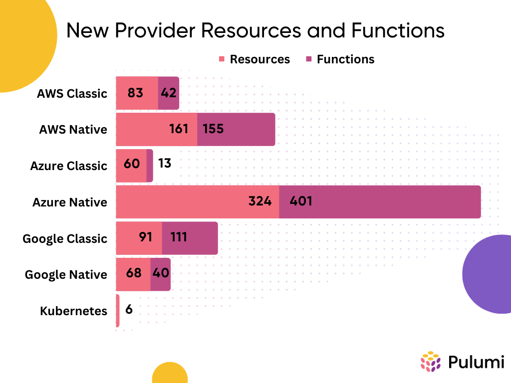
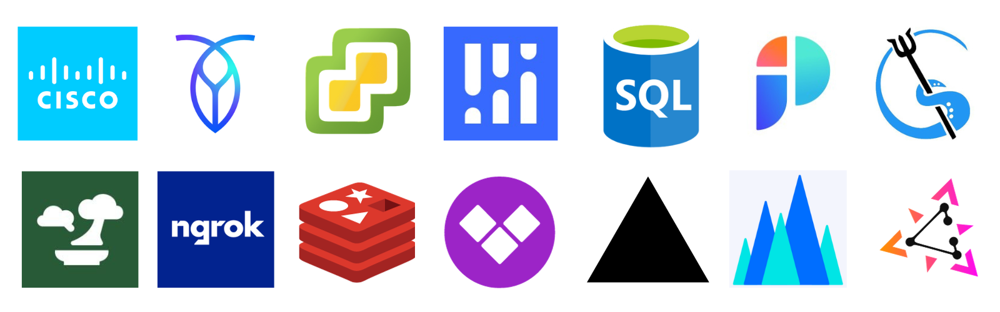

We've had an exciting quarter at Pulumi, shipping all kinds of improvements from our providers to our Cloud service. To stay up-to-date on all the details and additional improvements between release blogs, be sure to check out the [pulumi/pulumi repo](https://github.com/pulumi/pulumi/blob/master/CHANGELOG.md) changelog for CLI enhancements and the Pulumi Cloud features in the [new features blogs](https://www.pulumi.com/blog/tag/features) for updates on Pulumi Service features. We have a lot to cover, so let's get started!

<!--more-->

* [AI](#ai)
  * [Resource Search - AI Assist](#resource-search---ai-assist)
  * [Pulumi Insights and AI in the CLI](#pulumi-insights-and-ai-in-the-cli)
* [Pulumi Cloud](#pulumi-cloud)
  * [Microsoft Teams Webhook Integration](#microsoft-teams-webhook-integration)
  * [Admin Organization Access Tokens in Pulumi Cloud](#admin-organization-access-tokens-in-pulumi-cloud)
  * [Restore Stacks](#restore-stacks)
  * [Dependent Stack Updates with Pulumi Deployments](#dependent-stack-updates-with-pulumi-deployments)
  * [Review Stacks](#review-stacks)
  * [Property Search](#property-search)
  * [Slack and Deployment Notifications](#slack-and-deployment-notifications)
* [Core](#core)
  * [Go Generics](#go-generics)
  * [Pulumi Convert](#pulumi-convert)
* [Providers and Packages](#providers-and-packages)
  * [AWS Classic 6.0](#aws-classic-60)
  * [Kubernetes 4.0](#kubernetes-40)
  * [Azure Native 2.0](#azure-native-20)
  * [OIDC Support for Azure](#oidc-support-for-azure)
  * [New provider resources](#new-provider-resources)
  * [New Community Providers](#new-community-providers)
* [Wrap Up](#wrap-up)

## AI

### Resource Search - AI Assist

Pulumi Cloud [Resource Search AI assist](https://www.pulumi.com/blog/ai-assist-improvements/) is now generally available to all organizations, offering natural language search capabilities. This feature allows you to query their infrastructure with plain language requests. Suggested queries and an "I'm Feeling Lucky" button are now available to simplify the search process and provide insights into Resource Search functionality.

### Pulumi Insights and AI in the CLI

We've integrated Pulumi Insights, including AI and Resource Search, into the pulumi CLI. Now, you can harness [the power of AI and resource search](https://www.pulumi.com/blog/pulumi-insights-ai-cli/) directly in your terminal. This update also includes features like AI Assist for resource search and fine-grained resource property search, making these tools easily accessible via the pulumi CLI.

## Pulumi Cloud

### Microsoft Teams Webhook Integration

Setting up Microsoft Teams notifications is now easier than ever with support for Microsoft Teams formatted webhooks. You can quickly enable notifications about your Pulumi stacks and organizations in your Microsoft Teams workspace by providing an incoming webhook URL. New REST API endpoints and a Service Provider are available, allowing for efficient webhook creation at scale. These improvements enhance ChatOps workflows and provide better visibility into infrastructure changes while maintaining support for generic webhooks. For more details and how to get started, check out [this blog post](https://www.pulumi.com/blog/ms-teams-integration/).

### Admin Organization Access Tokens in Pulumi Cloud

The introduction of Admin permission scope for [Organization Access Tokens](https://www.pulumi.com/blog/org-admin-tokens/) provides elevated privileges for users who need them. These tokens enable actions like transferring stacks, modifying user access, team management, and more, previously restricted with regular Organization Access Tokens. Admin Organization Access Tokens cater to programmatic use cases that require higher-level permissions while maintaining a member's usual permissions. This enhancement expands the utility of Organization Access Tokens for Enterprise and Business Critical customers, and is available during the 14-day trial period as well.

### Restore Stacks

Pulumi Cloud now offers the capability to [restore previously deleted stacks](https://www.pulumi.com/blog/restore-stacks/), a feature requested by many users. This addition enables users to recover stacks that were either mistakenly deleted or intentionally removed while retaining their activity history. This self-service recovery option can be conveniently accessed via the Pulumi Cloud console by navigating to the Stacks page, locating the "restore stacks" function, and selecting the stacks they wish to recover. Up to the last 10 deleted stacks can be restored, and older ones can be retrieved through support.

### Dependent Stack Updates with Pulumi Deployments

Pulumi Deployments has two new features to help manage complex infrastructure projects more easily. The Deployment Webhook Destinations allow automatic triggering of updates in dependent stacks when changes occur in the parent stack. We've also added the Pulumi Auto Deploy Package to simplify the way you express stack dependencies, automating the creation and updating of Deployment Webhooks. For all the details and to get started, visit the [blog post](https://www.pulumi.com/blog/dependent-stack-updates/), [auto deploy package](https://www.pulumi.com/registry/packages/auto-deploy/) registry page, and [Pulumi Deployments](https://www.pulumi.com/docs/pulumi-cloud/deployments/) documentation.

### Review Stacks

New to Pulumi Deployments are [Review Stacks](https://www.pulumi.com/blog/review-stacks/), ephemeral cloud environments created automatically when a pull request is opened. These environments enable developers to make changes to both application and infrastructure code simultaneously, streamlining the development process. Review Stacks comment with the outputs from the deployment, making it easier to review code changes and collaborate with teammates. Review Stacks help optimize cloud costs by only existing as long as necessary during feature development. Configuring Review Stacks is a simple process that enhances development efficiency and collaboration among teams. Find more information in the [Review Stacks documentation](https://www.pulumi.com/docs/pulumi-cloud/deployments/review-stacks/).

### Property Search

Resource Search for Pulumi Cloud capabilities have been enhanced by allowing users to search over resource properties in addition to metadata, across over 100 cloud providers. The [Property Search](https://www.pulumi.com/blog/property-search/) feature provides deeper insights into cloud infrastructure, enabling users to search based on specific property names and values, such as instance type, region, or database version. This new feature is available in the Enterprise and Business Critical editions of Pulumi Cloud and aims to streamline resource management, compliance, and diagnostics, ultimately enhancing efficiency and collaboration in cloud environments.

### Slack and Deployment Notifications

We've made several improvements to our Pulumi Cloud Webhooks to enhance deployment notifications and response times. Now, you can easily [integrate Slack with Pulumi](https://www.pulumi.com/blog/slack-integration/) Cloud for organization or stack notifications without hosting their infrastructure. This integration provides centralized visibility, allowing teams to quickly access stack and update details, operation information, and user activity, streamlining collaboration and reducing context switching. Event notifications and filtering options have been expanded for both Pulumi Cloud Webhooks and the Slack integration, making deployment monitoring more efficient and accessible. These enhancements are available to all Pulumi Cloud organizations.

## Core

### Go Generics

We've implemented Go generics in our SDKs, enabling type safety and reducing excessive code generation.  This means you can write more reliable and maintainable infrastructure code with reduced chances of panics, leading to more robust cloud infrastructure deployments. For a deeper dive into this feature and how to get started, explore this [blog post](https://www.pulumi.com/blog/go-generics-preview/).

### Pulumi Convert

The introduction of `pulumi convert` in the Pulumi CLI simplifies the migration process for teams transitioning from Terraform to Pulumi. This feature allows you to [convert entire Terraform projects](https://www.pulumi.com/blog/converting-full-terraform-programs-to-pulumi/) into Pulumi, including support for modules, core Terraform 1.4 features, and most Terraform built-in functions. Starting from Pulumi CLI version 3.71.0, you can directly access this converter, streamlining the conversion of full Terraform programs. This enhancement builds upon our CrossCode foundations, enabling universal infrastructure as code support and introducing the concept of converter plugins for future integrations. This feature supports various use cases, such as migrating existing Terraform projects and modules to Pulumi, enhancing our commitment to providing versatile solutions for infrastructure as code.

## Providers and Packages

### AWS Classic 6.0

The 6.0 release of the [Pulumi AWS Classic](https://www.pulumi.com/registry/packages/aws/) provider introduces essential enhancements and updates to one of the most extensively used providers in the Pulumi ecosystem. These improvements encompass TF Plugin Framework support, the inclusion of new resources and functions, significant SDK size optimizations for faster downloads and improved developer experiences, resolutions to top-upvoted issues, and removal of deprecated resources. To dig deeper into these changes, check out the [migration guide](https://www.pulumi.com/registry/packages/aws/how-to-guides/6-0-migration/) and [blog post](https://www.pulumi.com/blog/announcing-6-0-of-the-pulumi-aws-classic-provider/).

### Kubernetes 4.0

[Pulumi Kubernetes 4.0](https://www.pulumi.com/registry/packages/kubernetes/) brings new enhancements in managing Kubernetes resources. It embraces Kubernetes Server-Side Apply as the default mode, enabling features like upserting and Patch resources. Improved diffs remove the dependence on kubectl annotations, and provide simpler access to outputs in the Python, Go and Java SDKs, supporting any self-hosted or managed Kubernetes cluster with version 1.13 or newer. You can migrate existing projects or start new ones with Kubernetes 4.0 for superior Kubernetes resource management. Find more information in the [blog post](https://www.pulumi.com/blog/kubernetes-4-0-even-more-kubernetes-native/) and [migration guide](https://www.pulumi.com/registry/packages/kubernetes/how-to-guides/v4-migration/).

### Azure Native 2.0

The [Pulumi Azure Native provider](https://www.pulumi.com/registry/packages/azure-native/) 2.0 has been shipped with enhanced performance and usability, making it easier to manage Azure resources efficiently. Key features include a significant reduction in SDK size for faster development, refreshed default module versions for access to the latest Azure features, expanded top-level default module coverage, title case consistency, simplified user-assigned identity inputs, and more. Visit the [blog post](https://www.pulumi.com/blog/introducing-azure-native-v2/) and [migration guide](https://www.pulumi.com/registry/packages/azure-native/from-v1-to-v2/) to learn more.

### OIDC Support for Azure

The [Azure Native](https://www.pulumi.com/registry/packages/azure-native/) and [Azure Classic](https://www.pulumi.com/registry/packages/azure/) providers now fully support [Azure OIDC authentication](https://www.pulumi.com/blog/oidc-with-azure/). OIDC, or OpenID Connect. OIDC authentication allows you to authenticate your Pulumi program with Azure using federated identity, reducing the need for secrets management. You can establish the trust relationship between Azure and other services like GitHub and configure your Pulumi program to use OIDC for authentication, making your cloud infrastructure management more secure and efficient.

### New provider resources

In addition to releasing major versions of 3 of our most popular providers, we're always keeping our providers up-to-date to bring you the latest functionality in your Pulumi programs. We've added 793 resources and 762 functions across our most popular providers, along with many more throughout our ecosystem.

### New Community Providers

Welcome to the 17 new community providers in the registry!

* [Cisco ACI](https://www.pulumi.com/registry/packages/aci/)
* [ACME](https://www.pulumi.com/registry/packages/acme/)
* [CockroachDB Cloud](https://www.pulumi.com/registry/packages/cockroach/)
* [ESXi Native](https://www.pulumi.com/registry/packages/esxi-native/)
* [Impart Security](https://www.pulumi.com/registry/packages/impart/)
* [Cisco IOS XE](https://www.pulumi.com/registry/packages/iosxe/)
* [Matchbox](https://www.pulumi.com/registry/packages/matchbox/)
* [Microsoft SQL Server](https://www.pulumi.com/registry/packages/mssql/)
* [ngrok](https://www.pulumi.com/registry/packages/ngrok/)
* [Cisco NX OS](https://www.pulumi.com/registry/packages/nxos/)
* [Port](https://www.pulumi.com/registry/packages/port/)
* [Prodvana](https://www.pulumi.com/registry/packages/prodvana/)
* [Redis Cloud](https://www.pulumi.com/registry/packages/rediscloud/)
* [Vantage](https://www.pulumi.com/registry/packages/vantage/)
* [Zitadel](https://www.pulumi.com/registry/packages/zitadel/)
* [Vercel](https://www.pulumi.com/registry/packages/vercel/)
* [Volcengine](https://www.pulumi.com/registry/packages/volcengine/)

## Wrap Up

We've had an incredible couple months introducing so many exciting features and enhancements across our entire platform. From Slack and Microsoft Teams integrations to Review Stacks, major provider release to Go Generics,  we've been focused on making your cloud development experience more efficient and powerful. Don't miss out on all these exciting developments—check out our [changelog](https://github.com/pulumi/pulumi/blob/master/CHANGELOG.md) for CLI updates and our [new features blogs](https://www.pulumi.com/blog/) for the latest on Pulumi Cloud. Explore these new features today and see the difference they can make in your projects. Happy coding!
