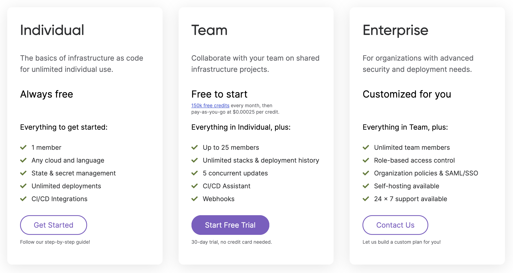

In this update:

- New and updated cloud providers
  - [Pulumi supports Confluent Cloud]()
  - [100 new resources in the Azure Native provider]()
- Pulumi engine and core technologies
  - [Input parameters can now be marked as secret]()
  - [Pulumi Packages: schema documentation and enhancements]()
- Pulumi Service and Pulumi.com
  - [New usage-based pricing for your whole team]()

<!--more-->

## New and updated cloud providers

### Pulumi supports Confluent Cloud

The new Confluent Cloud provider for Pulumi allows you to manage cloud-native Apache Kafka services with Pulumi infrastructure-as-code.



{}

```javascript
const ccloud = require("@pulumi/confluent")

const env = new ccloud.ConfluentEnvironment("ts-environment");
```

{}
{}

```typescript
import * as confluent from "@pulumi/confluent";

const env = new ccloud.ConfluentEnvironment("ts-environment");
```

{}
{}

```python
import pulumi_confluent as confluent

environment = ccloud.ConfluentEnvironment("py-env")
```

{}
{}

```go
package main

import (
  "github.com/pulumi/pulumi-confluent/sdk/go/confluent"
  "github.com/pulumi/pulumi/sdk/v3/go/pulumi"
)

func main() {
  pulumi.Run(func(ctx *pulumi.Context) error {

    env, err := confluent.NewConfluentEnvironment(ctx, "py-env", nil)
    if err != nil {
      return err
    }

    return nil
  })
}

```

{}
{}

```csharp
using System.Collections.Generic;
using System.Threading.Tasks;
using Pulumi;
using Pulumi.Confluent;

class Program
{
    static Task Main() =>
        Deployment.Run(() => {
            var environment = new CCloud.ConfluentEnvironment("csharp-env");
        });
}
```

{}



Get started in the [Confluent Cloud provider docs]().

### 100 new resources in the Azure Native provider

We shipped 3 new versions of the Azure Native provider (1.10.0, 1.9.0, and 1.8.0) that collectively added 100 new resources that you can manage with the Azure Native provider. These new provider versions give you full access to the new resources and services announced at [Microsoft Build 2021](https://news.microsoft.com/build-2021-book-of-news/), including new analytics, machine learning, and security capabilities across the Azure platform.

[See the full list](https://github.com/pulumi/pulumi-azure-native/blob/v1.10.0/CHANGELOG.md)

## Pulumi CLI and core technologies

In this milestone, we shipped Pulumi versions [3.3.0](https://github.com/pulumi/pulumi/releases/tag/v3.3.0), [3.3.1](https://github.com/pulumi/pulumi/releases/tag/v3.3.1), and [3.4.0](https://github.com/pulumi/pulumi/releases/tag/v3.4.0). The full list of changes in each version is available in the linked changelog; read on to learn about some of the biggest changes.

### Input parameters can now be marked as secret

It's now possible to mark any input parameter as a secret, which can be helpful when you need to pass in secret data, like when creating a Kubernetes Secret resource. Pulumi will protect these input parameters by encrypting them in the state and obfuscating them in outputs.

Learn more at [pulumi/pulumi#7062](https://github.com/pulumi/pulumi/issues/7062)

### Pulumi Packages: schema documentation and enhancements

[Pulumi Packages](), released at [PulumiUP earlier this year]() enable cloud infrastructure resource provisioning to be defined once, in your language of choice, and made available to users in all Pulumi languages. A key part of Pulumi Packages is the Pulumi schema that defines each resource in a package.  We have now introduced new [documentation for Pulumi Package Schema]().

We've also updated the Pulumi Package schema to make it more powerful. For more complex Pulumi Package scenarios, you may want to be able to reference the types in one Pulumi Package from another Pulumi Package. Previously, this was only possible if you authored your Pulumi Package in Go; now, it's possible in all Pulumi Languages.

Learn more at [pulumi/pulumi#6777](https://github.com/pulumi/pulumi/issues/6777)

## Pulumi Service and Pulumi.com

### New usage-based pricing for your whole team

We launched Pulumi Team Edition, a new way for teams to adopt and use Pulumi and the Pulumi Service to collaborate on building, managing, and deploying cloud infrastructure as code. Pulumi Team Edition is priced based on the number of cloud resources under management, with a generous free tier to ensure that teams can get up and running with Pulumi Team Edition at no cost.

Learn more in the [announcement blog post]()


