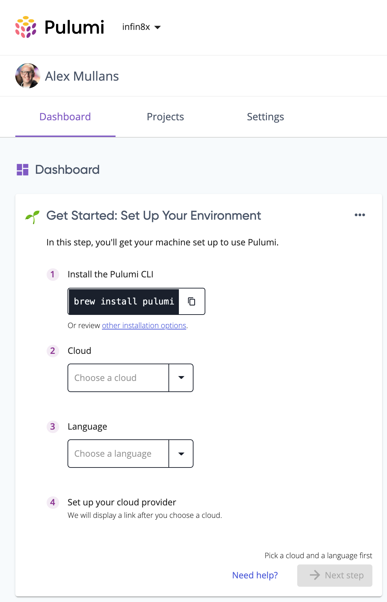

Another 3 weeks have passed, so it's time for another edition of the Pulumi release notes! This iteration we've been busy smashing bugs across our products (over 100!), but we've still got some great new features to share with you as well:

- New and updated cloud providers
  - [Kubernetes operator supports GitOps workflow]()
  - [Kubernetes improved performance]()
  - [12 new resources in the Azure Native provider]()
  - [Google Native: autonaming; easier management of project and region settings]()
- Pulumi CLI and core technologies
  - [Automation API: Select your backend]()
- Pulumi Service and Pulumi.com
  - [Get started with Pulumi, directly from the Pulumi Service]()

<!--more-->

## New and updated cloud providers

### Kubernetes operator supports GitOps workflow

For some Kubernetes workflows, developers want to be able to store their configuration in a Git repository but ensure that their cluster automatically stays up-to-date with the latest configuration when it's checked in. With the latest update to the Pulumi Kubernetes Operator, you can set up this type of GitOps workflow. To get started, TODO

[Learn more in this GitHub issue](https://github.com/pulumi/pulumi-kubernetes-operator/issues/50)

### Kubernetes improved performance

TODO

[Learn more in this GitHub issue](https://github.com/pulumi/pulumi-kubernetes/issues/1598)

### 12 new resources in the Azure Native provider

We shipped 4 new versions of the Azure Native provider (1.16.0 through 1.19.0) that collectively added 12 new resources that you can manage with the Azure Native provider, including Fast Healthcare Interoperability Resources (FHIR) and Azure Relay resources.

[See the full list](https://github.com/pulumi/pulumi-azure-native/blob/master/CHANGELOG.md#1190-2021-07-22)

### Google Native: autonaming; easier management of project and region settings

The preview of the Google Native provider continues to evolve. We shipped a new version of the Google Native provider ([0.5.0](https://github.com/pulumi/pulumi-google-native/releases/tag/v0.5.0)) that includes:

- Full auto-naming support, just like our other providers
- An easier way to use arguments like `machineType` that expect a fully-qualified string like `projects/${project}/zones/${zone}/machineTypes/f1-micro`: you can now use just the last value (`f1-micro`) in your program and the provider will construct the fully-qualified string
- Automatic selection of the project, region, and zone based on your configuration, so you no longer need to pass these values to the SDK's constructor
- An improved implementation of `BucketObject`

[See the full list of updates](https://github.com/pulumi/pulumi-google-native/blob/master/CHANGELOG.md)

## Pulumi CLI and core technologies

In this milestone, we shipped Pulumi versions [3.7.0](https://github.com/pulumi/pulumi/releases/tag/v3.7.0), [3.7.1](https://github.com/pulumi/pulumi/releases/tag/v3.7.1), and [3.8.0](https://github.com/pulumi/pulumi/releases/tag/v3.8.0). The full list of changes in each version is available in the linked changelog; read on to learn about some of the biggest changes.

### Automation API: Select your backend

Previously, the Automation API only used the backend that you selected the last time you ran the `pulumi login` command, which led to challenges for developers working across multiple backends for different projects. Now, you can set the `PULUMI_BACKEND_URL` variable in the environment where you run your Automation API program and it will use the backend specified by that URL.

[Learn more in this GitHub issue](https://github.com/pulumi/pulumi/issues/5591)

## Pulumi Service and Pulumi.com

### Get started with Pulumi, directly from the Pulumi Service

We're always looking for ways to make it easier for people who are new to Pulumi to get started successfully. This release, we've added a new dashboard card to your individual user dashboard on the Pulumi Service that helps you set up the Pulumi CLI and deploy your first stack of cloud infrastructure. Look for the "Get Started" card on your dashboard on the [Pulumi Service](https://app.pulumi.com/).

