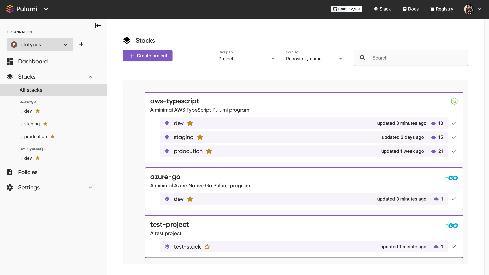
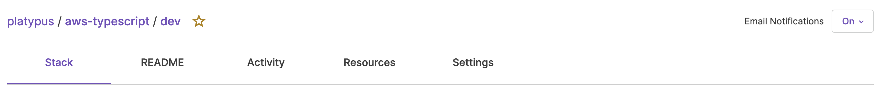
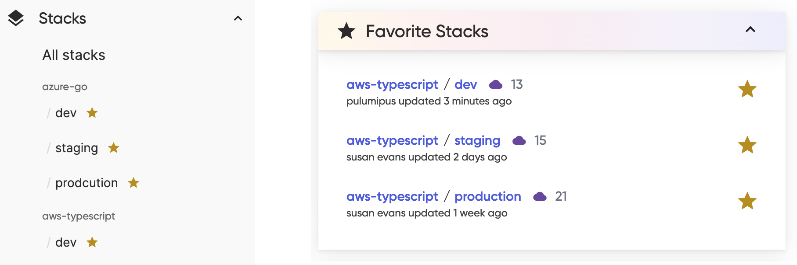
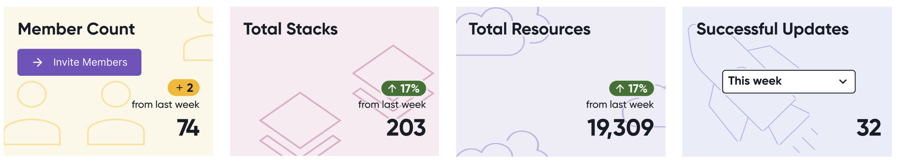
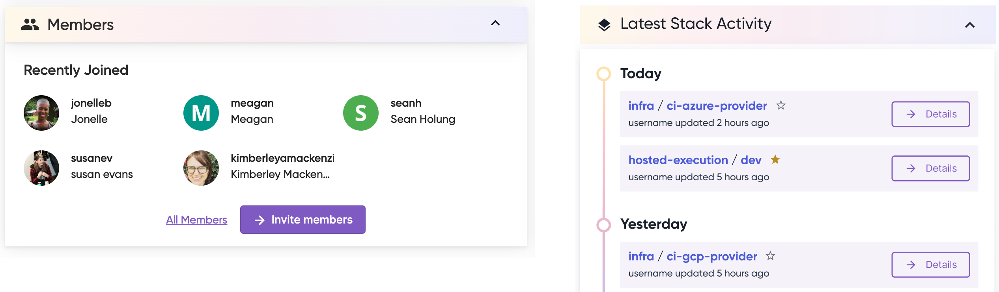

Earlier this year, Pulumi's user experience (UX) team sat down with users to understand how we can improve the Pulumi experience. It's important not only to the UX team, but across the company, that we listen to the real wants, needs, pains, and excitements of the people who use our product.

The [Pulumi Service](https://www.pulumi.com/docs/intro/pulumi-service/) was at the center of many conversations we had with users. The Pulumi Service is the easiest way to use Pulumi’s open source, universal infrastructure as code SDK at scale and provides a fully managed experience. The team is always exploring how we can deliver the best SaaS experience we can. But having input from the community gave us a meaningful point of entry.

<!--more-->

Here are the two problems our users faced that we wanted to improve:

1. Users were losing time trying to get where they needed to go. Users need to find important content faster and more easily.
2. Users didn't feel like they understood the "big picture" of their Pulumi usage. We wanted to offer improved sight lines into organizations' day-to-day operations.

We knew we could do better. Now, we're excited to share the changes we've made so far!

## New primary navigation pane

Next time you sign in to the Pulumi Service, look for the navigation pane on the left hand side of the page. All primary navigation items like your Dashboard, Stacks, and Settings are accessible in the new pane from anywhere in the Service.

The navigation pane consolidates actions and information so you don't have to look so hard to find where things are. You'll find options in the pane to:

- switch between your individual account and any other organizations you're part of
- create new organizations
- access your favorite stacks (read on to find out more!)
- directly access sub-pages like Billing or Access Tokens
- send us your feedback!

We made these changes to help you move through the Pulumi Service without losing your place and ensure constant access to key pages. Even if you collapse the navigation pane for more screen real estate, you can still get where you need to go!

If you're looking for your account details, they have moved into the black utility toolbar. To access your account settings or logout of the Pulumi Service, select your profile image at the top right of your browser window.

## Stack Favorites

You can now pin your favorite stacks, so you can quickly access the stacks you need most. This reduces your time spent combing through projects. Look for the star icon next to any stack name and select it to start building out your favorites list.

Your favorites list is your own. Even if you're part of an organization, your favorites won't be shared with anyone other than you. And you can have as many favorites as you like!

You can access the favorites list from two key locations in the Service: the primary navigation pane and the dashboard. All your favorites will appear in the navigation pane under the “Stacks” heading. You'll also have your list of favorites in a new dashboard card.

## Pulumi Service dashboard redesign

linter fun _image will be added here_

Lastly, we’ve also made significant changes to the Pulumi Service dashboard. Now you can access more information to help survey your operations at a glance.

Organizations can access some quick usage statistics at the top of their dashboards:

- member count and +/- change in the past week
- total stack count and percent change in the past week
- total resource count and percent change in the past week
- number of successful updates in the past day, week, month, and year

If you're part of an organization, you'll also see a “Members” card that tracks recently joined members. If you're an admin, you can manage any pending invites from this card.

We've also exposed more operation updates in the “Latest Stack Activity” card. You can see up to ten most recent updates and favorite those stacks directly from the dashboard card.

## Try out the Pulumi Service today

We'd love for you to take this and improved Pulumi Service for a ride! If you haven't already, you can [create an account](https://app.pulumi.com/signup) and experience these changes for yourself. Don't hesitate to [send us feedback](https://www.pulumi.com/contact/) about any thoughts and feelings you have about these changes or any and all things Pulumi! We're more than happy to learn from our community.

These changes wouldn’t be possible without the users who generously gave their time to have a conversation with us. We'll continue to translate user feedback into a better Pulumi experience. Know that this is just the start to even more improvements across the Service and the Pulumi platform!
