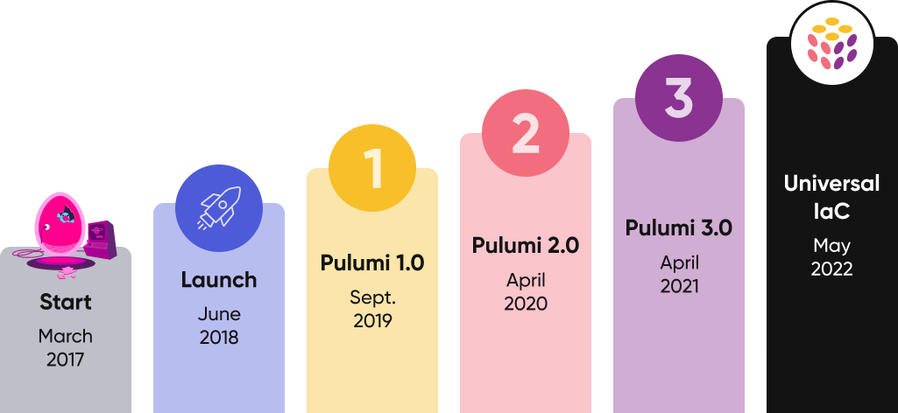
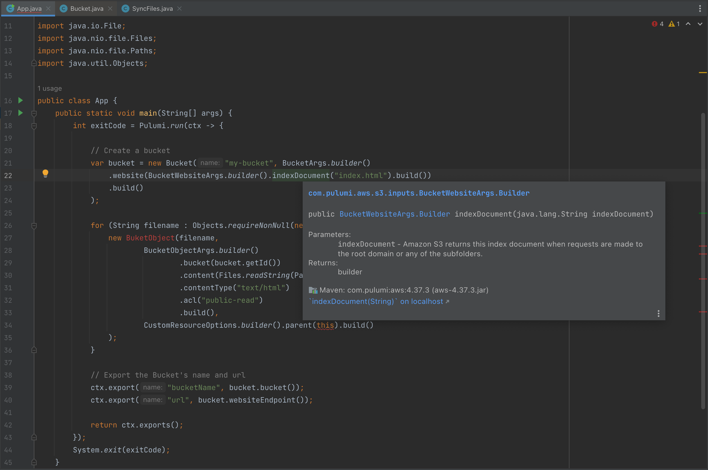
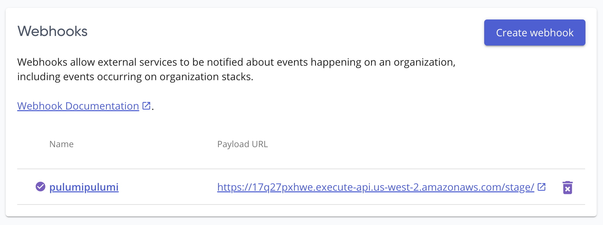

Over the last year since the launch of Pulumi 3.0, we’ve seen incredible growth in adoption and usage of the Pulumi open source project and Cloud Engineering platform, with more than a thousand new open source contributors, tens of thousands of new users, and millions of new cloud infrastructure resources being managed by Pulumi. Pulumi’s infrastructure as code tools are enabling teams to scale up their cloud infrastructure with robust software engineering tools and practices to get the most value out of their cloud platform investments.

Today, we’re excited to announce a wave of innovation across the Pulumi project with a collection of significant new feature launches. These new features bring together Pulumi’s __*Universal Infrastructure as Code*__ offering, supporting the widest range of builders, clouds, programming languages, and cloud architectures.

<!--more-->



Today’s launches include:

* __Pulumi support for Java__: New support for Java across the entire Pulumi platform, providing full access to the rich software engineering ecosystem for Java and the JVM.
* __Pulumi YAML__: A new simple YAML interface to the Pulumi platform, broadening the reach of Pulumi to use cases where a full blown programming language is not (yet!) necessary.
* __Crosswalk for AWS in all Pulumi Languages__: Support for the popular Crosswalk for AWS packages (for ECS, VPC, API Gateway and EKS) in all Pulumi languages.
* __AWS CDK on Pulumi__: Support for deploying AWS CDK constructs from within Pulumi infrastructure as code programs, enabling access to the broad array of higher-level components for AWS built by teams at AWS and the AWS CDK community.
* __New Cloud and SaaS Providers__: More than a dozen new packages in the Pulumi Registry for popular cloud/SaaS platforms from Pulumi partners, including Oracle Cloud, Elastic Cloud and Databricks.
* __Pulumi Service Provider for Pulumi__: A new provider for managing the Pulumi Service using Pulumi Infrastructure as Code.
* __Pulumi CrossCode__: Key improvements in the core technology powering Pulumi's universal infrastructure as code features, including `pulumi import`, `pulumi convert` and more.

These new features build on the Pulumi 3.0 foundation to offer a truly universal infrastructure as code platform for modern cloud engineers and teams.

## Pulumi Support For Java

Java is one of the most used programming languages in the world, with heavy usage in enterprises and organizations building for the cloud. The Java ecosystem has played a leading role in offering an incredibly rich ecosystem of software engineering capabilities - IDE tooling, strong typing, design patterns, build and package management, unit testing, and more.

Pulumi now supports Java (in addition to existing support for TypeScript, Python, Go and .NET) and other languages targeting the JVM. All the existing Pulumi CLI workflows can now be used with Java, and all packages in the Pulumi Registry are now available as Java libraries in Maven Central.



You can get started with Pulumi using Java today in the [Pulumi Getting Started guide](/docs/get-started/) and the [Pulumi and Java language docs](/docs/languages-sdks/java/).

👉 Read more in the [Pulumi and Java](/blog/announcing-infrastructure-as-code-with-java-and-pulumi/) blog post.

## Pulumi YAML

Pulumi has differentiated itself as an Infrastructure as Code tool that embraces popular programming languages and their rich software engineering ecosystems. However, our goal has always been to offer the broadest range of language support for the wide variety of use cases and users who need to interact with cloud infrastructure in modern cloud organizations.

Pulumi YAML offers a new, simple interface to the full richness of the Pulumi Platform. Pulumi YAML allows infrastructure as code to be authored in a single simple YAML file with just a few lines of YAML, immediately familiar to any engineer, operator or developer.

```yaml
name: yamldemo
runtime: yaml
resources:
  bucket:
    type: aws:s3:Bucket
    properties:
      website:
        indexDocument: index.html
  index.html:
    type: aws:s3:BucketObject
    properties:
      bucket: ${bucket.id}
      content: <h1>Hello, world!</h1>
      contentType: text/html
      acl: public-read
outputs:
  bucketName: ${bucket.id}
```

Like all other Pulumi languages, Pulumi YAML programs have access to all the core features of Pulumi’s infrastructure as code tooling, including native providers, secrets management, stack references, Pulumi Packages, and all the features of the Pulumi Service. YAML programs can interoperate seamlessly with the rest of the Pulumi ecosystem, consuming the outputs of other Pulumi programs and using Pulumi components built in existing Pulumi languages. For example, a complete EKS cluster can be configured using the EKS package (implemented in TypeScript):

```yaml
name: eks-cluster
runtime: yaml
resources:
 cluster:
   type: eks:Cluster
outputs:
 kubeconfig: ${cluster.kubeconfig}
```

Access to Pulumi packages authored in other Pulumi languages means complexity can be pushed into reusable infrastructure components instead of copy-pasted in YAML. And when complexity does increase, Pulumi YAML supports a new `pulumi convert` command to eject into any other Pulumi programming language to manage the increased complexity via rich software engineering features in those languages.

You can get started with Pulumi YAML today in the [Pulumi Getting Started](/docs/get-started/) guide and the [Pulumi YAML language docs](/docs/languages-sdks/yaml/).

👉 Read more in the [Pulumi YAML blog post](/blog/pulumi-yaml/).

## Crosswalk for AWS in All Pulumi Languages

[Crosswalk for AWS](/docs/clouds/aws/guides/) is a collection of libraries that use automatic well-architected best practices to make common infrastructure as code tasks in AWS easier and more secure. This includes libraries for EKS and API Gateway as well as the AWSX library that provides VPC, ECS, LoadBalancing and more.  All of these libraries are now available in the Pulumi Registry for all Pulumi languages.  The AWSX library, which was previously only available for Pulumi TypeScript users has become one of the most used libraries in the Pulumi ecosystem.  With today’s release, it is now available to the entirety of the Pulumi language ecosystem - including Java and YAML!

For example - to run a Docker container in ECS using default network and cluster settings, users can use the `awsx.ecs.FargateService` class along with an Application Load Balancer listening on port 80 at a stable address - with just a few lines of code:



{}

```typescript
import * as aws from "@pulumi/aws";
import * as awsx from "@pulumi/awsx";

const cluster = new aws.ecs.Cluster("default-cluster");

const lb = new awsx.lb.ApplicationLoadBalancer("nginx-lb");

const service = new awsx.ecs.FargateService("my-service", {
    cluster: cluster.arn,
    desiredCount: 2,
    taskDefinitionArgs: {
        container: {
            image: "nginx:latest",
            cpu: 512,
            memory: 128,
            essential: true,
            portMappings: [
                {
                    containerPort: 80,
                    targetGroup: lb.defaultTargetGroup,
                },
            ],
        },
    },
});

export const url = lb.loadBalancer.dnsName;
```

{}

{}

```python
import pulumi
import pulumi_aws as aws
import pulumi_awsx as awsx

cluster = aws.ecs.Cluster("default-cluster")

lb = awsx.lb.ApplicationLoadBalancer("nginx-lb")

service = awsx.ecs.FargateService("my-service",
    cluster=cluster.arn,
    desired_count=2,
    task_definition_args=awsx.ecs.FargateServiceTaskDefinitionArgs(
        container=awsx.ecs.TaskDefinitionContainerDefinitionArgs(
            image="nginx:latest",
            cpu=512,
            memory=128,
            essential=True,
            port_mappings=[awsx.ecs.TaskDefinitionPortMappingArgs(
                target_group=lb.default_target_group
            )],
        )
    )
)
```

{}

{}

```go
package main

import (
	"github.com/pulumi/pulumi-aws/sdk/v5/go/aws/ecs"
	"github.com/pulumi/pulumi-aws/sdk/v5/go/aws/lb"
	ecsx "github.com/pulumi/pulumi-awsx/sdk/go/awsx/ecs"
	lbx "github.com/pulumi/pulumi-awsx/sdk/go/awsx/lb"
	"github.com/pulumi/pulumi/sdk/v3/go/pulumi"
)

func main() {
	pulumi.Run(func(ctx *pulumi.Context) error {

		cluster, err := ecs.NewCluster(ctx, "default-cluster", &ecs.ClusterArgs{})
		if err != nil {
			return err
		}

		loadBalancer, err := lbx.NewApplicationLoadBalancer(ctx, "nginx-lb", &lbx.ApplicationLoadBalancerArgs{})
		if err != nil {
			return err
		}

		_, err = ecsx.NewFargateService(ctx, "my-service", &ecsx.FargateServiceArgs{
			Cluster:      cluster.Arn,
			DesiredCount: pulumi.Int(2),
			TaskDefinitionArgs: &ecsx.FargateServiceTaskDefinitionArgs{
				Container: &ecsx.TaskDefinitionContainerDefinitionArgs{
					Image:     pulumi.String("nginx:latest"),
					Cpu:       pulumi.Int(512),
					Memory:    pulumi.Int(128),
					Essential: pulumi.Bool(true),
					PortMappings: ecsx.TaskDefinitionPortMappingArray{
						ecsx.TaskDefinitionPortMappingArgs{
							ContainerPort: pulumi.Int(80),
							TargetGroup:   loadBalancer.DefaultTargetGroup,
						},
					},
				},
			},
		})
		if err != nil {
			return err
		}

		ctx.Export("url", loadBalancer.LoadBalancer.ApplyT(func(alb *lb.LoadBalancer) interface{} {
			return alb.DnsName
		}))
		return nil
	})
}
```

{}

{}

```csharp
var cluster = new Aws.Ecs.Cluster("default-cluster");
var lb = new Awsx.Lb.ApplicationLoadBalancer("nginx-lb");
var service = new Awsx.Ecs.FargateService("my-service", new Awsx.Ecs.FargateServiceArgs
{
    Cluster = cluster.Arn,
    DesiredCount = 2,
    TaskDefinitionArgs = new Awsx.Ecs.Inputs.FargateServiceTaskDefinitionArgs
    {
        Container = new Awsx.Ecs.Inputs.TaskDefinitionContainerDefinitionArgs
        {
            Image = "nginx:latest",
            Cpu = 512,
            Memory = 128,
            Essential = true,
            PortMappings = {new Awsx.Ecs.Inputs.TaskDefinitionPortMappingArgs
            {
                TargetGroup = lb.DefaultTargetGroup,
            }},
        }
    }
});
this.Url = lb.LoadBalancer.Apply(lb => lb.DnsName);
```

{}

{}

```yaml
name: awsx
runtime: yaml
resources:
  cluster:
    type: aws:ecs:Cluster
  lb:
    type: awsx:lb:ApplicationLoadBalancer
  nginx:
    type: awsx:ecs:FargateService
    properties:
      cluster: ${cluster.arn}
      taskDefinitionArgs:
        container:
          image: nginx:latest
          cpu: 512
          memory: 128
          portMappings:
            - containerPort: 80
              targetGroup: ${lb.defaultTargetGroup}
outputs:
  url: ${lb.loadBalancer.dnsName}
```

{}

You can get started with Crosswalk for AWS in the [Pulumi Crosswalk for AWS Guides](/docs/clouds/aws/guides/), now available with examples in all languages.

👉 Read more in the [Pulumi Crosswalk for AWS support for all Pulumi Languages](/blog/crosswalk-for-aws-all-languages/)  blog post.

## AWS CDK on Pulumi

The AWS Cloud Development Kit (CDK) offers a [large collection](https://docs.aws.amazon.com/cdk/api/v2/docs/aws-construct-library.html) of higher-level libraries ("constructs") for working with the AWS platform, built by service teams at AWS and by the AWS CDK community.  These libraries are available in the same set of general purpose programming languages that Pulumi supports, with the primary difference being that AWS CDK compiles infrastructure programs into CloudFormation, and uses CloudFormation to drive deployments.

With the new [AWS CDK on Pulumi](https://github.com/pulumi/pulumi-cdk) project, available in public preview today, we are opening up the ability to use AWS CDK constructs from within a Pulumi deployment.  For developers already using AWS CDK, this provides Pulumi as a new option for orchestrating deployments in place of CloudFormation, offering [improved deployment speed](https://www.pulumi.com/case-studies/panther-labs/#proving-pulumis-advantages), integration with the full set of features of the Pulumi Cloud Engineering Platform (like [Policy as Code](/docs/using-pulumi/crossguard/), [Audit Logs](/docs/pulumi-cloud/audit-logs/), [Secrets](/docs/concepts/secrets/), and much more). But even better, you can also now combine AWS CDK and Pulumi resources in a single Pulumi infrastructure as code project - passing outputs from Pulumi resources into AWS CDK constructs, and outputs from AWS CDK constructs into Pulumi resources.  This allows you to work across the >80 cloud and SaaS providers that Pulumi offers access to, while still benefiting from high level libraries from the AWS CDK project.

```typescript
import * as fs from 'fs';
import * as aws_events from 'aws-cdk-lib/aws-events';
import * as aws_events_targets from 'aws-cdk-lib/aws-events-targets';
import * as aws_lambda from 'aws-cdk-lib/aws-lambda';
import { CfnOutput, Duration } from 'aws-cdk-lib';
import * as pulumi from '@pulumi/pulumi';
import * as pulumicdk from '@pulumi/cdk';
import { Construct } from 'constructs';
import { remapCloudControlResource } from './adapter';

// Use Pulumi to construct an inline Lambda function
const lambdaFn = new aws.lambda.CallbackFunction('lambda', {
    callback: (ev, ctx) => console.log(ev),
});

class LambdaStack extends pulumicdk.Stack {
    lambdaArn: pulumi.Output<string>;

    constructor(id: string, options?: pulumicdk.StackOptions) {
        super(id, { ...options, remapCloudControlResource });

        // Use the AWS CDK Rule API directly.
        const rule = new aws_events.Rule(this, 'rule', {
            // Run 6:00 PM UTC every Monday through Friday
            schedule: aws_events.Schedule.expression('cron(0 18 ? * MON-FRI *)'),
        });

        const fn = aws_lambda.Function.fromFunctionArn(this, 'lambdaFn', pulumicdk.asString(lambdaFn.arn))

        // Use the AWS CDK to add a Rule target to trigger the Function.
        rule.addTarget(new aws_events_targets.LambdaFunction(lambdaFn));

        // Export the Lambda function's ARN as an output.
        this.lambdaArn = this.asOutput(lambdaFn.functionArn);

        this.synth();
    }
}

// Construct the CDK stack as a Pulumi component.
const stack = new LambdaStack('teststack');

// Use an output from the CDK construct from Pulumi.
export const lambdaArn = stack.lambdaArn;
```

This can be deployed with the `pulumi` CLI just like any other Pulumi program.

```
> pulumi up

Updating (dev)

View Live: https://app.pulumi.com/lukehoban/cdk-cron-lambda/dev/updates/37

     Type                                    Name                                               Status
 +   pulumi:pulumi:Stack                     cdk-cron-lambda-dev                                created
 +   └─ cdk:index:Stack                      teststack                                          created
 +      └─ cdk:construct:LambdaStack         teststack/teststack                                created
 +         ├─ cdk:construct:Function         teststack/teststack/lambda                         created
 +         │  ├─ cdk:construct:Role          teststack/teststack/lambda/ServiceRole             created
 +         │  │  └─ aws-native:iam:Role      lambdaServiceRole494E4CA6                          created
 +         │  └─ aws-native:lambda:Function  lambda8B5974B5                                     created
 +         └─ cdk:construct:Rule             teststack/teststack/rule                           created
 +            ├─ aws:cloudwatch:EventRule    ruleF2C1DCDC                                       created
 +            ├─ aws:cloudwatch:EventTarget  Target0                                            created
 +            └─ aws:lambda:Permission       ruleAllowEventRuleteststacklambda47768855D6EFF36B  created

Resources:
    + 11 created

Duration: 48s
```

[AWS CDK on Pulumi](https://github.com/pulumi/pulumi-cdk) is available for TypeScript today in public preview.

👉 Read more in the [AWS CDK on Pulumi](/blog/aws-cdk-on-pulumi/) blog post.

## New Cloud and SaaS Providers

Since launching the [Pulumi Registry](/registry/) last fall, we’ve added more than a dozen new packages, supporting a variety of new cloud and SaaS providers.

[Oracle Cloud](/registry/packages/oci/) is the most recent major new cloud provider, offering access to the entire surface area of Oracle’s Cloud platform.  In addition, new providers for [Elastic Cloud](/registry/packages/ec/), [DataBricks](/registry/packages/databricks/), [jFrog Artifactory](/registry/packages/artifactory/), [Event Store Cloud](/registry/packages/eventstorecloud/), [Scaleway](/registry/packages/scaleway/), [Slack](/registry/packages/slack/), [TailScale](/registry/packages/tailscale/), [Twingate](/registry/packages/twingate/), [Checkly](/registry/packages/checkly/), [Buildkite](/registry/packages/buildkite/) and more continue to expand the long tail of cloud and SaaS platforms accessible from Pulumi.


Every package in the Pulumi Registry supports all Pulumi programming languages, including Java and YAML. Documentation and getting started guides for every package are available from the Registry. Contributions to the Registry are now simpler than ever, with enhanced guides for [authoring and publishing](/docs/using-pulumi/pulumi-packages/how-to-author/) your own package in the Pulumi Registry.

## New Provider for the Pulumi Service

Pulumi’s users love managing __*all*__ of their cloud infrastructure using Pulumi, and that includes managing the state of the [Pulumi Service](/product/pulumi-service/) itself.

Today, we released a new [Pulumi provider for the Pulumi Service](/registry/packages/pulumiservice/), supporting configuration of [Teams](/docs/pulumi-cloud/access-management/teams/), [Access Tokens](https://www.pulumi.com/docs/pulumi-cloud/accounts/#access-tokens), [Stack Tags](/docs/cli/commands/pulumi_stack_tag/) and [Webhooks](/docs/pulumi-cloud/webhooks/) using infrastructure as code.

For example, you can create a webhook that is notified whenever a Pulumi Update completes, and log it using an AWS Lambda, with just a few lines of code using the new Pulumi Service provider along with the API Gateway package.

```typescript
import * as awsx from "@pulumi/awsx";
import * as pulumiservice from "@pulumi/pulumi-service";

const api = new awsx.apigateway.API("api", {
    routes: [{ path: "/", method: "POST", eventHandler: async (ev) => {
        const body = Buffer.from(ev.body!, 'base64').toString("ascii")
        console.log(JSON.stringify(body));
        return { statusCode: 200, body: "" };
    }}],
});

const webhook = new pulumiservice.Webhook("webhook", {
    active: true,
    organizationName: "upstarts",
    displayName: "pulumipulumi",
    payloadUrl: api.url,
});
```



👉 Read more in the [Pulumi Provider for the Pulumi Service](/blog/announcing-pulumi-service-provider/) blog post.

## Pulumi CrossCode

[Pulumi CrossCode](/crosscode/) is the underlying set of technologies that Pulumi uses to support a wide range of programming languages, to enable sharing components and packages between languages, to support converting infrastructure from existing formats into Pulumi, to import infrastructure directly from cloud providers into Pulumi code, and to support converting Pulumi YAML into other Pulumi languages.

Support for Java and YAML was built on (and into) CrossCode to enable these languages to leverage everything that exists in the Pulumi ecosystem and to easily plug into existing features like conversion tools, example generation and so much more value that exists in the Pulumi platform.

In addition, recent [improvements to the `pulumi import` command](/blog/changes-to-import) were enabled by CrossCode - making it possible to generate Pulumi Programs from existing cloud infrastructure.

And of course, the new `pulumi convert` command is powered by the existing features of CrossCode, opening up new paths for adoption and scaling of Pulumi projects.

Learn more about the technology underlying CrossCode in [GitHub](https://github.com/pulumi/pulumi/tree/master/pkg/codegen).

## Summary

Pulumi's Universal Infrastructure as Code platform supports the widest range of builders, clouds, programming languages, and cloud architectures available today.

With support for a broad range of languages - from the enterprise software engineering features of Java, to the simple declarative interface of Pulumi YAML - Pulumi scales from the simplest cloud use cases up into the most complex cloud infrastructure being managed today, and bridges the gap between cloud platform teams, operations teams, and application development teams.

With support for more than 80 cloud and SaaS providers, Pulumi can be used across multi-cloud workloads, and to coordinate the entire range of cloud infrastructure and managed services that define your cloud application - not just a single cloud provider.  And with high level components for AWS from both Pulumi Crosswalk for AWS and AWS CDK on Pulumi, developers working in AWS have the richest set of high level infrastructure building blocks available for productively composing well-architected cloud infrastructure on AWS.

To learn more about each of the new features - check out these blog posts with more details:

* [Pulumi and Java](/blog/announcing-infrastructure-as-code-with-java-and-pulumi/)
* [Pulumi YAML](/blog/pulumi-yaml/)
* [Pulumi Crosswalk for AWS support for all Pulumi Languages](/blog/crosswalk-for-aws-all-languages/)
* [AWS CDK on Pulumi](/blog/aws-cdk-on-pulumi/)
* [Pulumi Provider for the Pulumi Service](/blog/announcing-pulumi-service-provider/)

We’re incredibly excited about today’s launches, but also see an amazing opportunity ahead to continue to drive new innovation in Infrastructure as Code and the future of Cloud Engineering. Can’t wait to see what you build!
