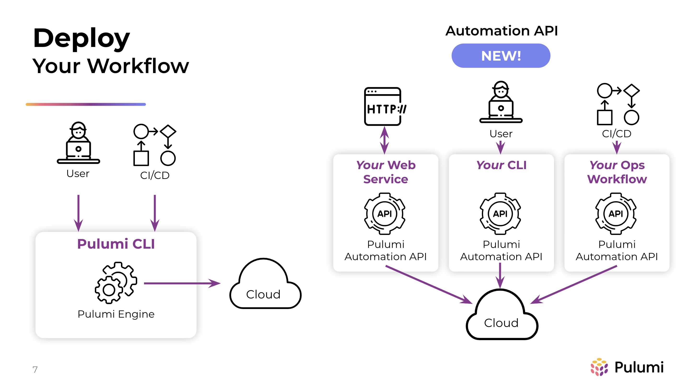
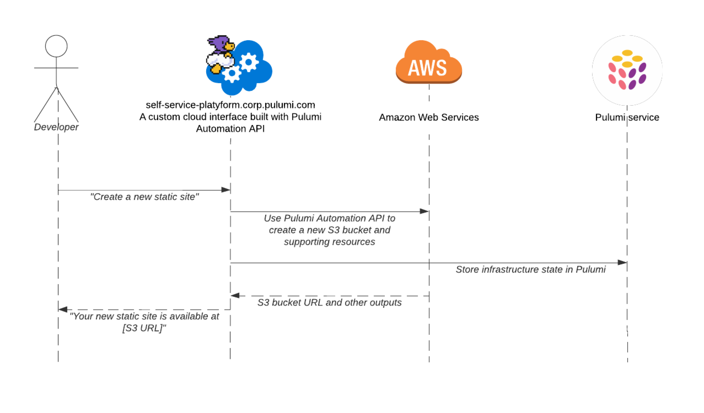
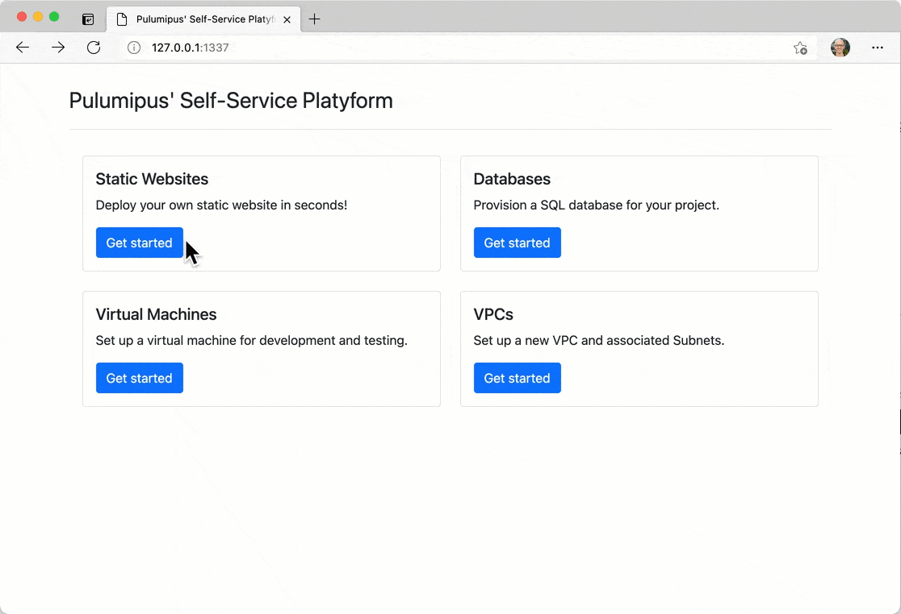
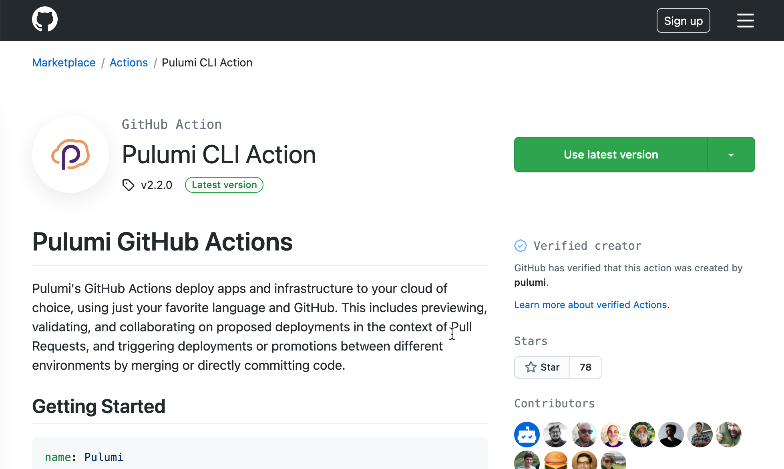

Pulumi Automation API exposes the full power of infrastructure as code through a programmatic interface, instead of through CLI commands. With Automation API, you can create software that has the capability to provision and configure infrastructure: create, update, configure, and destroy infrastructure dynamically. You can create new classes of Software-as-a-Service that provision unique infrastructure for every customer. You can build the perfect cloud interface for your organization, combining all of your infrastructure knowledge and best practices into a purpose-built tool, whether it's a SaaS offering, an internal web app, a purpose-built CLI tool, a CI/CD integration, or something else entirely.

We announced the general availability of Automation API today at [PulumiUP](/pulumi-up) and we’re excited to see what you create with it!

<!--more-->

## Making self-service infrastructure platforms easier

So, why might you want to create your own interface to the cloud? Let’s take a step back and review the journey that many organizations take when they embrace the modern cloud. Infrastructure engineers across the organization will typically start designing and iterating on infrastructure, using Pulumi interactively on the command line or sometimes using a graphical interface like the AWS Console and Azure Portal or an imperative CLI like `aws` or `az`. In this early phase, rapid iteration is important, as infrastructure engineers try different combinations of services, different configurations, and more until they land on a configuration that they want to make ready for production.

When they’re ready to go to production, the easy exploration and rapid iteration afforded by the cloud provider’s graphical and CLI interfaces become less important. Instead, new concerns about scalability, security, compliance, and cost control come to the forefront. At this point, it's common to turn to infrastructure as code templates. Pulumi’s modern IaC allows infrastructure engineers to codify the infrastructure they’ve designed into a code file that can be managed like any other piece of software: checked into source control, forked and modified, and executed when needed by an engineer or application developer using the `pulumi` CLI in a terminal. In some organizations, this is the end of the journey: application developers start from the canonical infrastructure as code solutions created by their infrastructure team and modify them as needed to suit their unique needs. In those organizations, Pulumi’s [policy-as-code offering](/docs/guides/crossguard/get-started) can help infrastructure teams keep application teams “within the guardrails” as they customize their infrastructure.

However, not all organizations want to expose the full complexity of infrastructure, or an infrastructure as code tool like Pulumi, to their application developers. This is where Pulumi’s Automation API and the custom cloud interfaces that can be created with it come into play. Automation API allows infrastructure teams to provide self-service tools (e.g. developer portals, purpose-built CLIs, custom frameworks, and CI/CD workflows) for building, deploying, and managing infrastructure that offer the right levels of complexity and customization for the tool’s target audience. With Automation API, infrastructure teams scale their knowledge and expertise across the entire organization by encoding it into the tool they create. Application teams get self-service access to infrastructure without having to understand every underlying resource and option. Security and compliance teams get peace of mind that all of the organization’s infrastructure is created and managed through an approved tool that follows the right processes and procedures.

## Unlocking new classes of Software-as-a-Service offerings

Before Automation API, most Software-as-a-Service (SaaS) products used multi-tenant infrastructure: infrastructure that's shared across many of the SaaS's customers. They did so because it wasn't possible to create and manage unique infrastructure for each customer. But, some SaaS customers—especially in regulated industries like healthcare and finance—were reluctant to use multi-tenant SaaS offerings because of security and performance concerns, like data leakage between tenants or inadequate performance when a neighboring tenant was heavily using the system.

Pulumi's Automation API unlocks new customers for existing SaaS products and entirely new classes of single-tenant SaaS products, like Pulumi customers [CockroachDB](https://www.cockroachlabs.com/blog/kubernetes-saas-implementation/) and [Snowflake](/case-studies/snowflake)). For these leading providers of cloud software, Automation API unlocks the capability to make infrastructure a fundamental part of their offering. With Automation API, they can create and manage unique infrastructure for every customer, even as they scale to 1,000s of customers. They can provide solutions that weren't feasible with multi-tenant infrastructure or bring existing solutions to customers with higher needs for security, performance, and compliance. In short, they can leverage cloud infrastructure as a competitive advantage.

## Start using Automation API: from `pulumi up` to `stack.up()`

To get started with Automation API, you can take any existing Pulumi program. Instead of running commands like `pulumi up` interactively in a terminal to provision your infrastructure, with Automation API you write an application that calls functions like `stack.up()`. Then, when you deploy that application and give your customers access to it, they can stand up infrastructure when they’re ready.

At its core, the Automation API enables you to use the entire Pulumi engine as an SDK for the applications you create. Like all of Pulumi, Automation API is available in multiple languages, so you can create applications that use it in TypeScript/JavaScript, Python, Go, and C#.

👉 Get started with the [Automation API User Guide](/docs/guides/automation-api)

## Automation API in the wild

In the short while that Automation API has been in preview, we’ve already seen it used for a wide variety of custom platforms and other automation-centric use cases like CI/CD. Automation API powers custom infrastructure platforms—like [Mercedes-Benz Research & Development’s platform](/case-studies/mercedes-benz)—that empower teams across the organization to stand up the infrastructure they need in the cloud when they need it. It’s also used to operate Pulumi natively in automation and CI/CD environments; if you’ve used Pulumi’s GitHub Action, you’ve already used Automation API. Read on to see how Automation API has been used across languages, scenarios, and ecosystems.

### Pulumipus’ Self-Service Platform, a web app in Python

Today at PulumiUP, [Komal Ali](https://twitter.com/zwitkali)—one of the primary authors of Automation API—will show “Pulumipus’ Self-Service Platyform”: a Python-based interface for creating customized static sites, databases, virtual machines, and more. The demo shows how easy it is to build a self-service web interface for infrastructure by combining Pulumi infrastructure as code and a Flask web app. The code is open source and [available on GitHub](https://github.com/komalali/self-service-platyform).

### Ploy, a CLI in Go

It’s also possible to create custom command-line interfaces with Automation API. Lee Briggs, a Pulumi community engineer, shows one such interface [in this video](https://www.youtube.com/watch?v=aF7qtH_Q-Uo), called Ploy. Ploy is a Heroku-like interface for deploying Docker images to a Kubernetes cluster. Ploy is fully [open source on GitHub](https://github.com/jaxxstorm/ploy) and combines Pulumi infrastructure with a Go CLI using Promptui.

### Python IaC in your Jupyter notebook

Many data scientists work in Jupyter notebooks, where they can interactively execute Python code as they train models, create analyses, and more. Because these notebooks use Python, it’s possible to use Pulumi’s Python SDK and Automation API to create infrastructure interactively. Pulumian Sophia Parafina showed how to do so in [this blog post from earlier this year](https://www.pulumi.com/blog/data-science-in-the-cloud/). Examples of using Pulumi in a Jupyter notebook are available in our [open source examples repository on GitHub](https://github.com/pulumi/automation-api-examples/tree/main/python/pulumi_via_jupyter).

### Pulumi Resource Type for Concourse, a CI/CD extension in Go

Some users’ perfect interface to the cloud is a continuous integration and delivery (CI/CD) platform that builds applications and infrastructure together in a unified pipeline. Pulumi’s Automation API is a key component that has helped many of our customers plug Pulumi into their CI/CD platform of choice. One such extension is the [Pulumi Resource Type for Concourse](https://github.com/ringods/pulumi-resource/), which allows users of the [Concourse CI](https://concourse-ci.org/) product to add infrastructure to their pipelines. Authored by Pulumi community member Ringo De Smet, the extension is [open source on GitHub](https://github.com/ringods/pulumi-resource/).

### Pulumi GitHub Action, a CI/CD extension in TypeScript

Pulumi works great with GitHub Actions, one of the most popular CI/CD systems, thanks to our GitHub Action, which Automation API also powers. Co-developed by Pulumi community member Simen A. W. Olsen and Pulumian Paul Stack, Pulumi’s GitHub Action gives you complete control over Pulumi in your CI/CD and other automation workflows. [Read more about how it was created using Automation API](/blog/supercharging-our-github-action-with-the-pulumi-automation-api) or see the TypeScript [source code on GitHub](https://github.com/pulumi/actions).

👉 [See more examples of Automation API in action](https://github.com/pulumi/automation-api-examples)

## Keep exploring

Automation API is just one part of the Pulumi Cloud Engineering Platform, announced today at PulumiUP. Watch the PulumiUP event for more.

👉 [Get started with the Automation API User Guide](/docs/guides/automation-api)
👉 [PulumiUP](/pulumi-up)
