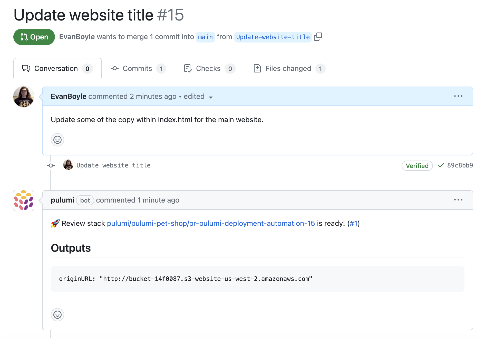
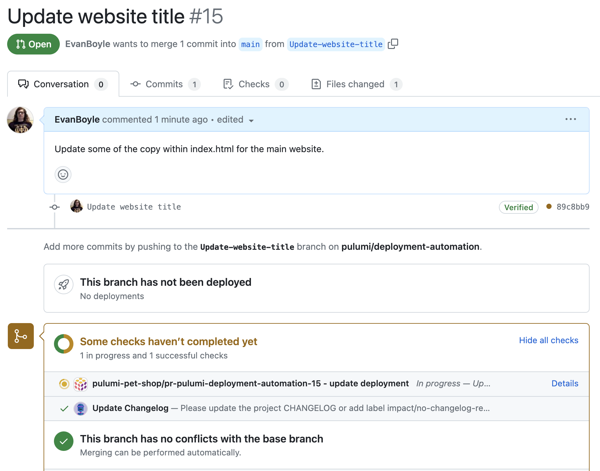

At Pulumi, our engineering team writes *a ton* of code. We have hundreds of repositories with programs managing thousands of stacks and tens of thousands of cloud resources. These tools and services power production workloads, internal tools, business intelligence and process, and more. When you’re an engineer looking to work in one of these repositories, making a code change is usually the easy part. The hard part is figuring out how to get a tight dev loop going. Are there instructions in the README for running locally? A docker compose file? Can I figure out what config and upstream stack references are required to stand up a fresh dev stack? We make it incredibly easy to build in the cloud and write prolific amounts of code, and with that comes a need to standardize our development process.

Today we’re excited to announce Review Stacks, the productivity boost for every developer and every codebase in your organization - all powered by Pulumi Deployments. Review Stacks are dedicated cloud environments that get created automatically every time a pull request is opened. Pulumi Deployments creates a new stack from a template you configure, runs an update to deploy the code in your branch, and posts a comment to the pull request with the outputs and URLs for your deployed changes making it easy to share with teammates and streamline collaboration.



Uniquely, Review Stacks enable you to iterate on both application code changes and infrastructure code changes at the same time. Making changes to HTML, CSS, Next.js, Go APIs, Pulumi configuration, subnet configuration, databases, and load balancers are all possible with Review Stacks. No more fumbling with out-of-date READMEs and developer documentation. Just open a pull request and you can start testing changes against everything from simple static websites to API servers, microservices, data pipelines, Kubernetes clusters, and any other piece of infrastructure across Pulumi’s 100+ cloud providers.

Review Stacks manage the full lifecycle of your cloud development environment including creating it when the PR is opened, updating it every time a new commit is pushed, and destroying and cleaning up all cloud resources when the pull request is merged or closed. They even integrate with GitHub checks so that you can gate your pull requests on successful Review Stack deployments.



Pulumi customers already using review stacks find that it saves their developers time. Having a standardized process for development environments and change management makes it easier to onboard new developers, and load-balance teammates onto unfamiliar projects and codebases. It also makes it substantially easier for developers to work on multiple feature branches and bug fixes at the same time, as they don’t have to worry about manually maintaining and juggling development environments.

“Pulumi allows every engineer to build and update infrastructure instead of only our infrastructure team, which enables us to ship faster than if we were using a domain-specific language,” said Aaron Gibralter, head of engineering, Mighty. “With Pulumi Deployments, we could easily set up a standardized CI/CD infrastructure workflow for every engineer that immediately makes them productive. Review Stacks automates the work of managing our own ephemeral infrastructure and makes our lives easier.”

Review Stacks also provide an avenue for optimizing cloud costs. Rather than keeping development infrastructure running 24/7, Review Stacks only exist as long as an engineer works on a feature. Since review stacks are flexible and built on Pulumi IaC, it is also possible to configure Review Stacks to deploy to multi-tenant environments that share development infrastructure to further streamline costs.

## Configuring Review Stacks

Configuring Review Stacks is a simple three-step process:

1. Create a new stack and `Pulumi.<stack>.yaml` configuration file - this config will be copied into every review stack that gets created, and can even be modified within a PR
2. Configure Deployment Settings for the stack - this specifies how to acquire source code, cloud credentials and more when deploying via Pulumi Deployments
3. Set the `pullRequestTemplate` Deployment Setting to true - this indicates that all pull requests against this stack’s branch should reference this stack as a Review Stack template.

You can use an existing stack as a Review Stack template, as long as it has Pulumi Deployment settings configured. This will cause Review Stacks to get deployed into the same cloud account. If you want to separate the cloud resources in your production stack from the resources created via Review Stacks then you can create a separate stack and template that references a different cloud account (AWS, Azure, GCP, etc).

Review Stacks and Deployment Settings can be configured via the Pulumi Cloud console, the Pulumi Cloud REST API, or within a Pulumi Program using the Pulumi Cloud Resource Provider.

### REST API

```
curl -i -XPOST -H "Content-Type: application/json" -H "Authorization: token $PULUMI_ACCESS_TOKEN" \
--location "https://api.pulumi.com/api/preview/org/project/stack/deployment/settings" \
-d '{
  "gitHub":{
    "pullRequestTemplate": true
    }
}'
```

### Pulumi Cloud Resource Provider

```typescript
import * as pulumiservice from "@pulumi/pulumiservice";

const deploymentSettings = new pulumiservice.DeploymentSettings("deploymentSettings", {
	organization: pulumi.getOrganization(),
	project: "your project",
	stack: "your stack",
	github: {
		deployCommits: true,
		previewPullRequests: true,
		pullRequestTemplate: true,
		repository: "pulumi/deployment-automation",
	},
	sourceContext: {
		git: {
			branch: "refs/heads/main",
			repoDir: "pulumi-pet-shop",
		},
	},
});
```

## Collaborate in the Cloud

Cloud software is a huge asset but without a repeatable and standardized process for development, the sprawl of different toolchains and processes can slow you to a screeching halt. The cloud should be an accelerant to your business, not a bottleneck. Whether you’re a team of five or an enterprise of thousands, Review Stacks and Pulumi Deployments enables you to ship with more velocity, confidence, and collaboration.

Check out these resources and get started today:

- TODO review stacks docs link
- TODO deploy docs link
- TODO slack link

Happy building!
