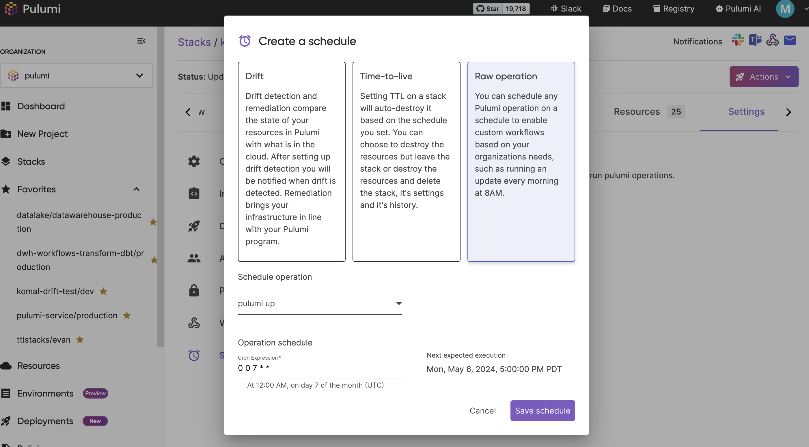

In the rapidly evolving world of cloud infrastructure, the complexities and costs of managing such environments are escalating. In response to these challenges, Pulumi is excited to announce Scheduled Deployments for Pulumi Cloud. This new feature, which builds upon the robust foundation of Pulumi Deployments, is designed to streamline cloud management by automating the deployment and deactivation of resources according to customizable schedules. Two new Pulumi features also announced today, [Drift Detection and Remediation](/blog/drift-detection) and [Time-to-Live Stacks](/blog/ttl), are built on top of the new Scheduled Deployments functionality. These three new features are available today on the Enterprise and Business Critical editions of Pulumi Cloud.

### Simplifying Cloud Operations Through Automation

Scheduled Deployments enable precise automation of cloud operations, allowing users to schedule any Pulumi operation—such as `pulumi up`, `pulumi refresh`, `pulumi destroy`, or `pulumi preview`—for any stack with Pulumi Deployments. This feature is not just about automating routine tasks; it’s about enhancing operational efficiency, reducing costs, and deploying resources exactly when needed.

#### Example Use Cases

- **Automating Deployments outside of Git:** Pulumi Deployments handles Git based Deployments well, but we have heard from customers there are times you want to intentionally diverge from Git triggered Deployments, such as wanting to deploy only at set times ahead of a large usage event or deploy only on non-peak traffic times.
- **Cost Optimization:** Automatically power down non-critical development or test stacks during off-hours to cut unnecessary cloud spend. These stacks can be reactivated on a schedule or on-demand, ensuring resources are available precisely when teams need them without incurring costs during idle times.
- **Product Launches:** Configure infrastructure to deploy right before a major release with `pulumi up`, ensuring that all resources are aligned and active precisely for the event, eliminating the need for last-minute manual updates.
- **Scheduled Processing:** Perfect for tasks that require computing resources at specific times, such as nightly batch processing or periodic machine learning model training. Schedule these operations to maximize resource utilization and shut down upon task completion to optimize costs.

### How Scheduled Deployments Work

Users can define schedules for any Pulumi operation, on any stack, using cron expressions, which provide the flexibility to specify exact times for operations. This granular control over deployment timing allows for effective management of infrastructure tasks, accommodating even the most complex scheduling needs. Pulumi Deployments Schedules can be set up using the Pulumi Cloud console, our [REST API](/docs/pulumi-cloud/deployments/api) or managed in source control using the [Pulumi Service Provider](/registry/packages/pulumiservice/api-docs/provider).

### Integration with Existing Features

Scheduled Deployments integrate seamlessly with existing Pulumi Deployments. The concurrency limits of Pulumi Deployments apply and if deployments on a stack are paused, the scheduled deployments will queue, waiting for the pause to lift before executing. This integration ensures that all scheduled activities respect the operational parameters set within Pulumi Cloud.

## Getting Started with Scheduled Deployments

### Setting it up in the Pulumi Cloud Console

We'll walk through how to get up and running with Scheduled Deployments in the Pulumi Cloud console, REST API and Pulumi Service Provider. For more details on how to implement and maximize the benefits of Scheduled Deployments, please visit [our documentation](/deployments/scheduled-deployments).

Setting up Scheduled Deployments via the Pulumi Cloud console is straightforward:


In order to set up Drift Detection and Remediation in the Pulumi Cloud console, follow these steps:

1. Ensure Deployments Settings are configured on the stack [see the docs](/docs/pulumi-cloud/deployments/reference)
2. Navigate to the Stack > Settings > Schedules
3. Select "Raw operation"
4. Select from the drop-down the type of operation you would like to schedule
5. Set the schedule using a cron expression
6. Save the Schedule



Now you have a Scheduled Deployment!

### Setting it up in the API

For those who prefer to automate and script their infrastructure tasks, Time-to-Live schedules can be configured programmatically using simple HTTP requests.

- Create a schedule
- Get a schedule for a stack
- Update or delete a schedule
- Pause or resume a schedule
- List all schedules in the organization (includes Drift and Time-to-Live schedules)

Below is an example of creating a Schedule on a stack programmatically:

```bash
curl \
  -H "Accept: application/vnd.pulumi+8" \
  -H "Content-Type: application/json" \
  -H "Authorization: token $PULUMI_ACCESS_TOKEN" \
  --request POST \
  --data '{ "scheduleCron":"0 0 * * *", "request": { "operation": "update" } }' \
  https://api.pulumi.com/api/stacks/{organization}/{project}/{stack}/deployments/schedules
```

Refer to the [Pulumi Deployments REST API documentation](/docs/pulumi-cloud/deployments/api) for more details on how to use the REST API to manage Scheduled Deployments.

### Setting it up in the Pulumi Service Provider

TODO

## Wrapping it up

We are looking forward to unlocking this capability to enable an out of the box way to automate your reoccuring workflows.

Happy building!
