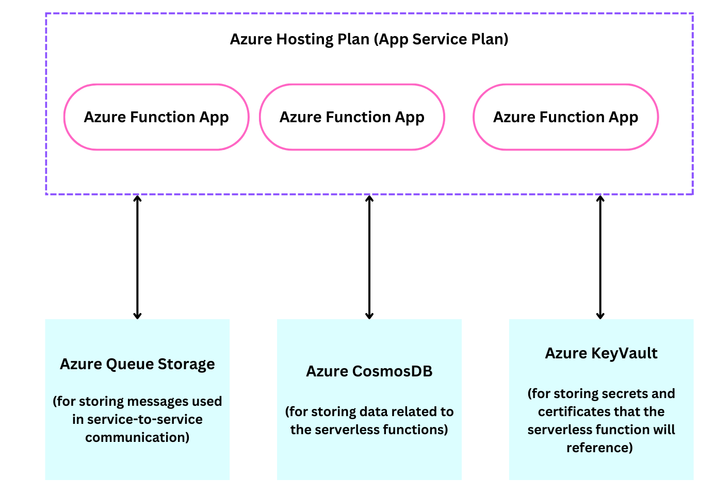

Serverless architectures have gained more popularity in the recent years because they make it easier for software developers to focus on application development without the additional operation overhead. With Pulumi, you can deploy and manage your serverless infrastructure and this article shows you how to do this with Azure.

Before we go into the specifics of serverless architecture design with Pulumi on azure, let's go
through the basics of serverless - this is important for the rest of the article.

## What is Serverless Architecture

Serverless architecture is a cloud computing model that simplifies the management of infrastructure. This allows software developers to focus on writing code without worrying
about server provisioning, scaling or maintenance. The idea behind it is functions as a service (FaaS), in which the environment dynamically scales in response to demand and code is executed in response to events. In the serverless architecture, developers focus on writing and deploying code in the form of serverless functions, which are executed in response to specific events or triggers.

Key characteristics of serverless architecture include:

- Event-Driven: Serverless functions are triggered by events in the system. These events could be HTTP requests, messages in a queue, or changes to a data store.

- Auto-Scaling: With serverless, resources automatically scale up or down to match the workload so you don't use infrastructure beyond what you actually need.

- Pay-as-You-Go: You are charged only for the actual compute resources you use during code execution.

The serverless architecture model is in line with current tech trends such as cloud-native development and DevOps, by allowing developers to focus on code development and pushing faster releases.

## Serverless Function Design

The design of the serverless function is important for the success of your application. When mapping out the architectural design for your Azure function, you should consider some of the following:

- **Function Logic**: A serverless function should have a well-defined purpose and focus on a specific task. If a function has multiple responsibilities, consider breaking it into smaller, more focused functions. In the serverless app we deployed using Pulumi, we had two functions `date` and `weather` and it is clear what their responsibilities are.

    ``` go
    // The 'date' function that returns the current date
	mux.HandleFunc("/api/date", func(w http.ResponseWriter, r *http.Request) {
		w.Header().Set("Access-Control-Allow-Origin", "*")
		w.Header().Set("Access-Control-Allow-Methods", "GET")

		if r.Method == http.MethodOptions {
			w.WriteHeader(http.StatusNoContent)
			return
		}

		w.Header().Set("Content-Type", "application/json")
		w.Write([]byte(fmt.Sprintf(`{ "now": %d }`, time.Now().UnixNano()/1000000)))
	})

    // The 'weather' function that returns the weather
	mux.HandleFunc("/api/weather", func(w http.ResponseWriter, r *http.Request) {
		w.Header().Set("Access-Control-Allow-Origin", "*")
		w.Header().Set("Access-Control-Allow-Methods", "GET")

		if r.Method == http.MethodOptions {
			w.WriteHeader(http.StatusNoContent)
			return
		}

		weather := getWeatherData()

		// Convert the weather data to JSON.
		responseJSON, err := json.Marshal(weather)
		if err != nil {
			http.Error(w, "Error encoding response to JSON", http.StatusInternalServerError)
			return
		}

		w.Header().Set("Content-Type", "application/json")
		w.WriteHeader(http.StatusOK)
		w.Write(responseJSON)
	})
    ```

- **Statelessness**: Serverless functions should be stateless. This encourages scalability and fault tolerance since every serverless function call should be able to function on its own, regardless of previous or subsequent calls. The recommended practise for managing data that has to be persistent beyond the span of one function execution is to store it externally in reliable data storage systems like object stores or databases. In doing so, serverless applications maintain the clear separation between function logic and stateful data management while guaranteeing data durability, consistency, and adaptability to changing workloads.

- **Function triggers**: When dealing with serverless functions you should choose the Right trigger that best suits your use case. Common triggers include HTTP requests, message queues, database changes, and timers. In our application, we used an HTTP trigger for our two functions.

    ``` go
    // The 'date' function that returns the current date
	mux.HandleFunc("/api/date", func(w http.ResponseWriter, r *http.Request) {
        ...
	})

    // The 'weather' function that returns the weather
	mux.HandleFunc("/api/weather", func(w http.ResponseWriter, r *http.Request) {
        ...
	})
    ```

    To set the trigger in your serverless function, navigate to your `function.json` configuration and set the `type` parameter in the `bindings` object.

    ``` json
    "bindings": [
        {
            "authLevel": "Anonymous",
            "type": "httpTrigger",
            "direction": "in",
            "name": "req",
        "methods": [
            "get"
        ]
        },
        {
            "type": "http",
            "direction": "out",
            "name": "res"
        }
    ]

    ```

- **Scalability**: Serverless doesn't mean "no server" otherwise, where will the code actually run? The meaning of serverless is "less server." When event density rises, the majority of serverless platforms offer a set of options to manage how the infrastructure should scale. There are several options available to you, and the technique you use will depend on the function. Azure Functions offer auto-scaling, allowing your application to seamlessly handle increased workloads.  By designing your serverless functions with scalability in mind, you can maintain optimal performance even during traffic spikes, delivering a responsive and reliable experience to your users.

- **Dependency across multiple services**: In your serverless architecture, there are times when functions depend on other functions. This typically happens a lot in distributed systems. For example in an e-commerce service, the checkout function could depend on the payment function. However, it's advised that services avoid making direct references to one another in order to prevent hard coupling that can cause issues later. A significant amount of reworking may be required if direct references for a service need to be changed. Using message services, such as queues or topics, to facilitate service-to-service communication is a good way to handle this.

> Figure 1. Resources needed in a serverless architecture


To create serverless infrastructure for an application that should have distint function logic, statelessness, message queue triggers, auto scaling, and service to service communication, you can identify all the cloud resources needed for your infrastructure and use Pulumi to declare and manage those resources. The interesting thing about Pulumi's code-driven infrastructure provisioning is that you can manage all your serverless infrastructure in one place which makes development faster, and treating IaC code like regular code also gives you the ability to track changes to infrastructure over time.

If you've joined us on this incredible journey to lean about serverless applications with Pulumi and Azure, we'd love to hear your story. How did it work out for you?

Our journey doesn't end here; there's a lot more you can do with serverless apps when you throw Pulumi into the mix. We invite you to share your thoughts, ideas, and suggestions, and we can't wait to see what you build!

Join us in the [Pulumi Community Slack](https://slack.pulumi.com) to decide what challenge we tackle next!
