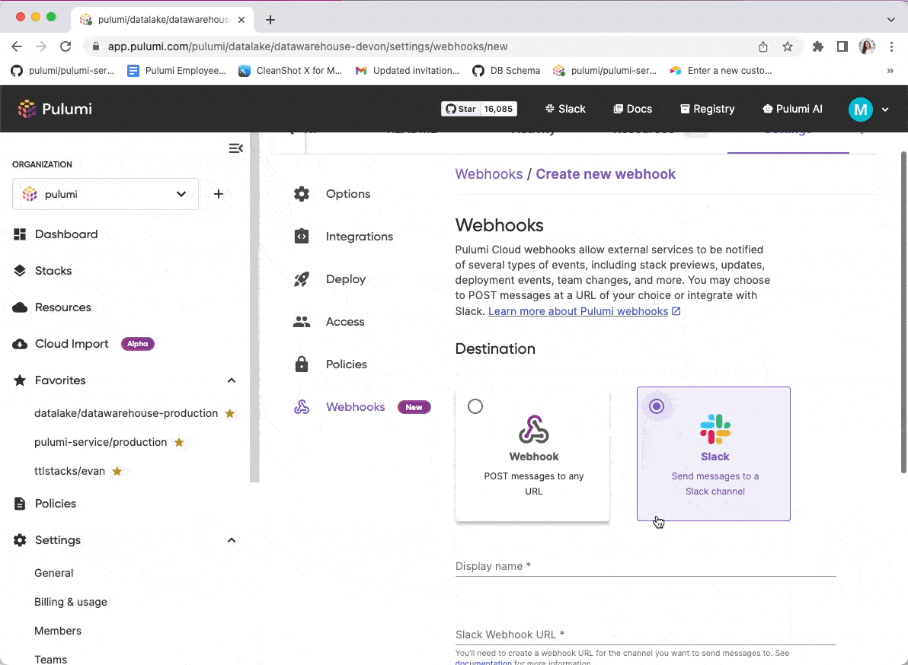

Today, we are excited to introduce a set of improvements to [Pulumi Cloud Webhooks](/docs/pulumi-cloud/webhooks), designed to streamline your deployment notifications to where you already spend your time, enabling faster response times to critical issues. We are also announcing two new improvements to our webhooks feature: Pulumi Deployments events and fine-grained filtering.

<!--more-->

Teams using Pulumi Cloud have been setting up Slack notifications for their stacks using Pulumi Cloud Webhooks. Webhooks can attach to a Pulumi organization or a Pulumi stack. Starting today, customers can set up a Slack integration, for organization or stack notifications, with less steps and without needing to host the infrastructure themselves. We have also expanded the types of event notifications and the filtering options on both Pulumi Cloud Webhooks and for the Slack integration.

Pulumi Cloud Webhooks, including the Slack integration, are available to all Pulumi Cloud organizations.

## Slack integration

### Setiing up the Slack Integration


Before today Pulumi customers used Pulumi Cloud Webhooks to set up generic JSON webhooks. When events occur, we send a HTTP POST request to any registered listeners. Webhooks can then be used to send notifications to an app (like Slack), start running automated tests, or even to update another stack! We have now built support for Slack-formatted webhooks, which allow you to quickly enable notifications about your Pulumi stacks and organizations into your Slack workspace by simply providing a [Slack incoming webhook URL](https://api.slack.com/messaging/webhooks).

You can either create your own Slack app (or use an existing one you may already have installed in your workspace) or you can use the below link to quickly get started with a pre-defined Slack app manifest.

[Create a Slack app from manifest](https://api.slack.com/apps?new_app=1&manifest_yaml=display_information%3A%0A%20%20name%3A%20pulumi-slack-notifications%0A%20%20description%3A%20Funnel%20Pulumi%20webhooks%20to%20Slack%0A%20%20background_color%3A%20%22%238a3391%22%0Afeatures%3A%0A%20%20bot_user%3A%0A%20%20%20%20display_name%3A%20pulumi-slack-notifications%0A%20%20%20%20always_online%3A%20false%0Aoauth_config%3A%0A%20%20scopes%3A%0A%20%20%20%20bot%3A%0A%20%20%20%20%20%20-%20incoming-webhook%0Asettings%3A%0A%20%20org_deploy_enabled%3A%20false%0A%20%20socket_mode_enabled%3A%20false%0A%20%20token_rotation_enabled%3A%20false)

By following these steps, which can also be found in [our webhooks documentation](/docs/pulumi-cloud/webhooks), in a few clicks you will have a Slack incoming webhook URL which you can use to set up a webhook in [Pulumi Cloud](https://app.pulumi.com), as shown in the GIF below.



There are Pulumi customers with hundreds to thousands of stacks, making setting up webhooks for each via the UI a time consuming task. In order to enable Pulumi notifications at scale, we have added Pulumi Cloud REST API endpoints for creating webhooks as well as [Pulumi Service Provider](https://www.pulumi.com/registry/packages/pulumiservice) support.

### Pulumi Cloud REST API

Create a webhook via the Pulumi Cloud REST API formatted for Slack, as shown in the example below.

```bash

curl \
  -H "Accept: application/vnd.pulumi+8" \
  -H "Content-Type: application/json" \
  -H "Authorization: token $PULUMI_ACCESS_TOKEN" \
  --request POST \
  --data '{
      "organizationName":"{organization}",
      "projectName":"{project}",
      "stackName":"{stack}",
      "displayName":"#some-slack-channel",
      "payloadUrl":"https://hooks.slack.com/services/...",
      "format": "slack",
      "active":true
  }' \
  https://api.pulumi.com/api/orgs/{organization}/{project}/{stack}/hooks


```

### Pulumi Service Provider

The Pulumi Service provider allows you to create Pulumi Cloud resources via Pulumi. You can provision and manage webhooks, including Slack-formatted webhooks, using this provider.



{}

```ts

import * as pulumi from "@pulumi/pulumi";
import { Webhook, WebhookFormat, WebhookFilters } from "@pulumi/pulumiservice";

const serviceOrg = "service-provider-test-org";

const webhook = new Webhook("wh", {
  active: true,
  displayName: "webhook-from-provider",
  organizationName: serviceOrg,
  payloadUrl: "https://google.com",
  filters: [WebhookFilters.DeploymentStarted, WebhookFilters.DeploymentSucceeded],
});

const stackWebhook = new Webhook("stack-webhook", {
  active: true,
  displayName: "stack-webhook",
  organizationName: serviceOrg,
  projectName: pulumi.getProject(),
  stackName: pulumi.getStack(),
  payloadUrl: "https://example.com",
  format: WebhookFormat.Slack,
})

export const orgName = webhook.organizationName;
export const name = webhook.name;
export const stackWebhookName = stackWebhook.name;
export const stackWebhookProjectName = stackWebhook.projectName;

```

{}

{}

```yaml

name: yaml-webhooks
runtime: yaml
description: A minimal example of provisioning access token via Pulumi YAML

resources:
  webhook:
    type: pulumiservice:index:Webhook
    properties:
      active: true
      displayName: yaml-webhook
      organizationName: service-provider-test-org
      payloadUrl: "https://google.com"

outputs:
  # export the name of the webhook
  name: ${webhook.name}

```

{}

## Pulumi Deployment Notifictation Events

Pulumi Deployments is infrastructure deployments as a managed service. With Pulumi Deployments, you can run a Pulumi infrastructure as code action (a preview, update, destroy or refresh) inside Pulumi’s managed service. Pulumi provides scalability, observability and security for deployments. Both Slack-formatted and generic JSON webhooks in Pulumi Cloud now send notifications events on Pulumi Deployments statuses: when a deployment is queued, started, succeeds and fails.

## Filtering Notifictation Events

Event filtering allows you to select which events should be delivered to each webhook. You may want to receive
all events, or filter to specific events (only failures, only deployment events, etc.). The following table describes the various event filters available and the context in which they are relevant.

| Filter                 | Event Kind      | Webhook Type               | Triggered                         |
|------------------------|-----------------|----------------------------|-----------------------------------|
| `stack_created`        | `stack`         | Organization webhooks only | When a stack is created.          |
| `stack_deleted`        | `stack`         | Organization webhooks only | When a stack is deleted.          |
| `preview_succeeded`    | `stack_preview` | Both                       | When a stack `preview` succeeds.  |
| `preview_failed`       | `stack_preview` | Both                       | When a stack `preview` fails.     |
| `update_succeeded`     | `stack_update`  | Both                       | When a stack `update` succeeds.   |
| `update_failed`        | `stack_update`  | Both                       | When a stack `update` fails.      |
| `destroy_succeeded`    | `stack_update`  | Both                       | When a stack `destroy` succeeds.  |
| `destroy_failed`       | `stack_update`  | Both                       | When a stack `destroy` fails.     |
| `refresh_succeeded`    | `stack_update`  | Both                       | When a stack `refresh` succeeds.  |
| `refresh failed`       | `stack_update`  | Both                       | When a stack `refresh` fails.     |
| `deployment_queued`    | `deployment`    | Both                       | When a deployment is queued.      |
| `deployment_started`   | `deployment`    | Both                       | When a deployment starts running. |
| `deployment_succeeded` | `deployment`    | Both                       | When a deployment succeeds.       |
| `deployment_failed`    | `deployment`    | Both                       | When a deployment fails.          |

## Wrapping up

We hope you and your team can streamline deployment related notifications to where you spend your time. Our webhooks improvements enable ChatOps workflows and more visibility into your infrastructure. As always, please let us know if you have feedback on the feature by opening a issue in the Pulumi Cloud requests repository or if you have other features you would like to see in Pulumi Cloud.

Happy building! 👷
