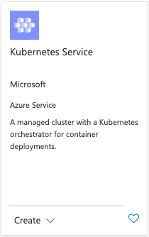
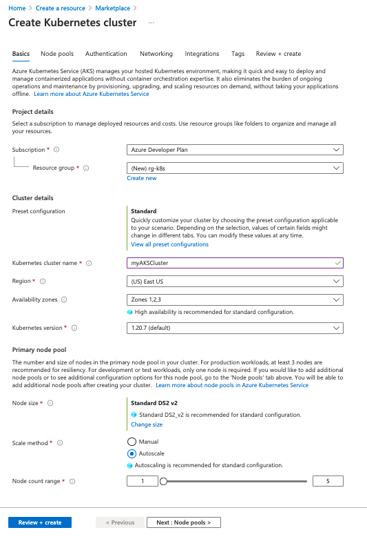
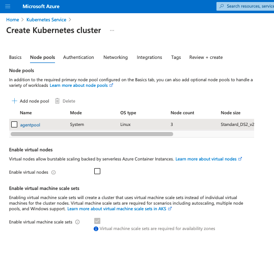
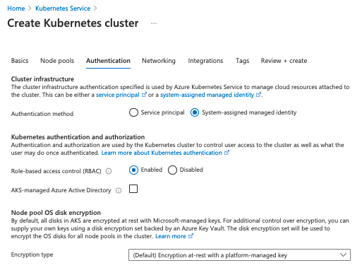
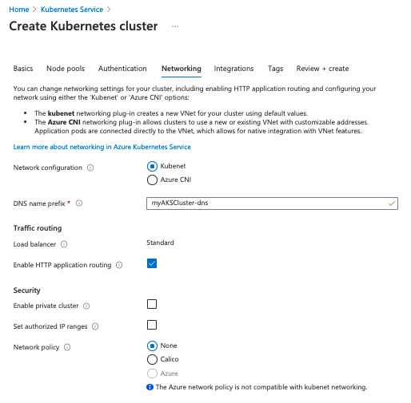
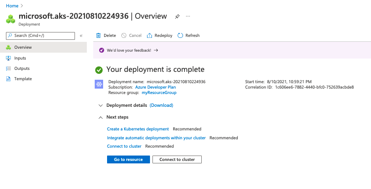

History lesson time! In 2011, microservices debuted as an architectural style suited for the cloud. In 2013, Docker simplified building containers. Combining containers and microservices sparked a change in how applications were built and distributed in the cloud. As performance, scaling, and reliability became an increasing concern, container orchestration platforms became widely available. Kubernetes became the dominant container orchestration through community and corporate support, and some have suggested it was [inevitable](https://elastisys.com/why-kubernetes-was-inevitable/). Every major cloud service provider, including Azure, offers a version of Kubernetes.

Kubernetes streamlines container deployment and management, making applications scale and accessible. This article demonstrates configuring and deploying Kubernetes with Azure.

<!--more-->

## A Kubernetes Review

If you're not familiar with Kubernetes concepts and terminology, the Getting Started with Kubernetes series can help get you up to speed.

- [Getting Started With Kubernetes: Clusters and Nodes]()
- [Getting Started With Kubernetes: Application Basics]()
- [Getting Started With Kubernetes: Advanced Deployment]()
- [Getting Started with Kubernetes: Stateful Applications]()
- [Getting Started With Kubernetes: Networking]()
- [Getting Started With Kubernetes: Day 2]()

## Azure Kubernetes Service

Azure Kubernetes Service (AKS) is a hosted Kubernetes service. Azure manages the Kubernetes master nodes, and you are responsible for managing the agent or worker nodes. You only pay for the worker nodes in your cluster that make up your application.

Kubernetes nodes are the worker machines that can be either physical or virtual. AKS nodes use Azure virtual machines (VMs); and you can add storage, upgrade cluster components, or even run multiple node pools with mixed operating systems.

You can create an AKS cluster with

- the Azure CLI,
- the Azure portal,
- PowerShell, and
- templates, such as Azure Resource Manager (ARM) templates.

### AKS features

Configuring and deploying Kubernetes can be complex. AKS provides many features to simplify the process, including the following features:

- Cluster node and pod scaling adjust the number of nodes or pods as resource demand changes. [Pods can scale horizontally, and the cluster can also autoscale](https://docs.microsoft.com/en-us/azure/aks/tutorial-kubernetes-scale?tabs=azure-cli).
- Kubernetes is a fast-moving open source project, and AKS supports multiple versions. You can [upgrade the cluster nodes](https://docs.microsoft.com/en-us/azure/aks/node-image-upgrade) without interrupting the application.
- If you perform machine learning, AKS can create [GPU-enabled node pools](https://docs.microsoft.com/en-us/azure/aks/gpu-cluster) for compute-intensive, graphics-intensive, and visualization workloads.
- AKS supports access control through [Kubernetes RBAC](https://kubernetes.io/docs/reference/access-authn-authz/rbac/) and Azure [Active Directory](https://docs.microsoft.com/en-us/azure/aks/managed-aad).
- Integrated logging and monitoring with [Azure Monitor for Containers](https://docs.microsoft.com/en-us/azure/azure-monitor/containers/container-insights-overview) collects memory and processor metrics from containers, nodes, and controllers.
- AKS lets you mount static or dynamic storage volumes for persistent data. Storage volumes use Azure Disks for single pod access or Azure Files for concurrent pod access.
- [Virtual networking](https://docs.microsoft.com/en-us/azure/aks/concepts-network) for pods in the cluster and other nodes let you use a peered virtual network. The network also provides ingress for applications with HTTP application routing.
- Integration with development tools for Helm and a [Visual Studio Code extension for Kubernetes](https://marketplace.visualstudio.com/items?itemName=ms-kubernetes-tools.vscode-kubernetes-tools) improves the developer experience.
- Support for Docker images, including storage with [Azure Container Registry](https://azure.microsoft.com/en-us/services/container-registry/), makes deployment easier.

## Create an AKS Cluster with the Azure Portal

We'll use the Azure Portal to illustrate the steps to configure and deploy an AKS Cluster.

**Step 1**: Create a Kubernetes Service.

- Open the [Azure Portal](https:portal.azure.com) and select **Create Resource**.
- Select **Containers > Kubernetes Service**.
- Select **Create**.



**Step 2**: Create an AKS cluster.

For this example, we will configure several options in the `Basic` window but use defaults for most options.

- In `Subscription`, Select an `Azure Subscription`
- Create or select a [Resource Group](https://docs.microsoft.com/en-us/azure/azure-resource-manager/management/overview)
- In `Cluster details`, set the `Kubernetes cluster name`
- Change the `Region` if needed

Use the default values for `Primary node pool` and select `Next: node pools`.



**Step 3**: Configure node pools.

A node pool is a logical grouping of nodes. Nodes in a pool can have different virtual machines, different Kubernetes versions, and other attributes. You can use different node pools for different purposes, such as grouping workflows, e.g., a node pool for production and one for dev or test.

For this example, use the default values for node pools.



**Step 4**: Configure authentication.

You can authenticate, authorize, secure, and control access to Kubernetes clusters with:

- [Kubernetes role-based access control](https://kubernetes.io/docs/reference/access-authn-authz/rbac/) (Kubernetes RBAC) to grant access to service accounts
- [Azure Active Directory integration](https://docs.microsoft.com/en-us/azure/aks/managed-aad) that provides a multi-tenant, cloud-based directory and identity management service.

To configure `Authentication` for this example, set the `Authentication method` to `System-assigned managed identity`. You can set `Role-based access control (RBAC)` to enabled, but it's unnecessary for the example. Use the default value for the `Node pool OS disk encryption` type.



**Step 5**: Configure networking

AKS can use either `kubenet` or `Azure CNI` networking. Kubenet is the default configuration for AKS cluster creation.

With `kubenet`, Azure creates and configures the virtual network. However, only the nodes receive a routable IP address and pods use a NAT to communicate with resources outside the AKS cluster. This approach reduces the number of IP addresses you need to reserve in your network space for pods to use.

`Azure CNI`assigns an IP address to every pod, which makes them directly accessible. The IP addresses must be unique and  planned in advance. Each node must be configured for the maximum number of pods to reserve IP addresses per node. Without accounting for the number of pods, the network can run out of IP addresses to allocate or necessitate the need to rebuild clusters with a larger subnet.

For this example, we'll use `kubenet` for it's simplicity, but in production `Azure CNI` maybe the better choice for applications.



**Step 6**: Complete the deployment

Select **Review + create** to deploy. Deployment takes several minutes to complete. On completion, you can verify the **Deployment details** or select **Connect to cluster**.



**Step 7**: Connect to the cluster

You can manage your cluster with [`kubectl`](https://kubernetes.io/docs/tasks/tools/#kubectl), a command line tool for managing Kubernetes. You can install `kubectl` on [linux](https://kubernetes.io/docs/tasks/tools/install-kubectl-linux), [macOS](https://kubernetes.io/docs/tasks/tools/install-kubectl-macos), and [Windows](https://kubernetes.io/docs/tasks/tools/install-kubectl-windows).

Copy and paste the commands to connect and authenticate to your cluster using the [Azure CLI](https://docs.microsoft.com/en-us/cli/azure/install-azure-cli).


After connecting and authenticating to your cluster, you can use `kubectl` to query your cluster.

```bash
$ kubectl get nodes
NAME                                STATUS   ROLES   AGE     VERSION
aks-agentpool-19694923-vmss000000   Ready    agent   9m35s   v1.20.7
aks-agentpool-19694923-vmss000001   Ready    agent   9m39s   v1.20.7
aks-agentpool-19694923-vmss000002   Ready    agent   9m47s   v1.20.7
$ kubectl get all
NAME                 TYPE        CLUSTER-IP   EXTERNAL-IP   PORT(S)   AGE
service/kubernetes   ClusterIP   10.0.0.1     <none>        443/TCP   11m
```

Your AKS cluster is deployed and running.

## Deploying an AKS cluster with code

Now that we have reviewed the process for creating an AKS cluster using the Azure Portal, we can repeat the process using code.

**Step 1**: Create a `Resource group` and a `Service principal` for the cluster. Note that we used a `System-assigned managed identity` in the Azure Portal example.



    {}

        // Create an Azure Resource Group
        var resourceGroup = new ResourceGroup("azure-cs-aks");

        // Create an AD service principal
        var adApp = new Application("aks", new ApplicationArgs
        {
            DisplayName = "aks"
        });
        var adSp = new ServicePrincipal("aksSp", new ServicePrincipalArgs
        {
            ApplicationId = adApp.ApplicationId
        });

        // Generate random password
        var password = new RandomPassword("password", new RandomPasswordArgs
        {
            Length = 20,
            Special = true
        });

        // Create the Service Principal Password
        var adSpPassword = new ServicePrincipalPassword("aksSpPassword", new ServicePrincipalPasswordArgs
        {
            ServicePrincipalId = adSp.Id,
            Value = password.Result,
            EndDate = "2099-01-01T00:00:00Z"
        });

        // Generate an SSH key
        var sshKey = new PrivateKey("ssh-key", new PrivateKeyArgs
        {
            Algorithm = "RSA",
            RsaBits = 4096
        });

    {}
    {}

		// Create an Azure Resource Group
		resourceGroup, err := resources.NewResourceGroup(ctx, "azure-go-aks", nil)
		if err != nil {
			return err
		}

		// Create an AD service principal.
		adApp, err := azuread.NewApplication(ctx, "aks", &azuread.ApplicationArgs{
			DisplayName: pulumi.String("aks"),
		})
		if err != nil {
			return err
		}

		adSp, err := azuread.NewServicePrincipal(ctx, "aksSp", &azuread.ServicePrincipalArgs{
			ApplicationId: adApp.ApplicationId,
		})
		if err != nil {
			return err
		}

		// Generate a random password.
		password, err := random.NewRandomPassword(ctx, "password", &random.RandomPasswordArgs{
			Length:  pulumi.Int(20),
			Special: pulumi.Bool(true),
		})
		if err != nil {
			return err
		}

		// Create the Service Principal Password.
		adSpPassword, err := azuread.NewServicePrincipalPassword(ctx, "aksSpPassword", &azuread.ServicePrincipalPasswordArgs{
			ServicePrincipalId: adSp.ID(),
			Value:              password.Result,
			EndDate:            pulumi.String("2099-01-01T00:00:00Z"),
		})
		if err != nil {
			return err
		}

		// Generate an SSH key.
		sshArgs := tls.PrivateKeyArgs{
			Algorithm: pulumi.String("RSA"),
			RsaBits:   pulumi.Int(4096),
		}
		sshKey, err := tls.NewPrivateKey(ctx, "ssh-key", &sshArgs)
		if err != nil {
			return err
		}

    {}
    {}

        # Create new resource group
        resource_group = resources.ResourceGroup("azure-native-py-aks")

        # Create an AD service principal
        ad_app = azuread.Application("aks", display_name="aks")
        ad_sp = azuread.ServicePrincipal("aksSp", application_id=ad_app.application_id)

        # Generate random password
        password = random.RandomPassword("password", length=20, special=True)

        # Create the Service Principal Password
        ad_sp_password = azuread.ServicePrincipalPassword("aksSpPassword",
                                                        service_principal_id=ad_sp.id,
                                                        value=password.result,
                                                        end_date="2099-01-01T00:00:00Z")

        # Generate an SSH key
        ssh_key = tls.PrivateKey("ssh-key", algorithm="RSA", rsa_bits=4096)

    {}
    {}

        // Create an Azure Resource Group
        const resourceGroup = new resources.ResourceGroup("azure-go-aks");

        // Create an AD service principal
        const adApp = new azuread.Application("aks", {
            displayName: "aks",
        });
        const adSp = new azuread.ServicePrincipal("aksSp", {
            applicationId: adApp.applicationId,
        });

        // Generate random password
        const password = new random.RandomPassword("password", {
            length: 20,
            special: true,
        });

        // Create the Service Principal Password
        const adSpPassword = new azuread.ServicePrincipalPassword("aksSpPassword", {
            servicePrincipalId: adSp.id,
            value: password.result,
            endDate: "2099-01-01T00:00:00Z",
        });

        // Generate an SSH key
        const sshKey = new tls.PrivateKey("ssh-key", {
            algorithm: "RSA",
            rsaBits: 4096,
        });

    {}


**Step 2**: Configure the AKS cluster

We set the configuration options in `ManagedClusterAgentPoolProfileArgs`:

- `Count`: Number of virtual machines
- `MaxPods`: Maximum number of pods that can run on a node.
- `Mode`: Sets the type of pool node, which can be [system or user](https://docs.microsoft.com/en-us/azure/aks/use-system-pools)
- `Name`: Name of the pool node
- `OsType`: Specifies the OS type
- `Type`: Choose between a [`VirtualMachineScaleSet`](https://docs.microsoft.com/en-us/azure/aks/use-system-pools) or an [`AvailabilitySet`](https://docs.microsoft.com/en-us/azure/aks/availability-zones)
- `VmSize`: The virtual machine size used by the cluster.

The remaining parameters set the Kubernetes version, enables RBAC, and configures the Linux profile for the  `ContainerService`.


    {}

        var cluster = new ManagedCluster("my-aks", new ManagedClusterArgs
        {
            ResourceGroupName = resourceGroup.Name,
            AgentPoolProfiles =
            {
                new ManagedClusterAgentPoolProfileArgs
                {
                    Count = 3,
                    MaxPods = 110,
                    Mode = "System",
                    Name = "agentpool",
                    OsDiskSizeGB = 30,
                    OsType = "Linux",
                    Type = "VirtualMachineScaleSets",
                    VmSize = "Standard_DS2_v2",
                }
            },
            DnsPrefix = "AzureNativeprovider",
            EnableRBAC = true,
            KubernetesVersion = "1.18.14",
            LinuxProfile = new ContainerServiceLinuxProfileArgs
            {
                AdminUsername = "testuser",
                Ssh = new ContainerServiceSshConfigurationArgs
                {
                    PublicKeys =
                    {
                        new ContainerServiceSshPublicKeyArgs
                        {
                            KeyData = sshKey.PublicKeyOpenssh,
                        }
                    }
                }
            },
            NodeResourceGroup = $"MC_azure-cs_my_aks",
            ServicePrincipalProfile = new ManagedClusterServicePrincipalProfileArgs
            {
                ClientId = adApp.ApplicationId,
                Secret = adSpPassword.Value
            }
        });

    {}
    {}

		// Create the Azure Kubernetes Service cluster.
		cluster, err := containerservice.NewManagedCluster(ctx, "go-aks", &containerservice.ManagedClusterArgs{
			ResourceGroupName: resourceGroup.Name,
			AgentPoolProfiles: containerservice.ManagedClusterAgentPoolProfileArray{
				&containerservice.ManagedClusterAgentPoolProfileArgs{
					Name:         pulumi.String("agentpool"),
					Mode:         pulumi.String("System"),
					OsDiskSizeGB: pulumi.Int(30),
					Count:        pulumi.Int(3),
					VmSize:       pulumi.String("Standard_DS2_v2"),
					OsType:       pulumi.String("Linux"),
				},
			},
			LinuxProfile: &containerservice.ContainerServiceLinuxProfileArgs{
				AdminUsername: pulumi.String("testuser"),
				Ssh: containerservice.ContainerServiceSshConfigurationArgs{
					PublicKeys: containerservice.ContainerServiceSshPublicKeyArray{
						containerservice.ContainerServiceSshPublicKeyArgs{
							KeyData: sshKey.PublicKeyOpenssh,
						},
					},
				},
			},
			DnsPrefix: resourceGroup.Name,
			ServicePrincipalProfile: &containerservice.ManagedClusterServicePrincipalProfileArgs{
				ClientId: adApp.ApplicationId,
				Secret:   adSpPassword.Value,
			},
			KubernetesVersion: pulumi.String("1.18.14"),
		})
		if err != nil {
			return err
		}

    {}
    {}

        # Create cluster
        managed_cluster_name = config.get("managedClusterName")
        if managed_cluster_name is None:
            managed_cluster_name = "azure-native-aks"

        managed_cluster = containerservice.ManagedCluster(
            managed_cluster_name,
            resource_group_name=resource_group.name,
            agent_pool_profiles=[{
                "count": 3,
                "max_pods": 110,
                "mode": "System",
                "name": "agentpool",
                "node_labels": {},
                "os_disk_size_gb": 30,
                "os_type": "Linux",
                "type": "VirtualMachineScaleSets",
                "vm_size": "Standard_DS2_v2",
            }],
            enable_rbac=True,
            kubernetes_version="1.18.14",
            linux_profile={
                "admin_username": "testuser",
                "ssh": {
                    "public_keys": [{
                        "key_data": ssh_key.public_key_openssh,
                    }],
                },
            },
            dns_prefix=resource_group.name,
            node_resource_group=f"MC_azure-native-go_{managed_cluster_name}_westus",
            service_principal_profile={
                "client_id": ad_app.application_id,
                "secret": ad_sp_password.value
            })

    {}
    {}

        const cluster = new containerservice.ManagedCluster(managedClusterName, {
            resourceGroupName: resourceGroup.name,
            agentPoolProfiles: [{
                count: 3,
                maxPods: 110,
                mode: "System",
                name: "agentpool",
                nodeLabels: {},
                osDiskSizeGB: 30,
                osType: "Linux",
                type: "VirtualMachineScaleSets",
                vmSize: "Standard_DS2_v2",
            }],
            dnsPrefix: resourceGroup.name,
            enableRBAC: true,
            kubernetesVersion: "1.18.14",
            linuxProfile: {
                adminUsername: "testuser",
                ssh: {
                    publicKeys: [{
                        keyData: sshKey.publicKeyOpenssh,
                    }],
                },
            },
            nodeResourceGroup: `MC_azure-go_${managedClusterName}`,
            servicePrincipalProfile: {
                clientId: adApp.applicationId,
                secret: adSpPassword.value,
            },
        });

    {}


**Step 3**: Export the `kubeconfig` file

A [`kubeconfig`](https://kubernetes.io/docs/concepts/configuration/organize-cluster-access-kubeconfig/) file organizes information about clusters and allows `kubectl` connect to the cluster.



    {}

    ...

            // Export the KubeConfig
            this.KubeConfig = Output.Tuple(resourceGroup.Name, cluster.Name).Apply(names =>
                GetKubeConfig(names.Item1, names.Item2));
        }
        [Output]
        public Output<string> KubeConfig { get; set; }

        private static async Task<string> GetKubeConfig(string resourceGroupName, string clusterName)
        {
            var credentials = await ListManagedClusterUserCredentials.InvokeAsync(new ListManagedClusterUserCredentialsArgs
            {
                ResourceGroupName = resourceGroupName,
                ResourceName = clusterName
            });
            var encoded = credentials.Kubeconfigs[0].Value;
            var data = Convert.FromBase64String(encoded);
            return Encoding.UTF8.GetString(data);
        }

    {}
    {}

		ctx.Export("kubeconfig", pulumi.All(cluster.Name, resourceGroup.Name, resourceGroup.ID()).ApplyT(func(args interface{}) (string, error) {
			clusterName := args.([]interface{})[0].(string)
			resourceGroupName := args.([]interface{})[1].(string)
			creds, err := containerservice.ListManagedClusterUserCredentials(ctx, &containerservice.ListManagedClusterUserCredentialsArgs{
				ResourceGroupName: resourceGroupName,
				ResourceName:      clusterName,
			})
			if err != nil {
				return "", err
			}
			encoded := creds.Kubeconfigs[0].Value
			kubeconfig, err := base64.StdEncoding.DecodeString(encoded)
			if err != nil {
				return "", err
			}
			return string(kubeconfig), nil
		}))

    {}
    {}

        # Export kubeconfig
        encoded = creds.kubeconfigs[0].value
        kubeconfig = encoded.apply(
            lambda enc: base64.b64decode(enc).decode())
        pulumi.export("kubeconfig", kubeconfig)

        {}
        {}

    {}
    {}

        const creds = pulumi.all([cluster.name, resourceGroup.name]).apply(([clusterName, rgName]) => {
            return containerservice.listManagedClusterUserCredentials({
                resourceGroupName: rgName,
                resourceName: clusterName,
            });
        });

        const encoded = creds.kubeconfigs[0].value;
        export const kubeconfig = encoded.apply(enc => Buffer.from(enc, "base64").toString());

    {}


**Step 4**: Connect to the AKS cluster

We can use the `kubeconfig` file connect to the cluster. It's common practice to copy the `kubeconfig` file to `~/.kube/config`, which is the directory that `kubectl` looks for the file. However, you can use any directory with the `--kubeconfig` flag, e.g.,

```bash
$ kubectl --kubeconfig /path/to/kubeconfig_file get pods
```

As this example shows, deploying an AKS cluster requires setting parameters. This action can be done in the portal or with code. The advantage of code is that clusters can be created on demand without having to use the Azure portal. This setup is convenient when you have different environments, such as a dev/test environment and a production environment.

The complete code for deploying AKS is available on GitHub for [Typescript](https://github.com/pulumi/examples/tree/master/azure-ts-aks), [Python](https://github.com/pulumi/examples/tree/master/azure-py-aks), [Go](https://github.com/pulumi/examples/tree/master/azure-go-aks), and [C#](https://github.com/pulumi/examples/tree/master/azure-cs-aks).

## Summary

Azure Kubernetes Service lets you deploy a Kubernetes cluster quickly and efficiently. An AKS deployment configures the worker nodes since the master nodes are provided by Azure. The Azure Portal provides a simplified interface for configuration, but if you want fine-grain control over the deployment, infrastructure as code is an option. This is particularly true for production deployments where the configuration requires tuning for an application deployment.

In the next article in this series, we'll deploy an application on an AKS cluster using different methods.
