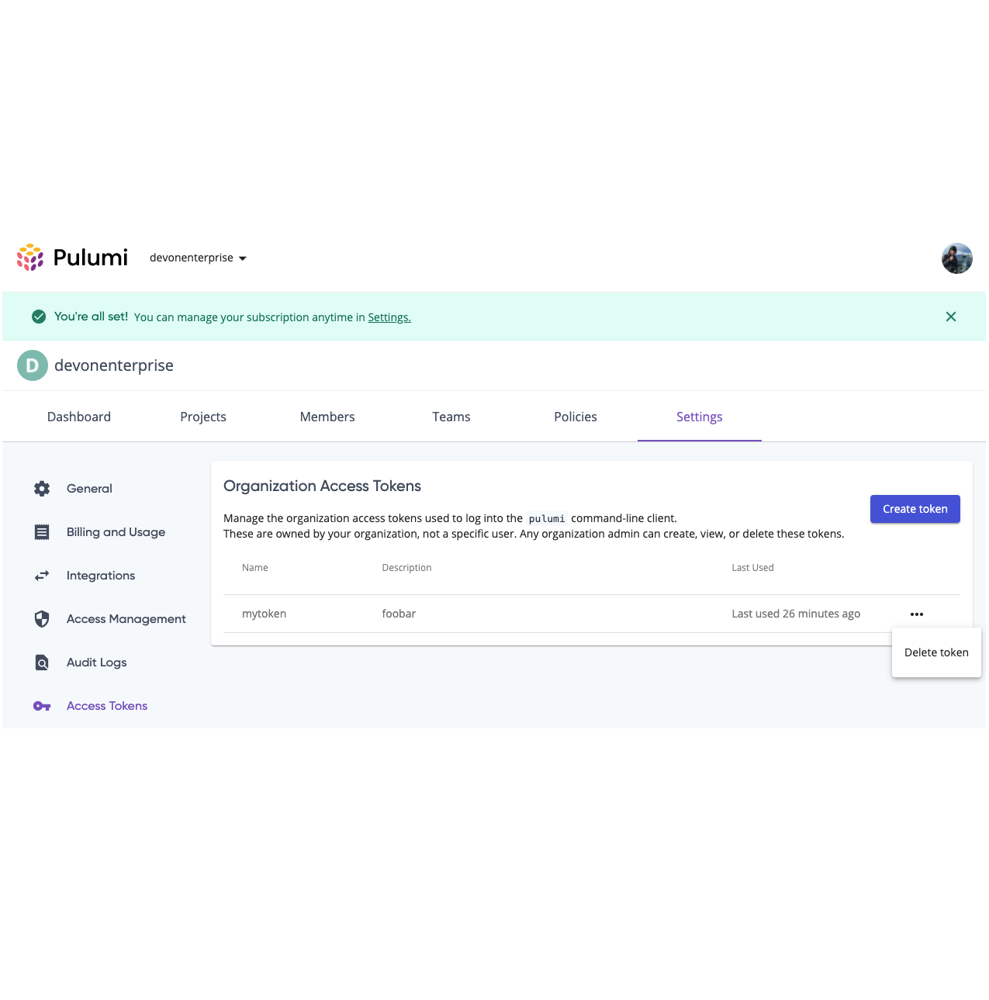

## Personal Access Tokens

This tab lets you manage the [access tokens](https://en.wikipedia.org/wiki/Access_token) used for logging into the Pulumi service. It provides a list of all the access tokens associated with your account, including a description and last used information for each token.

When you run [`pulumi login`]() from the command line, you will be prompted for an access token. Once obtained, the access token logs you into the Pulumi Service and lets you interact with the Pulumi service and manage your stacks.

### Creating Access Tokens

To create an access token:

1. Select your profile picture.
1. Select **Settings**.
1. Navigate to **Access Tokens**.
1. Select **Create token**.

### Deleting Access Tokens

To delete an access token:

1. Select your profile picture.
1. Select **Settings**.
1. Navigate to **Access Tokens**.
1. Use the trash can icon to delete a token.

## Organization Access Tokens

Organization Access Tokens provide Enterprise Growth and Business Critical customers the opportunity to manage resources and stack operations for their organization independent of a single-user account.

Leveraging Organization Access Tokens for your organization's automation delivers two core benefits:
 * Prevents organizations from needing to pass around a Personal Access Token belonging to a privileged organization member or admin in their automated tooling. This eliminates risk with modifying or removing organization memberships, as members can be decoupled from such automation pipelines.
 * Promotes less privileged access, as an Organization Access Token, unlike a Personal Access Token, is granted privileges only to the organization in which it was created, rather than to all organizations a single user belongs to.

Tokens are created, managed, and removed by organization administrators, accessible on the Organization Settings page.

### Creating an Organization Access Token

From the organization’s homepage, visit Settings, then Access Tokens. To be shown this menu option, you must be on an Enterprise Growth or Business Critical subscription or trial. From the token landing page, you will see a “Create token” button in the top right of the page. Click this button to be prompted to create a token.

The token must have a name that is unique among all Organization Access Tokens assigned to it. This allows tokens taking operations on behalf of your organization to be identifiable in the event that one is compromised. This name must be unique even among deleted tokens, in order to maintain the integrity of Audit Log Events which persist the token’s name (even for a deleted token) as part of the event (see below). Any other organization admin can delete this token; it is not owned by the admin which created it.

Creation of any Organization Access Token, and the user who performed it, is logged as an Audit Log Event.

### Viewing Organization Access Tokens

Organization Access Tokens are viewed by going to the organization’s Settings page, then selecting Access Tokens from the menu. As with Personal Access Tokens, this table displays all tokens belonging to your organization, and at what time they were last successfully used to carry out an operation. Only organization admins of an organization with an Enterprise Growth or Business Critical subscription will see access to this page.

### Deleting an Organization Access Token

An access token can be deleted by any organization admin at any time. Click the ellipsis icon at the end of the row, and select “Delete token”.

You will be asked to confirm. If you choose to delete a token, its access will immediately be revoked and all further operations using it will fail as unauthorized.

### Auditing Organization Token Actions

Since an organization can have multiple Organization Access Tokens, it’s necessary to be able to identify them uniquely in Audit Log Events. All Audit Log Events which were triggered by an Organization Access Token will surface the token’s unique name, and in the event of Audit Log Export, the token’s UUID as well.

### Permissions/Authorization

Put simply: Organization Access Tokens behave like an organization member with [stack write permissions](https://www.pulumi.com/docs/intro/pulumi-service/projects-and-stacks/#stack-permissions) to all of the organization’s stacks. They do not grant any privileges to view the console, or to create additional Organization or Personal Access Tokens. See below for a full list of accessible APIs:

#### API Access

See the Pulumi [Service REST API docs](https://www.pulumi.com/docs/reference/service-rest-api/) for more information about each API endpoint.

| Action | Org Token Access |
|--------|------|
| Stacks |
|--------|------|
| List Stacks | ✅ |
| Get Stack | ✅ |
| Get Stack State | ✅ |
| Transfer Stack |  |
| Delete Stack |  |
|--------|------|
| Stack Tags |
|--------|------|
| Get Stack Tags | ✅ |
| Set Stack Tag | ✅ |
| Delete Stack Tag | ✅ |
|--------|------|
| Stack Updates |
|--------|------|
| List Stack Updates | ✅ |
| Get Update Status | ✅ |
| List Update Events | ✅ |
| List Previews | ✅ |
|--------|------|
| Organizations |
|--------|------|
| List Users | ✅ |
| Add User to Organization |  |
| Remove User from Organization |  |
| Create Team | ✅ |
| Delete Team |  |
| Update Team Membership |  |
| Grant Stack Access to Team |  |
| Remove Stack Access from Team |  |
| Update User’s Role |  |
| List User Access Tokens |  |
| Create User Access Token |  |
| Delete User Access Token |  |
| Create Webhook | ✅ |
| List Webhooks | ✅ |
| Get Webhook | ✅ |
| Ping Webhook | ✅ |
| List Webhooks Deliveries | ✅ |
|--------|------|
| Audit Logs |
|--------|------|
| Get Audit Log Events (JSON) | ✅ |
| Export Audit Log Events (CSV or CEF) | ✅ |
