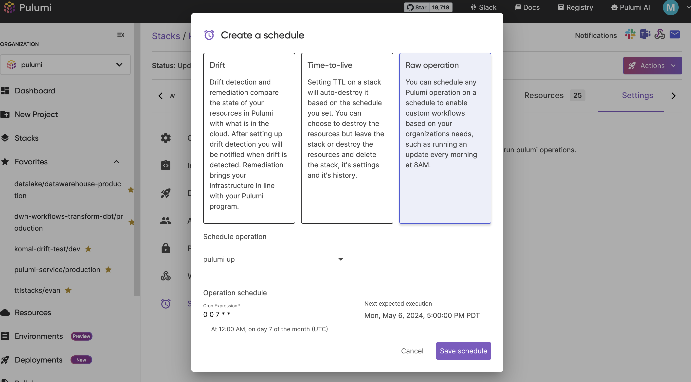

Scheduled Deployments in Pulumi Cloud introduces a robust capability to automate cloud operations, enabling more control over when and how infrastructure updates are applied. This feature is ideal for teams looking to enhance operational efficiency by automating routine tasks and ensuring that changes are made during optimal times, such as off-peak hours or predetermined maintenance windows.

Users can easily define schedules for any stack with Pulumi Deployments configured, using cron expressions to specify exact times for operations. This granular level of control allows for precise management of infrastructure tasks, accommodating complex scheduling needs. Scheduled Deployments build upon the existing infrastructure provided by Pulumi Deployments, enhancing it with the flexibility to manage deployment timing extensively. This means Pulumi Deployments concurrency limits apply to scheduled deployments and pausing deployments on a stack will queue scheduled deployments as well.

## Pulumi Cloud UI

In order to set up a deployment schedule in the Pulumi Cloud console, follow these steps:

<!-- markdownlint-disable ol-prefix -->
1. Ensure Deployments Settings are configured on the stack [see the docs](/docs/pulumi-cloud/deployments/reference)
2. Navigate to the Stack > Settings > Schedules


3. Select "Drift"
4. (Optional) Turn on auto-remediation if applicable
5. Set the schedule using a cron expression
6. Save the Schedule
<!-- markdownlint-enable ol-prefix -->


### Setting it up in the API

For those who prefer to automate and script their infrastructure tasks, Time-to-Live schedules can be configured programmatically using simple HTTP requests.

- Create a schedule
- Get a schedule for a stack
- Update or delete a schedule
- Pause or resume a schedule
- List all schedules in the organization (includes Drift and Time-to-Live schedules)

Below is an example of creating a Schedule on a stack programmatically:

```bash
curl \
  -H "Accept: application/vnd.pulumi+8" \
  -H "Content-Type: application/json" \
  -H "Authorization: token $PULUMI_ACCESS_TOKEN" \
  --request POST \
  --data '{ "scheduleCron":"0 0 * * *", "request": { "operation": "update" } }' \
  https://api.pulumi.com/api/stacks/{organization}/{project}/{stack}/deployments/schedules
```

Refer to the [Pulumi Deployments REST API documentation](/docs/pulumi-cloud/deployments/api) for more details on how to use the REST API to manage Scheduled Deployments.

### Pulumi Cloud Service provider

TODO
