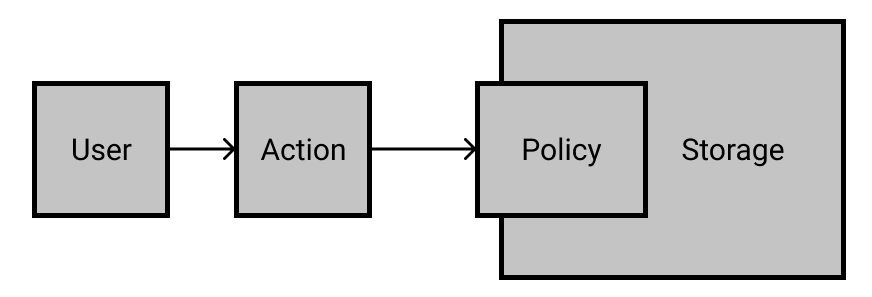

Just like any application code, Pulumi infrastructure code can be abstracted, enabling us to work with models or objects, depending on which language we use to define that code. If we use an object-oriented language such as JavaScript, Python, or TypeScript, we can create and instantiate classes. For languages like Go, we can build up interfaces. In all cases, we're thinking in terms of taking code that we've written and making it reusable in some form.

Breaking apart Pulumi code is essential to keeping a clean, well-organized, and easily maintained code base that enables teams to collaborate to enhance current systems. Over the course of these pathways, we've been pretending we're part of a fictional organization called Pulumipus (after Pulumi's beloved mascot), so let's imagine that we've now scaled beyond the basic boba shop from the Fundamentals series to an entire brand with many, many smaller organizations. As the owners of the infrastructure for the Pulumipus brand, we've got a lot of resources to maintain, and it's much better to reuse code that we write once rather than repeating ourselves continuously in our program and throughout all of the programs we maintain.

Let's first explore abstraction.

## Thinking in abstraction

When we use our code for our Pulumi program, we're generally starting out with a declarative approach: We write code that declares, for example, we want three resources of a specific type, provisioned in the order in which we declare them, and run the code to create those three resources in order.

To get to more complex architectures, we need to enable the ability to break apart that code so we can reuse components and call things in any order we choose, knowing that we will get the expected result each time. We also need to allow others to use parts of our code without necessarily needing to know precisely how it's put together. This abstractionist way of thinking means we're thinking in terms of the mental models we use to understand the cloud architectures that are available to us&mdash;or what we want to make available to others in our organization.

## Exploring an example

Let's imagine the Pulumipus brand is expanding to all kinds of systems, and so we don't know which infrastructure each team will need. However, each team will need some kind of storage for objects that has access policies and security controls, no matter whether they're doing a serverless build or a VM-based build.

Mentally, we're defining a sort of abstraction like this:

Seems pretty clean, doesn't it? Abstraction is thinking through what we experience when we call the code, so that anyone calling that code experiences the same thing. The part that gets complicated is when we start translating that idea to code.

Let's now go explore the more practical encapsulation concept!
