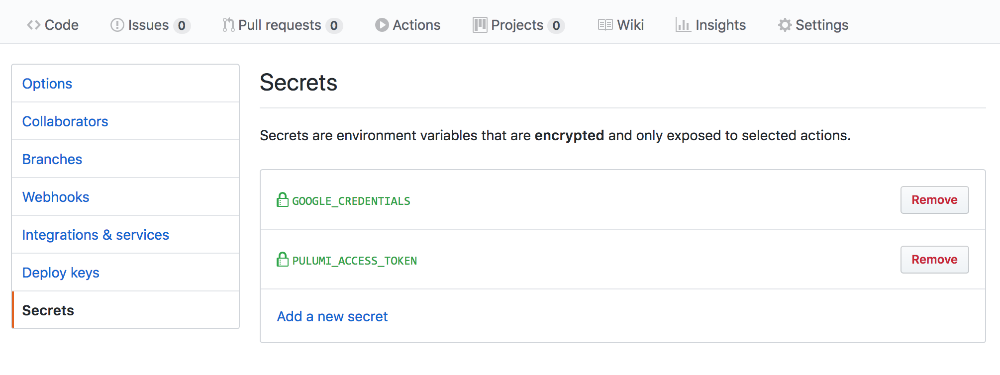
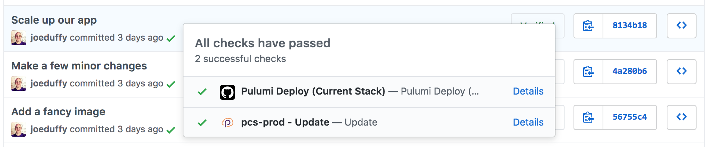
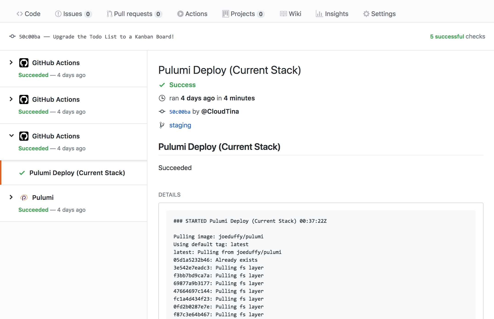

Pulumi’s approach to infrastructure as code is great for continuous delivery, because it uses source code to model cloud resources. This means updates to your cloud infrastructure can be reviewed, validated, and tested using the same process that you have today. For example, doing code reviews via Pull Requests, running code through linters or static analysis tools, and running unit and integration tests as appropriate. It all “just works” for your cloud infrastructure the same way it would for your application code.

For this guide, we'll be using [GitHub Actions](https://developer.github.com/actions).

## Committing the Workflow Files

The first thing we need to do is commit our workflow files to the GitHub repository containing our Pulumi project.

### The pull_request Workflow File

Add a new file to your Boba Shop project repository at .github/workflows/pull_request.yml containing the following workflow definition, which instructs GitHub Actions to run pulumi preview in response to all pull_request events:



{}

```yaml
name: Pulumi
on:
  - pull_request
jobs:
  preview:
    name: Preview
    runs-on: ubuntu-latest
    steps:
      - uses: actions/checkout@v2
      - uses: actions/setup-node@v2
        with:
          node-version: 14.x
      - name: Configure AWS Credentials
        uses: aws-actions/configure-aws-credentials@v1
        with:
          aws-access-key-id: ${{ secrets.AWS_ACCESS_KEY_ID }}
          aws-region: ${{ secrets.AWS_REGION }}
          aws-secret-access-key: ${{ secrets.AWS_SECRET_ACCESS_KEY }}
      - run: npm install
      - uses: pulumi/actions@v3
        with:
          command: preview
          stack-name: dev
        env:
          PULUMI_ACCESS_TOKEN: ${{ secrets.PULUMI_ACCESS_TOKEN }}
```

{}

{}

```yaml
name: Pulumi
on:
  - pull_request
jobs:
  preview:
    name: Preview
    runs-on: ubuntu-latest
    steps:
      - uses: actions/checkout@v2
      - uses: actions/setup-python@v2
        with:
          python-version: 3.6
      - name: Configure AWS Credentials
        uses: aws-actions/configure-aws-credentials@v1
        with:
          aws-access-key-id: ${{ secrets.AWS_ACCESS_KEY_ID }}
          aws-region: ${{ secrets.AWS_REGION }}
          aws-secret-access-key: ${{ secrets.AWS_SECRET_ACCESS_KEY }}
      - run: pip install -r requirements.txt
      - uses: pulumi/actions@v3
        with:
          command: preview
          stack-name: dev
        env:
          PULUMI_ACCESS_TOKEN: ${{ secrets.PULUMI_ACCESS_TOKEN }}
```

{}

{}

```yaml
name: Pulumi
on:
  - pull_request
jobs:
  preview:
    name: Preview
    runs-on: ubuntu-latest
    steps:
      - uses: actions/checkout@v2
      - uses: actions/setup-go@v1
        with:
          go-version: 1.14.x
      - name: Configure AWS Credentials
        uses: aws-actions/configure-aws-credentials@v1
        with:
          aws-access-key-id: ${{ secrets.AWS_ACCESS_KEY_ID }}
          aws-region: ${{ secrets.AWS_REGION }}
          aws-secret-access-key: ${{ secrets.AWS_SECRET_ACCESS_KEY }}
      - run: go mod download
      - uses: pulumi/actions@v3
        with:
          command: preview
          stack-name: dev
        env:
          PULUMI_ACCESS_TOKEN: ${{ secrets.PULUMI_ACCESS_TOKEN }}
```

{}

{}

```yaml
name: Pulumi
on:
  - pull_request
jobs:
  preview:
    name: Preview
    runs-on: ubuntu-latest
    steps:
      - uses: actions/checkout@v2
      - uses: actions/setup-dotnet@v1
        with:
          dotnet-version: 3.1.x
      - name: Configure AWS Credentials
        uses: aws-actions/configure-aws-credentials@v1
        with:
          aws-access-key-id: ${{ secrets.AWS_ACCESS_KEY_ID }}
          aws-region: ${{ secrets.AWS_REGION }}
          aws-secret-access-key: ${{ secrets.AWS_SECRET_ACCESS_KEY }}
      - uses: pulumi/actions@v3
        with:
          command: preview
          stack-name: dev
        env:
          PULUMI_ACCESS_TOKEN: ${{ secrets.PULUMI_ACCESS_TOKEN }}
```

{}


### The push Workflow File

Now add another new file to your Boba Shop project repository at `.github/workflows/push.yml`containing the following workflow definition, which instructs GitHub Actions to run `pulumi up` whenever a commit is made to the `main` branch.



{}

```yaml
name: Pulumi
on:
  push:
    branches:
      - main
jobs:
  preview:
    name: Update
    runs-on: ubuntu-latest
    steps:
      - uses: actions/checkout@v2
      - uses: actions/setup-node@v2
        with:
          node-version: 14.x
      - name: Configure AWS Credentials
        uses: aws-actions/configure-aws-credentials@v1
        with:
          aws-access-key-id: ${{ secrets.AWS_ACCESS_KEY_ID }}
          aws-region: ${{ secrets.AWS_REGION }}
          aws-secret-access-key: ${{ secrets.AWS_SECRET_ACCESS_KEY }}
      - run: npm install
      - uses: pulumi/actions@v3
        with:
          command: up
          stack-name: dev
        env:
          PULUMI_ACCESS_TOKEN: ${{ secrets.PULUMI_ACCESS_TOKEN }}
```

{}

{}

```yaml
name: Pulumi
on:
  push:
    branches:
      - main
jobs:
  preview:
    name: Update
    runs-on: ubuntu-latest
    steps:
      - uses: actions/checkout@v2
      - uses: actions/setup-python@v2
        with:
          python-version: 3.6
      - name: Configure AWS Credentials
        uses: aws-actions/configure-aws-credentials@v1
        with:
          aws-access-key-id: ${{ secrets.AWS_ACCESS_KEY_ID }}
          aws-region: ${{ secrets.AWS_REGION }}
          aws-secret-access-key: ${{ secrets.AWS_SECRET_ACCESS_KEY }}
      - run: pip install -r requirements.txt
      - uses: pulumi/actions@v3
        with:
          command: up
          stack-name: dev
        env:
          PULUMI_ACCESS_TOKEN: ${{ secrets.PULUMI_ACCESS_TOKEN }}
```

{}

{}

```yaml
name: Pulumi
on:
  push:
    branches:
      - main
jobs:
  preview:
    name: Update
    runs-on: ubuntu-latest
    steps:
      - uses: actions/checkout@v2
      - uses: actions/setup-go@v1
        with:
          go-version: 1.14.x
      - name: Configure AWS Credentials
        uses: aws-actions/configure-aws-credentials@v1
        with:
          aws-access-key-id: ${{ secrets.AWS_ACCESS_KEY_ID }}
          aws-region: ${{ secrets.AWS_REGION }}
          aws-secret-access-key: ${{ secrets.AWS_SECRET_ACCESS_KEY }}
      - run: go mod download
      - uses: pulumi/actions@v3
        with:
          command: up
          stack-name: dev
        env:
          PULUMI_ACCESS_TOKEN: ${{ secrets.PULUMI_ACCESS_TOKEN }}
```

{}

{}

```yaml
name: Pulumi
on:
  push:
    branches:
      - main
jobs:
  preview:
    name: Update
    runs-on: ubuntu-latest
    steps:
      - uses: actions/checkout@v2
      - uses: actions/setup-dotnet@v1
        with:
          dotnet-version: 3.1.x
      - name: Configure AWS Credentials
        uses: aws-actions/configure-aws-credentials@v1
        with:
          aws-access-key-id: ${{ secrets.AWS_ACCESS_KEY_ID }}
          aws-region: ${{ secrets.AWS_REGION }}
          aws-secret-access-key: ${{ secrets.AWS_SECRET_ACCESS_KEY }}
      - uses: pulumi/actions@v3
        with:
          command: up
          stack-name: dev
        env:
          PULUMI_ACCESS_TOKEN: ${{ secrets.PULUMI_ACCESS_TOKEN }}
```

{}

## Configuring your Secrets

We have several secrets in our workflow files. To add values for them, go to your GitHub repository's Settings tab and select Secrets.



First, [create a new Pulumi Access Token](https://app.pulumi.com/account/tokens). Submit that token as a new secret named named `PULUMI_ACCESS_TOKEN`. This is what enables your GitHub Action to communicate with the Pulumi service on your behalf.

You will also need to add secrets for `AWS_ACCESS_KEY_ID`, `AWS_REGION` and `AWS_SECRET_ACCESS_KEY`.

## Pulumi in Action on GitHub Actions

To try things out, simply create a Pull Request or commit, and you will see these new actions showing up in the usual GitHub Checks dialog, with a green checkmark if everything went as planned:



Click the Logs pane to see the full output of the Pulumi CLI, along with the URL of your deployment on the Pulumi Console with more details:



## Congratulations!

You've successfully integrated Pulumi into the CI/CD workflow for your Boba Shop app, using GitHub Actions!