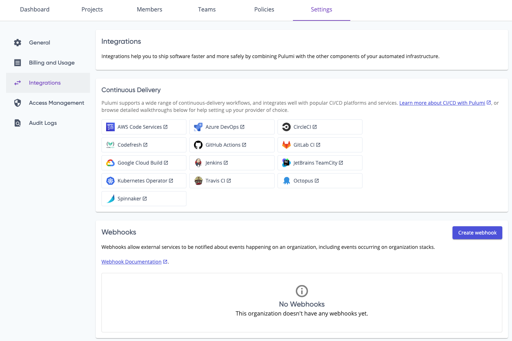
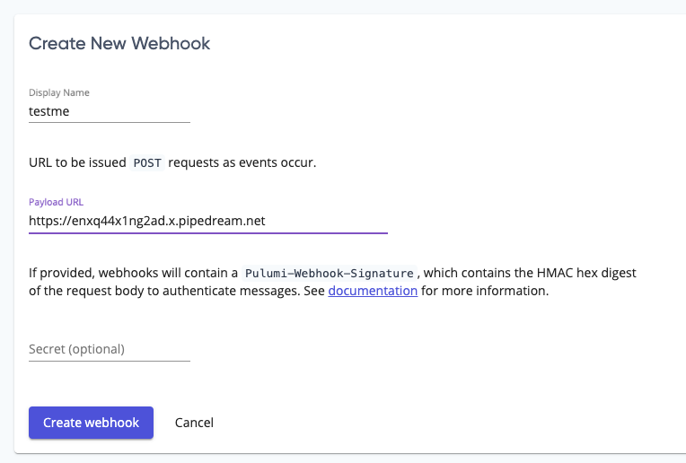
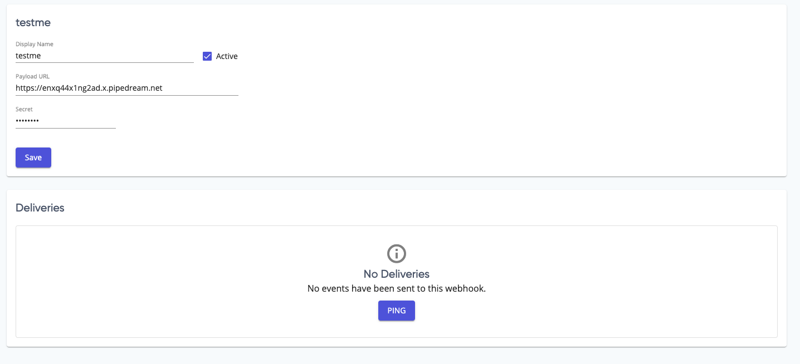
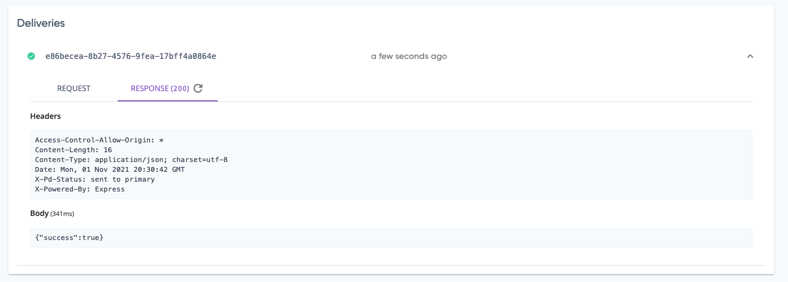
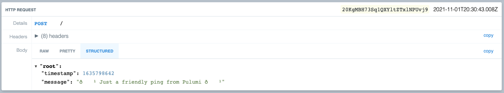
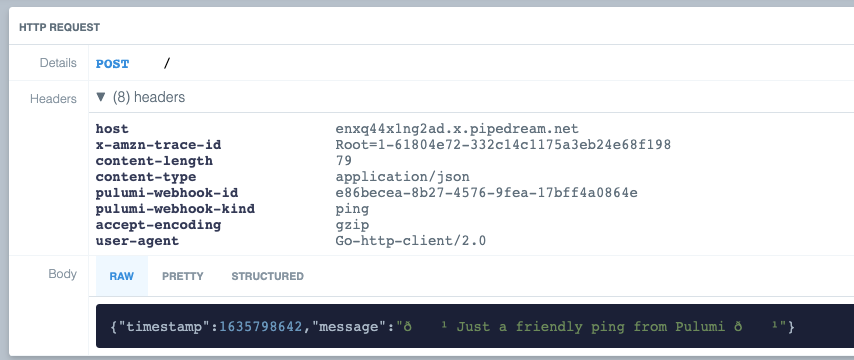

Pulumi Webhooks are available in the [Team](https://www.pulumi.com/pricing/) and
[Enterprise](https://www.pulumi.com/pricing/) plans, and they allow you to
notify external services of events happening within your Pulumi organization or
stack. For example, you can trigger a notification whenever a stack is updated.
Whenever an event occurs, Pulumi will send an `HTTP POST` request to all
registered webhooks. The webhook can then be used to emit some notification,
start running integration tests, or even update additional stacks.

Webhooks can be used for pretty much anything you want and are the foundation of
most ChatOps workflows. For our boba tea shop application, let's say you're now
part of a team responsible for the deployment and management of the overall
infrastructure. You're working asynchronously with your team, and there's a lot
of work happening on your environments as your boba shop grows. Webhooks going
into your chat infrastructure ensures, at a basic level, everyone can know what
activities are happening at any point in time. On a more advanced level, you can
send in chat-based commands to ask Pulumi to deploy your changes to the boba
shop infrastructure. Let's explore how we could use webhooks with our app if we
have the Team or Enterprise plan.

## Create a webhook

Webhooks can be attached to either a stack or an organization. If you attach a
webhook to a stack, an event posts to the webhook gets updates whenever a stack
is updated or changed. For organizations, an event posts to the webhook for
events happening within each of the organization's stacks.

We create webhooks in the Pulumi Console. From your stack or organization page,
select **Settings**. Webhooks are under the **Integrations** section:

Next, select **Create webhook**. On the next page, the webhook needs a display
name, a payload URL where the `POST` request will be sent, and an optional
secret if you need to authenticate your messages. It's good practice for public 
systems such as a Jenkins server to require a secret to ensure that the incoming
request can access critical infrastructure. If a secret is provided, webhook
deliveries will contain a signature in the HTTP request header to authenticate
messages as coming from the Pulumi Console.

![The Create New Webhook screen, with an entry field for a display name first. Then, the text "URL to be issued POST requests as events occur" with a field for the payload URL. Then the text "if provided, webhooks will contain a Pulumi-Webhook-Signature, which contains the HMAC hex digest of the request body to authenticate messages." and a link to the docs (which is unclickable in this image). Then there's a field for an optional secret. Finally, there's an inactive button for creating the webhook and a cancel button next to it.](webhook-screen-1.png)

For the Boba Tea Shop app, we're going to fake a webhook creation using
[Requestbin.com](https://requestbin.com). Enter a **Display Name**. Then, go
create a public requestbin, then take the URL and use it for the **Payload
URL**:

We're going to skip the secret for now.

When you select **Create webhook**, you'll find a new section called
**Deliveries**. Any instance of Pulumi sending events to this webhook will end
up here for you to inspect, which is especially helpful for debugging.

The **Ping** button allows you to send a test payload to the webhook to ensure
everything is wired up correctly. It's always a good idea to test your webhook
connection with a ping or similar small payload before relying on it for actual
use, so let's do that now. Select **Ping**, and you should get a delivery:

Select the **Response** tab to find the actual headers and body that make up the
response from the server you sent the payload to (the webhook endpoint):

What does the endpoint get? Switch over to your Requestbin instance, and you can
explore the request that got sent.

It matches the exact details you found on the Pulumi Console!

## Change the webhook data

If you ever need to change the name, the URL, or the secret for the webhook,
come back to this screen. You can change the details, then select **Save** to
adjust any of the information there. Perhaps, in the case of the boba tea shop
app, you needed to make the display name more descriptive as you build more
applications. Or you might be changing deployment systems, and you need to add
a new secret. For any reason, you can change the metadata whenever you need to.

## Deactivate the webhook

Sometimes, you want to turn off the webhook. Let's say you're doing a major
upgrade of the boba tea shop infrastructure on a specific stack, and you want to
pause all of the notifications because everyone is in the same video call during
the activities. Notification fatigue is a thing! Another possible case is you
are switching chatops platforms, and you want to deactivate the payloads until
you move over to the new platform.

Let's deactivate the webhook.

Next to the **Display Name**, there's a checkbox for whether the Pulumi system
is actively sending data to the webhook. Deslect the checkbox, then
select **Save**. That's it!

Now that we've tried out webhooks to start sending events to other platforms, we
have one more thing to explore: Policy-as-Code.