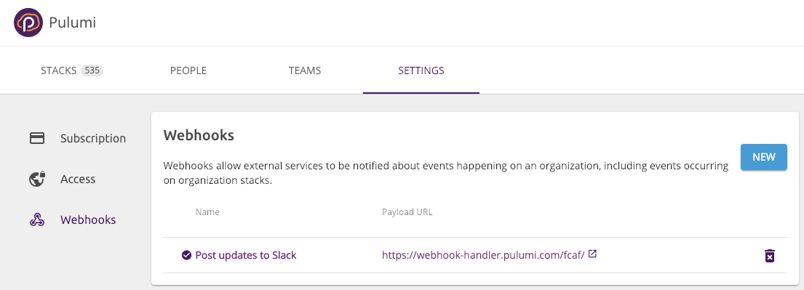
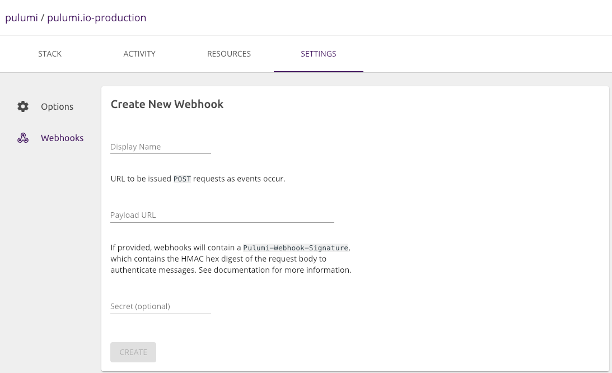

Pulumi Webhooks are available in the [Team](https://www.pulumi.com/pricing/) and
[Enterprise](https://www.pulumi.com/pricing/) plans, and they allow you to
notify external services of events happening within your Pulumi organization or
stack. For example, you can trigger a notification whenever a stack is updated.
Whenever an event occurs, Pulumi will send an HTTP POST request to all
registered webhooks. The webhook can then be used to emit some notification,
start running integration tests, or even update additional stacks.

Webhooks can be used for pretty much anything you want and are the foundation of
most ChatOps workflows.

## Management

Webhooks can be attached to either a stack or an organization. Stack webhooks
will be notified whenever a stack is updated or changed. Organization webhooks
will be notified for events happening within each of the organization's stacks.

From your Stack or Organization page, select **Settings** and then **Webhooks**.

## Create a Webhook

To create a webhook:

1. Navigate to the organization's **Settings**.
2. Navigate to **Integrations**.
3. Select **Create webhook**.
4. Provide a **Display Name**, **Payload URL**, and optionally a **Secret**.

If a secret is provided, webhook deliveries will contain a signature in the HTTP
request header that can be used to authenticate messages as coming from the
Pulumi Console.

