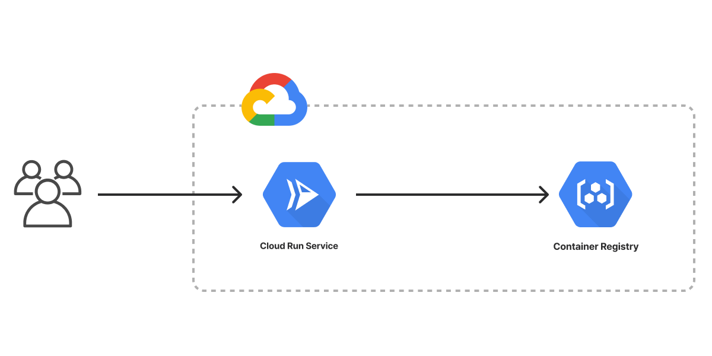

The Container Service template creates an infrastructure as code project in your favorite language that deploys a container service to Google Cloud. You can then use the container service to build your own containerized application. The architecture includes [Google Cloud Run]() for running containers on serverless compute and Artifact Registry for storing container images. The template generates a complete infrastructure project with example app content, providing you with a working project out of the box that you can customize easily and extend to suit your needs.



## Using this template

To use this template to deploy your own container service, make sure you've [installed Pulumi]() and [configured your Google Cloud credentials](), then create a new [project]() using the template in your language of choice:



Follow the prompts to complete the new-project wizard. When it's done, you'll have a complete Pulumi project that's ready to deploy and configured with the most common settings. Feel free to inspect the code in  for a closer look.

## Deploying the project

You must supply an existing project ID and choose a region before deploying the container service. You can input both through the new-project wizard. The template requires no additional configuration. Once the new project is created, you can deploy it immediately with [`pulumi up`]():

```bash
$ pulumi up
```

When the deployment completes, Pulumi exports the following [stack output]() values:

url
: The HTTP URL of your Cloud Run service.

Output values like these are useful in many ways, most commonly as inputs for other stacks or related cloud resources. The computed `url`, for example, can be used from the command line to open the newly deployed container in your favorite web browser:

```bash
$ open $(pulumi stack output url)
```

## Customizing the project

Projects created with the Container Service template expose the following [configuration]() settings:

container_port
: Specifies the port mapping for the container service. Defaults to port `8080`.

cpu
: Specifies the amount of CPU to use with each container instance. Defaults to `1` CPU.

memory
: Specifies the amount of memory to use with each container instance. Defaults to `1Gi`.

concurrency
: The maximum concurrent requests that can be received by a container instance. Defaults to `50`.

imageName
: The name of the container image deployed to your Cloud Run service. Defaults to `my-app`.

appPath
: Specifies the location of the Dockerfile used to build the container image that is run. Defaults to the `./app` folder, which contains a "Hello World" example app.

All of these settings are optional and may be adjusted either by editing the stack configuration file directly (by default, `Pulumi.dev.yaml`) or by changing their values with [`pulumi config set`]() as shown below:

```bash
$ pulumi config set someProp ../some/value
$ pulumi up
```

## Tidying up

You can cleanly destroy the stack and all of its infrastructure with [`pulumi destroy`]():

```bash
$ pulumi destroy
```

## Learn more

Congratulations! You're now well on your way to managing a production-grade container service on Google Cloud with Pulumi --- and there's lots more you can do from here:

* Discover more architecture templates in [Templates &rarr;]()
* Dive into the Google Cloud (Classic) package by exploring the [API docs in the Registry &rarr;]()
* Expand your understanding of how Pulumi works in [Learn Pulumi &rarr;]()
* Read up on the latest new features [in the Pulumi Blog &rarr;](/blog/tag/containers)
