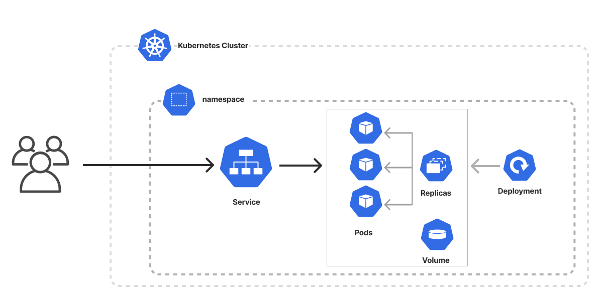

The Kubernetes Application template creates an infrastructure as code project in your favorite language that deploys a web application to an existing cluster with Pulumi. It uses Pulumi's [Native Kubernetes Provider](/registry/packages/kubernetes) to create a new namespace in an existing Kubernetes cluster and a new deployment to host the application. It also exposes the application as a service that's reachable from outside your cluster. The template generates a complete infrastructure as code program, including sample application code, to give you a working project out of the box that you can customize easily and extend to suit your needs.



## Using this template

To use this template to deploy a web application to a Kubernetes cluster, make sure you've already provisioned a [Kubernetes cluster](/templates/kubernetes), [installed Pulumi](/docs/get-started/install) and [`kubectl`](https://kubernetes.io/docs/tasks/tools/install-kubectl/), and [configured your kubeconfig file](/registry/packages/kubernetes/installation-configuration#setup). Then create a new [project](/docs/concepts/project) using the template in your language of choice:



Follow the prompts to complete the new-project wizard. When it's done, you'll have a complete Pulumi project that's ready to deploy and configured with the most common settings. Feel free to inspect the code in  for a closer look.

## Deploying the project

The template requires no additional configuration. By default, it will install Nginx. Once the new project is created, you can deploy it immediately with [`pulumi up`](/docs/cli/pulumi_up):

```bash
$ pulumi up
```

When the deployment completes, Pulumi exports the following [stack output](/docs/concepts/stack#outputs) values:

deploymentName
: The name of your new Kubernetes Deployment.

serviceName
: The name of your new Kubernetes Service.

Output values like these are useful in many ways, most commonly as inputs for other stacks or related cloud resources.

## Customizing the project

Projects created with the Kubernetes Application template expose the following [configuration](/docs/concepts/config) settings:

namespace
: The name of the namespace to be created in your existing cluster. Defaults to `default`.

replicas
: The number of replicated Pods to be created in your new Deployment. Defaults to `1`.

All of these settings are optional and may be adjusted either by editing the stack configuration file directly (by default, `Pulumi.dev.yaml`) or by changing their values with [`pulumi config set`](/docs/cli/pulumi_config_set) as shown below.

```bash
$ pulumi config set someProp ../some/value
$ pulumi up
```

## Tidying up

You can cleanly destroy the stack and all of its infrastructure with [`pulumi destroy`](/docs/cli/pulumi_destroy):

```bash
$ pulumi destroy
```

## Learn more

Congratulations! You're now well on your way to managing a production-grade Kubernetes application with Pulumi --- and there's lots more you can do from here:

* Discover more architecture templates in [Templates &rarr;](/templates)
* Dive into the Kubernetes package by exploring the [API docs in the Registry &rarr;](/registry/packages/kubernetes)
* Expand your understanding of how Pulumi works in [Learn Pulumi &rarr;](/learn)
* Read up on the latest new features [in the Pulumi Blog &rarr;](/blog/tag/kubernetes)
